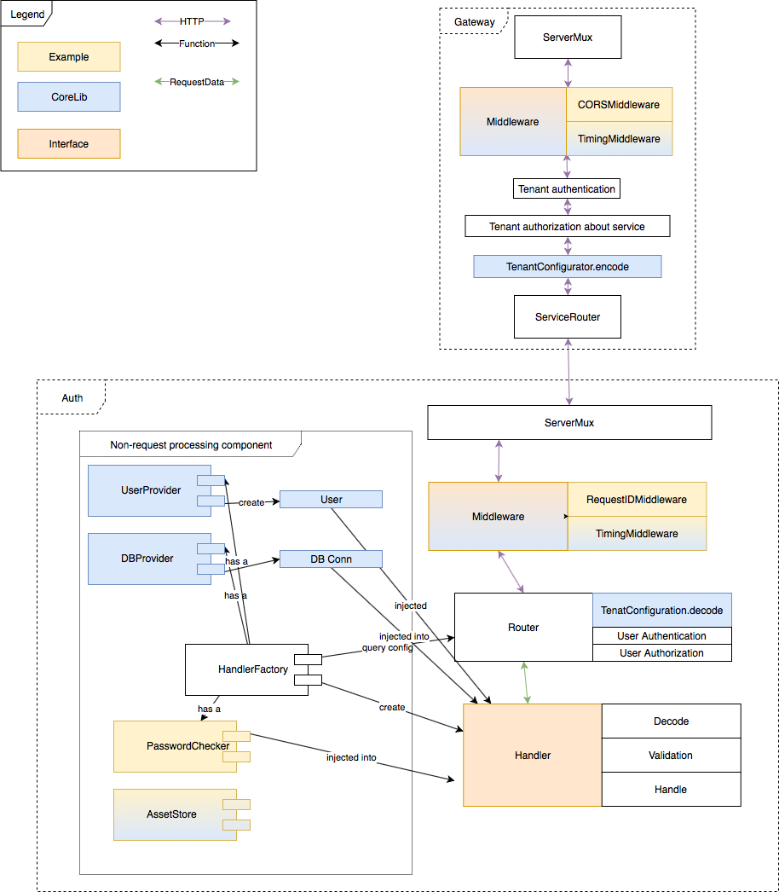

This document is describing how a request is being process in Skygear Next

## Flow disgram

[Source XML](./request-processing.xml), you can edit at https://www.draw.io/
Link for view: https://drive.google.com/file/d/1oB41Pi90Xo-Asx0ZhjuMue6R1V0e5Rfx/view?usp=sharing

## Router

Router is where request landed in skygear.io. We have the following commitment
on what Router will do and will not do:

- All processing are bounded to HTTP semantic
- Adding data are only to HTTP header
- It responsible for multi-tenant dispatch

When a request arrive Router, it will go through following stage:

- RequestMiddleware (From shared library)
- `TenantAuthenticator`
- `TenantAuthorizer`
- `TenantConfigurator`
- `ServiceRouter`

### Stages Responsibility

- `TenantAuthenticator`

Query the tenant user account according to the domain and/or path.

- `TenantAuthorizer`

Make sure the request tenant are authorized to use specific services, for
example, the domain is paid for pubsub services.

- `TenantConfigurator`

Query and inflate tenant specific configuration to HTTP Header.

- `ServiceRouter`

Dispatch HTTP request to the service instance, rewrite path if needed.

## Service block

After the request is processed by Router, all the multi-tenant information
should prepared and the services should not need extra IO, access to the
multi-tenant database

Following request processing is the suggested way for common web application
services, including Auth, CMS, Chat, Analytics

- RequestMiddleware (From shared library)
- Router
  - `UserAuthenticator`
  - `UserAuthorizer`
  - `HandlerFactory`
- Declared by Handler declaratively
  - `PermissionPredicate`
  - `Decode`
  - `Validate`
- `Handler`
  - Handle (Data process, business logic)
  - Response

### multi-tenant boundary

`Router` should be the last place that aware of multi-tenant logic in Service
block.

`Handler` is strictly not multi-tenant aware. An new instance of `Handler`
will create per request. It avoids the need of service dependency clean up
which lead to security issue.

### Stage responsibility

- `Router`

Create the actual `Handler` by `HandlerFactory`. It is responsibility to
inject the correct non-tenant aware services for `Handler` to use. The
dependency is specific at `Handler`.

- `Handler`

`Handler` specific its dependency declaratively.
`Handler` declare its permission requirement.
`Handler` write business logic imperatively.
