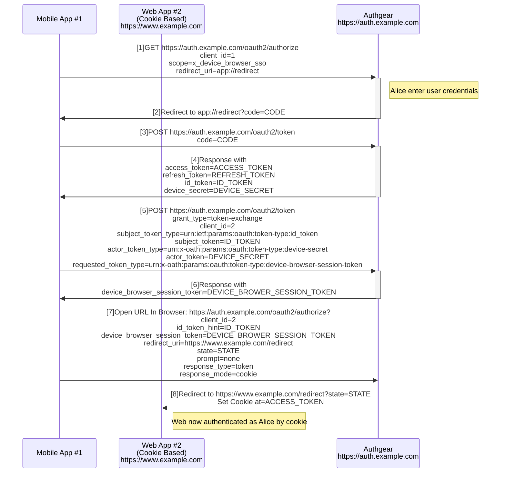

# App Initiated SSO to Web

## Abstract

This document describes a mechanism that allows a cookie based web app to share the authentication obtained by a mobile app.

This document is drafted based on [OpenID Connect Native SSO for Mobile Apps 1.0](https://openid.net/specs/openid-connect-native-sso-1_0.html).

## The Flow



Step [1] to [4] are the standard OpenID Connect authorization_code flow with the following extensions. In step [1], the `x_device_browser_sso` is specified signifying that the client is requesting a `device_secret` to be returned when the code is exchanged for tokens.

After step [4], Mobile App #1 stores the device_secret and id_token in the protected device storage accessible only to Mobile App #1.

Step [5] invokes the /token endpoint with the token exchange profile passing the id_token obtained from the device storage, the client_id and the device secret. A device_browser_session_token is then returned in step [6].

Step [7] uses the obtained device_browser_session_token to open /authorize in a browser, with the id_token used in step [5], and a redirect_uri pointing to Web App #2.

Step [8] redirects the browser to Web App #2, with a session cookies set. The session cookie can then be used for authorizing Web App #2 as it was logged in as the same user of Mobile App #1.

## Native App Authorization Extensions

Same as the [Native SSO](https://openid.net/specs/openid-connect-native-sso-1_0.html#name-native-app-authorization-ex), except that the new scope value supported is `x_device_browser_sso`.

## Token Exchange Profile for App Initiated SSO to Web

This section profiles the OAuth2 Token Exchange [RFC8693] spec and describes the processing rules used to exchange a previous authentication for a device browser session token, which can then be used to exchange for a browser session of another Web App.

### Defined token type identifiers

This profile also defines the following token type identifiers.

```
urn:x-oath:params:oauth:token-type:device-secret
```

Please refer to [OpenID Connect Native SSO for Mobile Apps 1.0](https://openid.net/specs/openid-connect-native-sso-1_0.html).

```
urn:authgear:params:oauth:token-type:device-browser-session-token
```

This token type identifier refers to the device browser session token mentioned in this spec. It can be used as the `requested_token_type` parameter in token exchange request.

### Token Exchange Request

When a mobile app wants to initiate SSO to web, it makes a /token endpoint request to obtain a device browser session token with the following parameters:

- `grant_type`: Must be `urn:ietf:params:oauth:grant-type:token-exchange`
- `subject_token`: The id_token obtained by the mobile app
- `subject_token_type`: Must be `urn:ietf:params:oauth:token-type:id_token`
- `actor_token`: The device_secret obtained by the mobile app
- `actor_token_type`: Must be `urn:x-oath:params:oauth:token-type:device-secret`
- `requested_token_type`: Optional. If given, the value must be `urn:authgear:params:oauth:token-type:device-browser-session-token`.

Here is an example:

```
POST /token HTTP/1.1
Host: auth.example.com
...
grant_type=urn%3Aietf%3Aparams%3Aoauth%3Agrant-type%3Atoken-exchange
&subject_token=<id_token>
&subject_token_type=urn%3Aietf%3Aparams%3Aoauth%3Atoken-type%3Aid-token
&actor_token=95twdf3w4y6wvftw35634t
&actor_token_type=urn%3Ax-oath%3Aparams%3Aoauth%3Atoken-type%3Adevice-secret
&requested_token_type=urn%3Aauthgear%3Aparams%3Aoauth%3Atoken-type%3Adevice-browser-session-token
```

### Token Exchange Response

The Token Exchange response for this profile has the following characteristics:

- `device_secret`: Required. A new device secret must be returned. The mobile app should update its device secret with the new secret.
- `x_device_browser_session_token`: Required. The device browser session token which can then be used to exchange for a browser cookie.
- `expires_in`: Required. When the device browser session token expires.

Here is an example:

```
HTTP/1.1 200 OK
Content-Type: application/json
Cache-Control: no-store

{
  "device_secret":"casdfgarfgasdfg",
  "x_device_browser_session_token": "zxczxczxc",
  "expires_in":300
}
```

## Exchanging for browser cookie of a session with the authorization endpoint

A web browser can open the /authorize endpoint to exchange for a valid browser session cookie with the following parameters:

- `client_id`: Required. The client_id of the obtained session.
- `id_token_hint`: Required. The id_token obtained by the mobile app.
- `x_device_browser_session_token`: Required. The device browser session token obtained from token exchange response.
- `scope`: Optional. Scope of the session of the browser session cookie. If not provided, it will be same as the scope of the session which generates this browser session cookie (i.e. The offline grant of the mobile app).
- `prompt`: Optional. If provided, must be `none`.
- `response_type`: Required. Must be one of the following values:
  - `session`: A long lived token will be set in the cookie, which shares the same lifetime of the refresh_token. However, it will not live longer than an IDP session.
  - `token`: A short lived token will be set in the cookie, which shares the same lifetime of an access_token.
- `response_mode`: Required. Must be `cookie`.
- `redirect_uri`: Required. The uri to redirect to on the operation completed. It must be whitelisted by the client specified in `client_id`.
- `state`: Optional. If provided, will be provided to the redirect_uri as a `state` query parameter.

In the response, the authorize endpoint will redirect the user to `redirect_uri`, and set a browser cookie.

## Changes In SDKs

- `authenticate()` will accept a new option `isSSOToWebEnabled: boolean`. When `true`, the `x_device_browser_sso` will be added to the authorize request.
- `constructAuthenticatedURL(): URL` will be added.
  - Parameters:
    - `redirectURI: URI`: The uri you want to open in authenticated state.
    - `state: string`: Similar to oauth `state`. Will be passed to `redirectURI` as a query parameter on complete.
  - Return:
    - The url which can then be opened in a browser.
  - Error will be thrown if the current session does not support sso to web. i.e. x_device_browser_sso does not exist in scope.

## Usecases

1. We have a native mobile consumer app, and a cookie based web marketing site. We want the user to be authenticated when opening the marketing site from the mobile consumer app.

- Steps:

  1. In the mobile app, call `authenticate()` with `isSSOToWebEnabled=true`. The mobile app is in authenticated state after user completed the login flow.
  2. In the mobile app, call `constructAuthenticatedURL()` with `redirect_uri=https://marketing-site.example.com`. An URL is returned from the method.
  3. Open the system browser with the URL obtained in step 2. The user finally arrived `https://marketing-site.example.com` with authenticated state.

2. We have a native mobile app which is able to start web SPAs inside the mobile app. We want the user to be considered authenticated as the same user of the native mobile appin inside the web SPAs. The web SPAs are refresh token based.

- Steps:

  1. In the mobile app, call `authenticate()` with `isSSOToWebEnabled=true,isSSOEnabled=true`. The mobile app is in authenticated state after user completed the login flow.
  2. In the mobile app, call `constructAuthenticatedURL()` with `redirect_uri=https://spa.example.com`. An URL is returned from the method.
  3. Open the system browser with the URL obtained in step 2. The user finally arrived `https://spa.example.com`.
  4. The SPA hosted in `https://spa.example.com` should call the `authenticate()` method of the SDK with `isSSOEnabled=true`.
  5. The user will see the continue screen of the auth ui. Press continue result in authenticated as the same user of the mobile app session.
