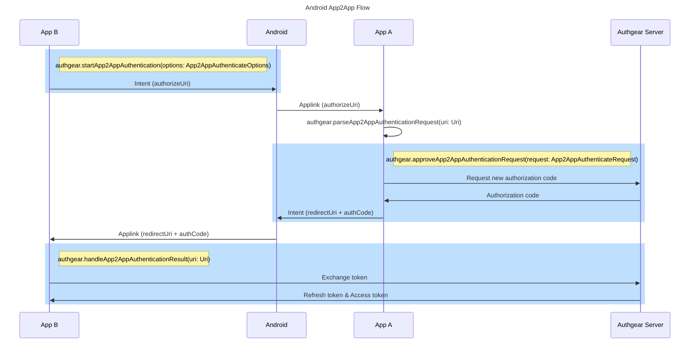
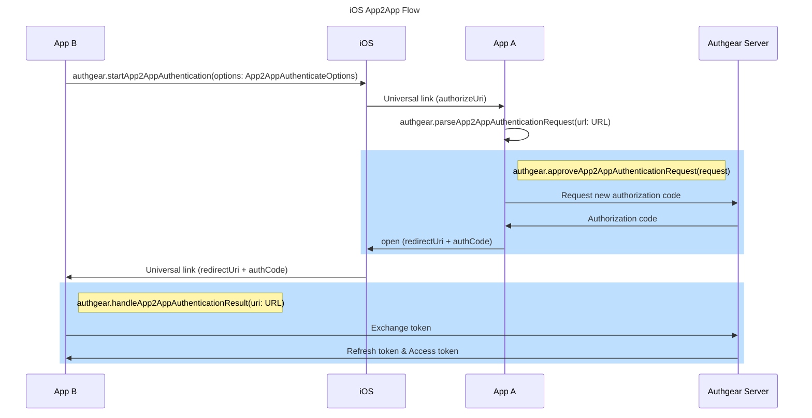

# App-to-App authentication

- [Abstract](#abstract)
- [Implementation details](#implementation-details)
  - [Terminology](#terminology)
  - [Server-side](#server-side)
  - [Android](#android)
    - [Android SDK](#android-sdk)
  - [iOS](#ios)
    - [iOS SDK](#ios-sdk)
- [Biometric Support](#biometric-support)
  - [Terminology](#biometric-terminology)
  - [Rationale](#biometric-rationale)
  - [Server-side](#biometric-server-side)
  - [iOS](#biometric-ios)
  - [Android](#biometric-android)
- [Related Readings](#related-readings)

## Abstract

App2app is a mechanism to allow authenticating through another app, which is installed in the same device.

The implementation described in this spec is based on [this blog post](https://openid.net/guest-blog-implementing-app-to-app-authorisation-in-oauth2-openid-connect/).

An app can start the authentication flow by opening a link to another app, instead of using the authorization endpoint. The app which handles the link should validate the authentication request, then could return a valid authorization code which could be used to perform code exchange in oidc.

## Implementation details

### Terminology

- Device key
  - A key pair which the private key should be stored in a secure storage in the device, generated per device for the use the app2app authentication.
  - The purpose of the key is to prove a refresh token does not leave the device which should own it.
  - It requires no user interaction to use the key.
  - It is re-generated for new refresh tokens. Therefore it is per device per refresh token (or offline grant).

### Server-side

- Configuration

  - A app2app section will be added to the client configs.

  ```yaml
  oauth:
    clients:
      - client_id: CLIENT_ID
        # ...Other configs
        x_app2app_enabled: true
        x_app2app_insecure_device_key_binding_enabled: false
  ```

  - `x_app2app_enabled`: boolean. Whether the client is able to handle app2app authentication requests from other clients.
  - `x_app2app_insecure_device_key_binding_enabled`: boolean. Default `false`. If `true`, offline grant of this client without a bound device key can be bound to a new device key when using the new grant type `urn:authgear:params:oauth:grant-type:app2app`. This option is for allowing existing logged in users to use app2app without requiring them to re-login. However this also allows sessions without a bound device key to be bound with any key and participate in app2app authentication which might be a security concern.

- Token Endpoint

  - For `grant_type=authorization_code`, a new parameter `x_app2app_device_key_jwt` is supported. This value can be specified by the client to enable app2app login. If specified, it should be a jwt signed by the private key of the device key, and containing the public key of that key pair in header, with a `challenge` obtained from server in payload. `x_app2app_device_key_jwt` will be ignored if `x_app2app_enabled` of the client configuration is not `true`.

  - A new grant_type `urn:authgear:params:oauth:grant-type:app2app` is supported. When using such grant_type, The following must be provided in the request:
    - `refresh_token`: a valid refresh token.
    - `client_id`: the authenticating client id.
    - `jwt`: a jwt with a challenge token obtained from the `/oauth2/challenge` api, signed with the private key of the device key bound to the refresh token. If `x_app2app_insecure_device_key_binding_enabled` is `true`, a jwt with a new device key will be allowed if there were no device key bound in the current offline grant. In this case the new key will be bound to the offline grant after the request.
    - `redirect_uri`: the redirect uri used to return the result to the authenticating app. The server checks if `redirect_uri` is listed in the `redirect_uris` of the client indicated by `client_id`.
  - The server will verify the signature, and generates a new authorization code associated with `client_id`. The client can then use this code to perform code exchange with `grant_type=authorization_code` and obtain a new set of refresh token and access tokens.

### Android



In android, app2app works with the following flow:

Assume there are two apps, A and B. App A is holding a valid user session, and app B is trying to authenticate through app A.

- App A

  - The client id is `client_a`
  - App A is able to handle applinks in domain `https://a.example.com/` with a properly setup [.well-known/assetlinks.json](https://developer.android.com/training/app-links/verify-android-applinks) file.

- App B

  - The `redirect_uris` includes `https://b.example.com/redirect`
  - The client id is `client_b`
  - App A is able to handle applinks in domain `https://b.example.com/` with a properly setup [.well-known/assetlinks.json](https://developer.android.com/training/app-links/verify-android-applinks) file.

1. App B initiates an app2app authentication flow using an intent with uri `https://a.example.com/authorize?client_id=client_a&redirect_uri=https%3A%2F%2Fb.example.com%2Fredirect&code_challenge=CHALLENGE`.

   - The parameters of the uri are:

     - `client_id`: The client id of the initiating app.
     - `redirect_uri`: The redirect uri used to recieve the authentication result.
     - `code_challenge`: The PKCE code challenge with the same purpose in the oidc authorize endpoint.

   - For security reason, App B should verify the signature of the app that is going to handle the intent by:
     - Fetching the `.well-known/assetlinks.json` from the domain of the uri. In this example it will be `https://a.example.com/.well-known/assetlinks.json`.
     - Obtain the package name and signature of the app which is going to handle the uri.
     - Find the `"delegate_permission/common.handle_all_urls"` relation, and obtain the related `package_name` and `sha256_cert_fingerprints` from the section. Verify it with the package name and signature obtained in the previous step. If none of the items match, returns error.
     - After validated the package name and signature, start an activity with an intent with the above uri.

2. App A handles the intent.

   - If App A is not authenticated, it can call `authenticate()` to obtain a valid session before performing the following steps.
   - Find out the package name of the app which will handle the `redirect_uri`.
   - Verify the signature of the above app by using the `.well-known/assetlinks.json` file, from the domain of the `redirect_uri`. In this example it is `https://b.example.com/.well-known/assetlinks.json`.
   - Call the token endpoint with `grant_type=urn:authgear:params:oauth:grant-type:app2app`.
     - `refresh_token` should be the refresh token of the existing session of App A.
     - `client_id` should be obtained from the intent uri, which is the authorizing app.
     - `jwt`: Refer to the Server-side section for details.
     - `redirect_uri` should be the redirect uri provided. The server will validate if it is a valid redirect uri.
   - Create an intent with the redirect uri, with the following parameters appended to the uri:
     - `code`: The new authorization code.
     - In this example it should be `https://b.example.com/redirect?code=CODE`

3. App B handles the redirect uri intent.

   - Extract `code` from the uri and use it to perform the code exchange.

#### Android SDK

The following parameter will be added to constructor of `Authgear`:

- `app2appOptions: App2AppOptions?`
  - App2app options. If `null`, this app cannot authenticate other apps through app2app.
  - `App2AppOptions` contains the following fields:
    - `isEnabled`: If true, new sessions will be prepared for participating in app2app authentication.
    - `isInsecureDeviceKeyBindingEnabled`: If true, the sdk will try to create and bind device key during `approveApp2AppAuthenticationRequest` to "migrate" to app2app sessions.

The following methods will be added in android sdk to support the app2app flow:

- `startApp2AppAuthentication(options: App2AppAuthenticateOptions)`
  - This method should be called to trigger a new app2app authorization request through another client.
  - `App2AppAuthenticateOptions.authorizationEndpoint` should be an url of an applink pointing to another client which handles the app2app authentication request.
  - `App2AppAuthenticateOptions.redirectUri` should be an uri for the another client to return the authentication result. It must be an applink which opens the current app.
  - `App2AppAuthenticateOptions.state`: Opaque value used to maintain state between the request and the callback. Same purpose as [state in oidc](https://openid.net/specs/openid-connect-core-1_0.html#AuthRequest).
- `parseApp2AppAuthenticationRequest(uri: Uri): App2AppAuthenticateRequest?`
  - Parse an url into an `App2AppAuthenticateRequest`, or `null` if the uri is not a valid app2app request.
- `approveApp2AppAuthenticationRequest(request: App2AppAuthenticateRequest)`
  - Approves an app2app request received from another client, returning a result through the redirect uri.
  - `request` should be the return value of `parseApp2AppAuthenticationRequest`.
  - This method must be called when then sdk session state is `AUTHENTICATED`, and the current session supported app2app authentication by providing a device key, else an error will be thrown.
- `rejectApp2AppAuthenticationRequest(request: App2AppAuthenticateRequest, error: Error)`
  - Rejects an app2app request received from another client, returning an error through the redirect uri.
  - `request` should be the return value of `parseApp2AppAuthenticationRequest`.
  - `error` is the reason to reject the request.

### iOS



In iOS, app2app works with the following flow:

Assume there are two apps, A and B. App A is holding a valid user session, and app B is trying to authenticate through app A.

- App A

  - The app is assiociated with the domain `https://a.example.com/` and therefore able to handle universal links to the domain.
  - The client id is `client_a`

- App B

  - The `redirect_uris` includes `https://b.example.com/redirect`
  - The app is assiociated with the domain `https://b.example.com/` and therefore able to handle universal links to the domain.
  - The client id is `client_b`

1. App B initiates an app2app authentication flow by opening an universal link with url `https://a.example.com/authorize?client_id=client_a&redirect_uri=https%3A%2F%2Fb.example.com%2Fredirect&code_challenge=CHALLENGE`.

   - For security reason, App B should only allow opening the url with universal link, or it should be an error.
   - The parameters of the uri is as follows:
     - `client_id`: The client id of the initiating app.
     - `redirect_uri`: The redirect uri used to recieve the authentication result.
     - `code_challenge`: The PKCE code challenge with the same purpose in the oidc authorize endpoint.

2. App A handles the universal link.

   - If App A is not authenticated, it can call `authenticate()` to obtain a valid session before performing the following steps.
   - Call the token endpoint with `grant_type=urn:authgear:params:oauth:grant-type:app2app`.
     - `refresh_token` should be the refresh token of the existing session of App A.
     - `client_id` should be obtained from the intent uri, which is the authorizing app.
     - `jwt`: Refer to the Server-side section for details.
     - `redirect_uri` should be the redirect uri provided. The server will validate if it is a valid redirect uri.
   - Open the redirect uri as a universal link, with the following parameters appended:
     - `code`: The new authorization code.
     - In this example the link opened should be `https://b.example.com/redirect?code=CODE`
   - Ensure the redirect uri is only opened as an universal link, else it should be be an error.

3. App B handles the universal link with the result.

   - Extract `code` from the url and use it to perform the code exchange.

#### iOS SDK

The following parameters will be added to constuctor of `Authgear`:

- `app2appOptions: App2AppOptions?`
  - app2app options. If `null`, this app cannot authenticate other apps through app2app.
  - `App2AppOptions` contains the following fields:
    - `isEnabled`: If true, new sessions will be prepared for participating in app2app authentication.
    - `isInsecureDeviceKeyBindingEnabled`: If true, the sdk will try to create and bind device key during `approveApp2AppAuthenticationRequest` to "migrate" to app2app sessions.

The following methods will be added in android sdk to support the app2app flow:

- `startApp2AppAuthentication(options: App2AppAuthenticateOptions)`
  - This method should be called to trigger a new app2app authorization request through another client.
  - `App2AppAuthenticateOptions.authorizationEndpoint` should be an url of an universal link pointing to another client which handles the app2app authentication request.
  - `App2AppAuthenticateOptions.redirectUri` should be an uri for the another client to return the authentication result. It must be an universal link which opens the current app.
  - `App2AppAuthenticateOptions.state`: Opaque value used to maintain state between the request and the callback. Same purpose as [state in oidc](https://openid.net/specs/openid-connect-core-1_0.html#AuthRequest).
- `parseApp2AppAuthenticationRequest(url: URL): App2AppAuthenticateRequest?`
  - Parse an url into an `App2AppAuthenticateRequest`, or `null` if the url is not a valid app2app request.
- `approveApp2AppAuthenticationRequest(request: App2AppAuthenticateRequest)`
  - Approves an app2app request received from another client, returning a result through the redirect uri.
  - `request` should be the return value of `parseApp2AppAuthenticationRequest`.
  - This method must be called when then sdk session state is `AUTHENTICATED`, and the current session supported app2app authentication by providing a `device_key`, else an error will be thrown.
- `rejectApp2AppAuthenticationRequest(request: App2AppAuthenticateRequest, error: Error)`
  - Rejects an app2app request received from another client, returning an error through the redirect uri.
  - `request` should be the return value of `parseApp2AppAuthenticationRequest`.
  - `error` is the reason to reject the request.
- `handleApp2AppAuthenticationResult(url: URL)`
  - This method should be called by the app which triggers the app2app authentication flow, and received the result through the redirect uri as an intent. `url` should be the URL of the universal link received.

## Biometric Support

Considering using app2app together with biometric authentication could be a common use case of app2app, we are going to support app2app with biometric authentication.

The idea is to allow the user to approve app2app requests together with biometric login.

<a id="biometric-terminology"></a>

### Terminology

- Biometric key
  - A key pair which the private key should be stored in a secure storage in the device, and protected by biometric authentication by the device.

<a id="biometric-rationale"></a>

### Rationale

- What we want to prove:

  - The person who approves the app2app request is the same person who setup biometric login in this device.

- Assumptions

  - Biometric keys are stored in a storage which any access to the key must pass a biometric authentication.
  - Biometric keys can only be used in one device.

- How to prove:
  - Since biometric keys are only accessible by the person who created it, and can only be used in the same device. If the client can provide a jwt which is signed by the biometric key, it is proven that the request it sent by the person to setup biometric login in the device.

<a id="biometric-server-side"></a>

### Server-side

- Support requiring biometric protected app2app device key in client config

  ```yaml
  oauth:
    clients:
      - client_id: CLIENT_ID
        # ...Other configs
        x_app2app_biometric_protection_required: true
  ```

  `x_app2app_biometric_protection_required` will be added to the client config. If it was set to `true`, the client is unable to issue new authorization code in `grant_type=urn:authgear:params:oauth:grant-type:app2app` if the current app2app device key is not protected by biometric authentication. See below for detailed implementation.

- Support app2app in biometric authentication requests

  We supported biometric authentication using `grant_type=urn:authgear:params:oauth:grant-type:biometric-request`. Currently, there are two supported actions in this `grant_type`, `setup` and `authenticate`.

  We will add one more action `authenticate_app2app`. If the server received a biometric-request request with this action, it should:

  - Do all things we did in `authenticate`, which generates new access token and refresh token.
  - Perform app2app authentication as what `grant_type=urn:authgear:params:oauth:grant-type:app2app` did, using the newly generated refresh token, and return the generated authorization code along with the response.

- Reject app2app authentication requests according to new configs

  If `x_app2app_biometric_protection_required` is `true`, we will reject any requests of `grant_type=urn:authgear:params:oauth:grant-type:app2app` to force the user to use `grant_type=urn:authgear:params:oauth:grant-type:biometric-request` with `authenticate_app2app` action to perform app2app.

<a id="biometric-ios"></a>

#### iOS

- A new method `approveApp2AppBiometricAuthenticationRequest(request: App2AppAuthenticateRequest, options?: BiometricOptions)` will be added.

  - `request` is the `App2AppAuthenticateRequest` returned by `parseApp2AppAuthenticationRequest`.
  - `options` defines how the user should be authenticated in the device. This must match the options provided during `enableBiometric` or the sdk may not be able to access the biometric key in the device.

  - Implementation:
    - Use `options` to create a authentication prompt. The authentication process should be handled by the OS.
    - After the user passed the authentication, use the biometric key to create a jwt with `action=authenticate_app2app`. Include the target app2app client id in payload using the field `client_id`.
    - Call token endpoint with `grant_type=urn:authgear:params:oauth:grant-type:biometric-request` and the generated jwt. Obtain a new set of access and refresh tokens, with a authorization code for the client id passed as `client_id`.
    - Return the authorization code using redirect uri in `request`.

#### Android

Same as iOS, with platform specific biometric authentication options in `BiometricOptions`.

#### Relationship with `x_app2app_insecure_device_key_binding_enabled`

When using biometric app2app, `x_app2app_insecure_device_key_binding_enabled` has no effect.

## Related Readings

- [OpenID Connect Client-Initiated Backchannel Authentication Flow - Core 1.0](https://openid.net/specs/openid-client-initiated-backchannel-authentication-core-1_0.html#rfc.section.7.1.1)
  - A flow allowing cross device authentication. However as the use case is a bit different from the app2app flow, we decided to implement the app2app flow instead of the CIBA flow.
