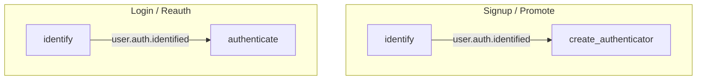
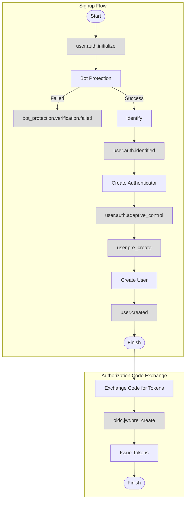
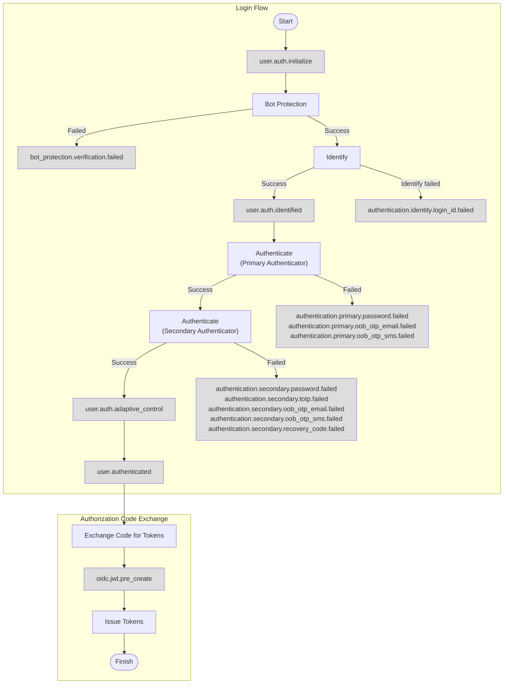

- [Event](#event)
  * [Event Definition](#event-definition)
  * [Event Shape](#event-shape)
    + [Event Shape Versioning](#event-shape-versioning)
    + [Event Context](#event-context)
  * [Event List](#event-list)
    + [Blocking Events](#blocking-events)
      - [user.pre_create](#userpre_create)
      - [user.profile.pre_update](#userprofilepre_update)
      - [user.pre_schedule_deletion](#userpre_schedule_deletion)
      - [user.pre_schedule_anonymization](#userpre_schedule_anonymization)
      - [user.auth.initialize](#userauthinitialize)
      - [user.auth.identified](#userauthidentified)
      - [user.auth.adaptive_control](#userauthadaptive_control)
      - [oidc.jwt.pre_create](#oidcjwtpre_create)
    + [Non-blocking Events](#non-blocking-events)
      - [user.created](#usercreated)
      - [user.profile.updated](#userprofileupdated)
      - [user.authenticated](#userauthenticated)
      - [user.signed_out](#usersigned_out)
      - [user.session.terminated](#usersessionterminated)
      - [user.anonymous.promoted](#useranonymouspromoted)
      - [user.disabled](#userdisabled)
      - [user.reenabled](#userreenabled)
      - [user.deletion_scheduled](#userdeletion_scheduled)
      - [user.deletion_unscheduled](#userdeletion_unscheduled)
      - [user.deleted](#userdeleted)
      - [user.anonymization_scheduled](#useranonymization_scheduled)
      - [user.anonymization_unscheduled](#useranonymization_unscheduled)
      - [user.anonymized](#useranonymized)
      - [authentication.identity.login_id.failed](#authenticationidentitylogin_idfailed)
      - [authentication.identity.anonymous.failed](#authenticationidentityanonymousfailed)
      - [authentication.identity.biometric.failed](#authenticationidentitybiometricfailed)
      - [authentication.primary.password.failed](#authenticationprimarypasswordfailed)
      - [authentication.primary.oob_otp_email.failed](#authenticationprimaryoob_otp_emailfailed)
      - [authentication.primary.oob_otp_sms.failed](#authenticationprimaryoob_otp_smsfailed)
      - [authentication.secondary.password.failed](#authenticationsecondarypasswordfailed)
      - [authentication.secondary.totp.failed](#authenticationsecondarytotpfailed)
      - [authentication.secondary.oob_otp_email.failed](#authenticationsecondaryoob_otp_emailfailed)
      - [authentication.secondary.oob_otp_sms.failed](#authenticationsecondaryoob_otp_smsfailed)
      - [authentication.secondary.recovery_code.failed](#authenticationsecondaryrecovery_codefailed)
      - [bot_protection.verification.failed](#bot_protectionverificationfailed)
      - [identity.email.added](#identityemailadded)
      - [identity.email.removed](#identityemailremoved)
      - [identity.email.updated](#identityemailupdated)
      - [identity.phone.added](#identityphoneadded)
      - [identity.phone.removed](#identityphoneremoved)
      - [identity.phone.updated](#identityphoneupdated)
      - [identity.username.added](#identityusernameadded)
      - [identity.username.removed](#identityusernameremoved)
      - [identity.username.updated](#identityusernameupdated)
      - [identity.oauth.connected](#identityoauthconnected)
      - [identity.oauth.disconnected](#identityoauthdisconnected)
      - [identity.biometric.enabled](#identitybiometricenabled)
      - [identity.biometric.disabled](#identitybiometricdisabled)

# Event

## Event Definition

Events are triggered when an operation is performed.

Events have two kinds, namely Blocking and Non-blocking.

Blocking event is triggered before the operation is performed. The operation can be aborted by Hooks.

Non-blocking event is triggered after the operation is performed.

## Event Shape

All events have the following shape:

```json5
{
  "id": "0E1E9537-DF4F-4AF6-8B48-3DB4574D4F24",
  "seq": 435,
  "type": "user.created",
  "payload": { /* ... */ },
  "context": { /* ... */ }
}
```

- `id`: The ID of the event.
- `seq`: A monotonically increasing signed 64-bit integer.
- `type`: The type of the event.
- `payload`: The payload of the event, varies with type.
- `context`: The context of the event.

### Event Shape Versioning

All fields are guaranteed that only backward-compatible changes would be made.

- Existing fields would not be removed or changed in meaning.
- New fields may be added.

### Event Context

- `app_id`: The app ID.
- `client_id`: The client id, if present.
- `timestamp`: signed 64-bit UNIX timestamp of when this event is generated. Retried deliveries do not affect this field.
- `user_id`: The ID of the user associated with the event. It may be absent. For example, the user has not authenticated yet.
- `ip_address`: The IP address of the HTTP request, if present.
- `user_agent`: The User-Agent HTTP request header, if present.
- `triggered_by`: The origin of the event.
  - `user`: The event originates from a end-user facing UI.
  - `admin_api`: The event originates from the Admin API.
  - `system`: The event originates from a background job.
  - `portal`: The event originates from the management portal.
- `preferred_languages`: User preferred languages which are inferred from the request. It is the value of `ui_locales` query parameter if it is provided, or the value of the `Accept-Language` header. It is an empty array when the event is not generated by the end user.
- `language`: The locale which is derived based on user's preferred languages and app's languages config. The fallback value is the fallback language of the app.
- `geo_location_code`: The (ISO 3166-1 alpha-2 code)[https://www.iban.com/country-codes] of the location derived from the ip address. `null` if the location cannot be determined by the ip address, for example, it is an internal ip address.
- `oauth`: Data related to OAuth. The field does not exist if the event is not from an OAuth flow (Such as SAML login).
  - `state`: `state` of the authorization request.
  - `x_state`: `x_state` of the authorization request.

## Event List

### Blocking Events

- [user.pre_create](#userpre_create)
- [user.profile.pre_update](#userprofilepre_update)

Blocking event Hooks can perform mutations. See [Blocking Event Mutations](./hook.md#blocking-event-mutations).

#### user.pre_create

Occurs right before the user creation. User can be created by user signup, user signup as anonymous user, admin api or admin portal create an user.

```json5
{
  "context": {
    ....
    "oauth": {
      "state": "the-value-of-state-if-provided"
    }
  },
  "payload": {
    "user": { /* ... */ },
    "identities": [ { /* ... */ } ]
  }
}
```

- `oauth.state`: OAuth state if the signup is triggered through authorize endpoint with state parameter.

#### user.profile.pre_update

Occurs right before the update of user profile.

```json5
{
  "payload": {
    "user": { /* ... */ }
  }
}
```

#### user.pre_schedule_deletion

Occurs right before the account deletion is scheduled.

```json5
{
  "payload": {
    "user": { /* ... */ }
  }
}
```

#### user.pre_schedule_anonymization

Occurs right before the account anonymization is scheduled.

```json5
{
  "payload": {
    "user": { /* ... */ }
  }
}
```

#### user.auth.initialize

Occurs right before any authentication, such as login.

Example payload:

```json5
{
  "authentication": {
    "authentication_flow": {
      "type": "login",
      "name": "default"
    }
  }
}
```

#### user.auth.identified



Occurs right after an identity is identified during authentication, such as login.

Example payload:

```json5
{
  "payload": {
    "authentication": {
      "authentication_flow": {
        "type": "login",
        "name": "default"
      },
      "user": { /* The identified user */
        "id": "c1397fc7-10ff-4cbd-bdc9-6fd9ae829c86",
        "is_anonymized": false,
        "is_anonymous": false,
        "is_deactivated": false,
        "is_disabled": false,
        "is_verified": true,
        "last_login_at": "2025-05-27T06:32:54.072273Z",
        "roles": [],
        "groups": [],
        "standard_attributes": {
          "email": "user@example.com",
          "email_verified": true
        },
        "custom_attributes": {},
        "created_at": "2025-05-27T06:32:54.005206Z",
        "updated_at": "2025-05-27T06:32:54.066087Z"
      },
      "used_identities": [
        { /* The identified identities in the current authentication */
          "id": "8f84ed75-5c8b-45c1-b657-b0c65ac3affe",
          "claims": {
            "email": "user@example.com",
            "email_verified": true,
            "family_name": "Authgear",
            "given_name": "Test",
            "https://authgear.com/claims/oauth/provider_alias": "google",
            "https://authgear.com/claims/oauth/provider_type": "google",
            "https://authgear.com/claims/oauth/subject_id": "1234567",
            "name": "Test Authgear"
          },
          "type": "oauth",
          "created_at": "2025-05-27T06:32:54.02264Z",
          "updated_at": "2025-05-27T06:32:54.02264Z"
        },
      ],
      "used_authenticators": [],
    },
    "identity": { /* The identified identity */
      "id": "8f84ed75-5c8b-45c1-b657-b0c65ac3affe",
      "claims": {
        "email": "user@example.com",
        "email_verified": true,
        "family_name": "Authgear",
        "given_name": "Test",
        "https://authgear.com/claims/oauth/provider_alias": "google",
        "https://authgear.com/claims/oauth/provider_type": "google",
        "https://authgear.com/claims/oauth/subject_id": "1234567",
        "name": "Test Authgear"
      },
      "type": "oauth",
      "created_at": "2025-05-27T06:32:54.02264Z",
      "updated_at": "2025-05-27T06:32:54.02264Z"
    }
  }
}
```

#### user.auth.adaptive_control

```mermaid
flowchart TD
 subgraph Signup["Signup / Promote"]
        signup_create_authenticator["create_authenticator"]
        signup_create_authenticator_2fa["create_authenticator"]
        signup_identify["identify"]
        signup_adaptive_control[user.auth.adaptive_control]:::event
        signup_contraints@{ shape: diamond, label: "contraints.amr === [\"mfa\"]?" }
        signup_finish["Finish"]
  end
    signup_identify --> signup_create_authenticator
    signup_create_authenticator --> signup_adaptive_control
    signup_adaptive_control -- "response" --> signup_contraints
    signup_contraints -- "yes" --> signup_create_authenticator_2fa
    signup_contraints -- "no" --> signup_finish
    signup_create_authenticator_2fa --> signup_finish
  subgraph Login["Login / Reauth"]
        login_authenticate["authenticate"]
        login_authenticate_2fa["authenticate"]
        login_identify["identify"]
        login_adaptive_control[user.auth.adaptive_control]:::event
        login_contraints@{ shape: diamond, label: "contraints.amr === [\"mfa\"]?" }
        login_finish["Finish"]
  end
    login_identify --> login_authenticate
    login_authenticate --> login_adaptive_control
    login_adaptive_control -- "response" --> login_contraints
    login_contraints -- "yes" --> login_authenticate_2fa
    login_contraints -- "no" --> login_finish
    login_authenticate_2fa --> login_finish
    
  classDef event fill:#dddddd
```



Occurs right before any authentication completes, such as login.

Example payload:

```json5
{
  "payload": {
    "authentication": {
      "authentication_flow": { 
        "type": "login",
        "name": "default"
      },
      "user": { /* The identified user */
        "id": "c1397fc7-10ff-4cbd-bdc9-6fd9ae829c86",
        "is_anonymized": false,
        "is_anonymous": false,
        "is_deactivated": false,
        "is_disabled": false,
        "is_verified": true,
        "last_login_at": "2025-05-27T06:32:54.072273Z",
        "roles": [],
        "groups": [],
        "standard_attributes": {
          "email": "user@example.com",
          "email_verified": true
        },
        "custom_attributes": {},
        "created_at": "2025-05-27T06:32:54.005206Z",
        "updated_at": "2025-05-27T06:32:54.066087Z"
      },
      "used_identities": [
        { /* The identified identities in the current authentication */
          "id": "8f84ed75-5c8b-45c1-b657-b0c65ac3affe",
          "claims": {
            "email": "user@example.com",
            "email_verified": true,
            "family_name": "Authgear",
            "given_name": "Test",
            "https://authgear.com/claims/oauth/provider_alias": "google",
            "https://authgear.com/claims/oauth/provider_type": "google",
            "https://authgear.com/claims/oauth/subject_id": "1234567",
            "name": "Test Authgear"
          },
          "type": "oauth",
          "created_at": "2025-05-27T06:32:54.02264Z",
          "updated_at": "2025-05-27T06:32:54.02264Z"
        },
      ],
      "used_authenticators": [ /* Authenticator used during the authentication */
        {
          "id": "2a6f9927-c76c-4112-868a-879547239266",
          "type": "oob_otp_sms",
          "kind": "primary"
        }
      ],
    },
  }
}
```

#### oidc.jwt.pre_create

Occurs right before the access token is issued.
Use this event to add custom fields to the JWT access token.

```json5
{
  "payload": {
    "user": { /* ... */ },
    "identities": [ ],
    "jwt": {
      "payload": {
        "iss": "issuer",
        "aud": ["audience"]
        "sub": "user_id"
      }
    }
  }
}
```

- `identities`: This contain all Login ID identities, OAuth identities, or LDAP identities that the user has.

### Non-blocking Events

- [user.created](#usercreated)
- [user.profile.updated](#userprofileupdated)
- [user.authenticated](#userauthenticated)
- [user.signed_out](#usersigned-out)
- [user.session.terminated](#usersessionterminated)
- [user.anonymous.promoted](#useranonymouspromoted)
- [authentication.identity.login_id.failed](#authenticationidentitylogin-idfailed)
- [authentication.identity.anonymous.failed](#authenticationidentityanonymousfailed)
- [authentication.identity.biometric.failed](#authenticationidentitybiometricfailed)
- [authentication.primary.password.failed](#authenticationprimarypasswordfailed)
- [authentication.primary.oob_otp_email.failed](#authenticationprimaryoob-otp-emailfailed)
- [authentication.primary.oob_otp_sms.failed](#authenticationprimaryoob-otp-smsfailed)
- [authentication.secondary.password.failed](#authenticationsecondarypasswordfailed)
- [authentication.secondary.totp.failed](#authenticationsecondarytotpfailed)
- [authentication.secondary.oob_otp_email.failed](#authenticationsecondaryoob-otp-emailfailed)
- [authentication.secondary.oob_otp_sms.failed](#authenticationsecondaryoob-otp-smsfailed)
- [authentication.secondary.recovery_code.failed](#authenticationsecondaryrecovery-codefailed)
- [bot_protection.verification.failed](#bot-protectionverificationfailed)
- [identity.email.added](#identityemailadded)
- [identity.email.removed](#identityemailremoved)
- [identity.email.updated](#identityemailupdated)
- [identity.phone.added](#identityphoneadded)
- [identity.phone.removed](#identityphoneremoved)
- [identity.phone.updated](#identityphoneupdated)
- [identity.username.added](#identityusernameadded)
- [identity.username.removed](#identityusernameremoved)
- [identity.username.updated](#identityusernameupdated)
- [identity.oauth.connected](#identityoauthconnected)
- [identity.oauth.disconnected](#identityoauthdisconnected)
- [identity.biometric.enabled](#identitybiometricenabled)
- [identity.biometric.disabled](#identitybiometricdisabled)

#### user.created

Occurs after a new user is created. User can be created by user signup, user signup as anonymous user, admin api or admin portal create an user.

```json5
{
  "payload": {
    "user": { /* ... */ },
    "identities": [ { /* ... */ } ]
  }
}
```

#### user.profile.updated

Occurs when the user profile is updated.

```json5
{
  "payload": {
    "user": { /* ... */ }
  }
}
```

#### user.authenticated

Occurs after user logged in.

```json5
{
  "payload": {
    "user": { /* ... */ },
    "session": { /* ... */ }
  }
}
```

#### user.signed_out

Occurs after the user signed out.
Note that there is no event when the session expires normally.

```json5
{
  "payload": {
    "user": { /* ... */ },
    "sessions": [ {/* ... */} ]
  }
}
```

#### user.session.terminated

Occurs after the user terminates sessions via the settings page, or the admin revokes users' sessions via the portal/admin api.

`termination_type` indicates how the sessions are terminated.

  - `individual`: The user/admin revokes an individual session. Multiple sessions may be deleted if they are in the same SSO group.
  - `all`: All sessions of a user are terminated. It usually happens when the admin terminates all sessions of a user.
  - `all_except_current`: All sessions except the current session are terminated. It usually happens when the user clicks terminated all other sessions on the settings page.

```json5
{
  "payload": {
    "user": { /* ... */ },
    "sessions": [ {/* ... */} ],
    "termination_type": "(individual|all|all_except_current)"
  }
}
```

#### user.anonymous.promoted

Occurs whenever an anonymous user is promoted to normal user.

```json5
{
  "payload": {
    "anonymous_user": { /* ... */ },
    "user": { /* ... */ },
    "identities": [{ /* ... */ }]
  }
}
```

#### user.disabled

Occurs when the user was disabled.

```json5
{
  "payload": {
    "user": { /* ... */ }
  }
}
```

#### user.reenabled

Occurs when the user was re-enabled.

```json5
{
  "payload": {
    "user": { /* ... */ }
  }
}
```

#### user.deletion_scheduled

Occurs when an account deletion was scheduled.

```json5
{
  "payload": {
    "user": { /* ... */ }
  }
}
```

#### user.deletion_unscheduled

Occurs when an account deletion was unscheduled.

```json5
{
  "payload": {
    "user": { /* ... */ }
  }
}
```

#### user.deleted

Occurs when the user was deleted.

```json5
{
  "payload": {
    "user": { /* ... */ }
  }
}
```

#### user.anonymization_scheduled

Occurs when an account anonymization was scheduled.

```json5
{
  "payload": {
    "user": { /* ... */ }
  }
}
```

#### user.anonymization_unscheduled

Occurs when an account anonymization was unscheduled.

```json5
{
  "payload": {
    "user": { /* ... */ }
  }
}
```

#### user.anonymized

Occurs when the user was anonymized.

```json5
{
  "payload": {
    "user": { /* ... */ }
  }
}
```

#### authentication.identity.login_id.failed

Occurs after a Email / Phone / Username Login ID was attempted to log in but it does not exist.

```json5
{
  "payload": {
    "login_id": "..."
  }
}
```

#### authentication.identity.anonymous.failed

Occurs after an anonymous user attempted to log in but failed to do so.

```json5
{
  "payload": {
    "user": { /* ... */ }
  }
}
```

#### authentication.identity.biometric.failed

Occurs after an user attempted to log in with biometric but failed to do so.

```json5
{
  "payload": {
    "user": { /* ... */ }
  }
}
```

#### authentication.primary.password.failed

Occurs after the user failed to input their primary password.

```json5
{
  "payload": {
    "user": { /* ... */ }
  }
}
```

#### authentication.primary.oob_otp_email.failed

Occurs after the user failed to input the OTP delivered to their email address.

```json5
{
  "payload": {
    "user": { /* ... */ }
  }
}
```

#### authentication.primary.oob_otp_sms.failed

Occurs after the user failed to input the OTP delivered to their phone.

```json5
{
  "payload": {
    "user": { /* ... */ }
  }
}
```

#### authentication.secondary.password.failed

Occurs after the user failed to input their secondary password.

```json5
{
  "payload": {
    "user": { /* ... */ }
  }
}
```

#### authentication.secondary.totp.failed

Occurs after the user failed to input the time-based one-time password.

```json5
{
  "payload": {
    "user": { /* ... */ }
  }
}
```

#### authentication.secondary.oob_otp_email.failed

Occurs after the user failed to input the OTP delivered to their email address.

```json5
{
  "payload": {
    "user": { /* ... */ }
  }
}
```

#### authentication.secondary.oob_otp_sms.failed

Occurs after the user failed to input the OTP delivered to their phone.

```json5
{
  "payload": {
    "user": { /* ... */ }
  }
}
```

#### authentication.secondary.recovery_code.failed

Occurs after the user failed to input the recovery code.

```json5
{
  "payload": {
    "user": { /* ... */ }
  }
}
```

#### bot_protection.verification.failed

Occurs after someone failed to pass the bot protection verification.

```json5
{
  "payload": {
    /* The useful information is in the event context, like IP address, timestamp */
  }
}
```

#### identity.email.added

Occurs when a new email is added to existing user. Email can be added by user in setting page, added by admin through admin api or portal.

```json5
{
  "payload": {
    "user": { /* ... */ },
    "identity": { /* ... */ }
  }
}
```


#### identity.email.removed

Occurs when email is removed from existing user. Email can be removed by user in setting page, removed by admin through admin api or portal.

```json5
{
  "payload": {
    "user": { /* ... */ },
    "identity": { /* ... */ }
  }
}
```


#### identity.email.updated

Occurs when email is updated. Email can be updated by user in setting page.

```json5
{
  "payload": {
    "user": { /* ... */ },
    "old_identity": { /* ... */ },
    "new_identity": { /* ... */ }
  }
}
```

#### identity.phone.added

Occurs when a new phone number is added to existing user. Phone number can be added by user in setting page, added by admin through admin api or portal.

```json5
{
  "payload": {
    "user": { /* ... */ },
    "identity": { /* ... */ }
  }
}
```


#### identity.phone.removed

Occurs when phone number is removed from existing user. Phone number can be removed by user in setting page, removed by admin through admin api or portal.

```json5
{
  "payload": {
    "user": { /* ... */ },
    "identity": { /* ... */ }
  }
}
```


#### identity.phone.updated

Occurs when phone number is updated. Phone number can be updated by user in setting page.


```json5
{
  "payload": {
    "user": { /* ... */ },
    "old_identity": { /* ... */ },
    "new_identity": { /* ... */ }
  }
}
```

#### identity.username.added

Occurs when a new username is added to existing user. Username can be added by user in setting page, added by admin through admin api or portal.

```json5
{
  "payload": {
    "user": { /* ... */ },
    "identity": { /* ... */ }
  }
}
```


#### identity.username.removed

Occurs when username is removed from existing user. Username can be removed by user in setting page, removed by admin through admin api or portal.

```json5
{
  "payload": {
    "user": { /* ... */ },
    "identity": { /* ... */ }
  }
}
```


#### identity.username.updated

Occurs when username is updated. Username can be updated by user in setting page.

```json5
{
  "payload": {
    "user": { /* ... */ },
    "old_identity": { /* ... */ },
    "new_identity": { /* ... */ }
  }
}
```

#### identity.oauth.connected

Occurs when user connected to a new OAuth provider.

```json5
{
  "payload": {
    "user": { /* ... */ },
    "identity": { /* ... */ }
  }
}
```

#### identity.oauth.disconnected

Occurs when user disconnected from an OAuth provider. It can be done by user disconnected OAuth provider in the setting page, or admin removed OAuth identity through admin api or portal.

```json5
{
  "payload": {
    "user": { /* ... */ },
    "identity": { /* ... */ }
  }
}
```

#### identity.biometric.enabled

Occurs when user enabled biometric login.

```json5
{
  "payload": {
    "user": { /* ... */ },
    "identity": { /* ... */ }
  }
}
```

#### identity.biometric.disabled

Occurs when biometric login is disabled. It will be triggered only when the user disabled it from the settings page or the admin disabled it from the admin api or portal.

```json5
{
  "payload": {
    "user": { /* ... */ },
    "identity": { /* ... */ }
  }
}
```

## Trigger Points

### Signup



### Login


