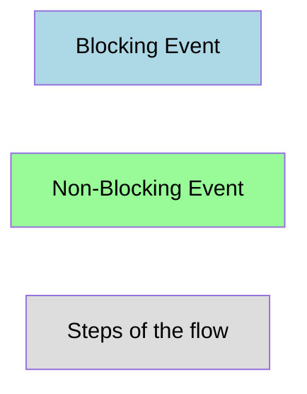
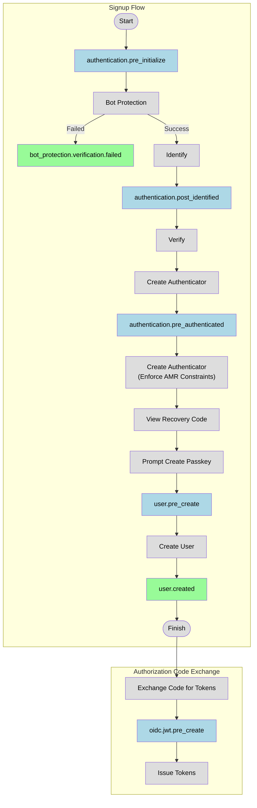
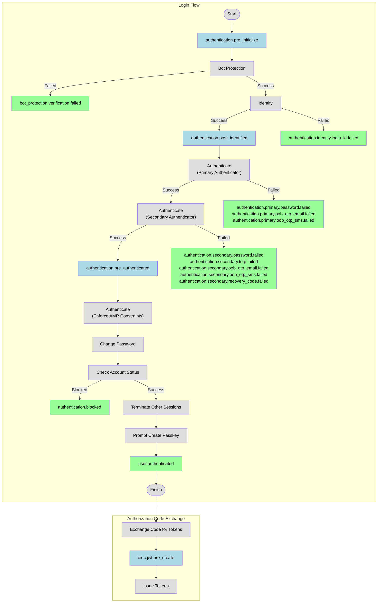

- [Event](#event)
  * [Event Definition](#event-definition)
  * [Event Shape](#event-shape)
    + [Event Shape Versioning](#event-shape-versioning)
    + [Event Context](#event-context)
  * [Event List](#event-list)
    + [Blocking Events](#blocking-events)
      - [user.pre_create](#userpre_create)
      - [user.profile.pre_update](#userprofilepre_update)
      - [user.pre_schedule_deletion](#userpre_schedule_deletion)
      - [user.pre_schedule_anonymization](#userpre_schedule_anonymization)
      - [authentication.pre_initialize](#authenticationpre_initialize)
      - [authentication.post_identified](#authenticationpost_identified)
      - [authentication.pre_authenticated](#authenticationpre_authenticated)
      - [oidc.jwt.pre_create](#oidcjwtpre_create)
      - [oidc.id_token.pre_create](#oidcid_tokenpre_create)
    + [Non-blocking Events](#non-blocking-events)
      - [user.created](#usercreated)
      - [user.profile.updated](#userprofileupdated)
      - [user.authenticated](#userauthenticated)
      - [user.reauthenticated](#userreauthenticated)
      - [user.signed_out](#usersigned_out)
      - [user.session.terminated](#usersessionterminated)
      - [user.anonymous.promoted](#useranonymouspromoted)
      - [user.disabled](#userdisabled)
      - [user.reenabled](#userreenabled)
      - [user.deletion_scheduled](#userdeletion_scheduled)
      - [user.deletion_unscheduled](#userdeletion_unscheduled)
      - [user.deleted](#userdeleted)
      - [user.anonymization_scheduled](#useranonymization_scheduled)
      - [user.anonymization_unscheduled](#useranonymization_unscheduled)
      - [user.anonymized](#useranonymized)
      - [authentication.identity.login_id.failed](#authenticationidentitylogin_idfailed)
      - [authentication.identity.anonymous.failed](#authenticationidentityanonymousfailed)
      - [authentication.identity.biometric.failed](#authenticationidentitybiometricfailed)
      - [authentication.primary.password.failed](#authenticationprimarypasswordfailed)
      - [authentication.primary.oob_otp_email.failed](#authenticationprimaryoob_otp_emailfailed)
      - [authentication.primary.oob_otp_sms.failed](#authenticationprimaryoob_otp_smsfailed)
      - [authentication.secondary.password.failed](#authenticationsecondarypasswordfailed)
      - [authentication.secondary.totp.failed](#authenticationsecondarytotpfailed)
      - [authentication.secondary.oob_otp_email.failed](#authenticationsecondaryoob_otp_emailfailed)
      - [authentication.secondary.oob_otp_sms.failed](#authenticationsecondaryoob_otp_smsfailed)
      - [authentication.secondary.recovery_code.failed](#authenticationsecondaryrecovery_codefailed)
      - [bot_protection.verification.failed](#bot_protectionverificationfailed)
      - [authentication.blocked](#authenticationblocked)
      - [identity.email.added](#identityemailadded)
      - [identity.email.removed](#identityemailremoved)
      - [identity.email.updated](#identityemailupdated)
      - [identity.phone.added](#identityphoneadded)
      - [identity.phone.removed](#identityphoneremoved)
      - [identity.phone.updated](#identityphoneupdated)
      - [identity.username.added](#identityusernameadded)
      - [identity.username.removed](#identityusernameremoved)
      - [identity.username.updated](#identityusernameupdated)
      - [identity.oauth.connected](#identityoauthconnected)
      - [identity.oauth.disconnected](#identityoauthdisconnected)
      - [identity.biometric.enabled](#identitybiometricenabled)
      - [identity.biometric.disabled](#identitybiometricdisabled)
      - [usage.alert.triggered](#usagealerttriggered)
    + [Events that support audit log](#events-that-support-audit-log)
  * [Trigger Points Diagrams](#trigger-points-diagrams)
    + [Signup](#signup)
    + [Login](#login)

# Event

## Event Definition

Events are triggered when an operation is performed.

Events have two kinds, namely Blocking and Non-blocking.

Blocking event is triggered before the operation is performed. The operation can be aborted by Hooks.

Non-blocking event is triggered after the operation is performed.

## Event Shape

All events have the following shape:

```json5
{
  "id": "0E1E9537-DF4F-4AF6-8B48-3DB4574D4F24",
  "seq": 435,
  "type": "user.created",
  "payload": { /* ... */ },
  "context": { /* ... */ }
}
```

- `id`: The ID of the event.
- `seq`: A monotonically increasing signed 64-bit integer.
- `type`: The type of the event.
- `payload`: The payload of the event, varies with type.
- `context`: The context of the event.

### Event Shape Versioning

All fields are guaranteed that only backward-compatible changes would be made.

- Existing fields would not be removed or changed in meaning.
- New fields may be added.

### Event Context

- `app_id`: The app ID.
- `client_id`: The client id, if present.
- `timestamp`: signed 64-bit UNIX timestamp of when this event is generated. Retried deliveries do not affect this field.
- `user_id`: The ID of the user associated with the event. It may be absent. For example, the user has not authenticated yet.
- `ip_address`: The IP address of the HTTP request, if present.
- `user_agent`: The User-Agent HTTP request header, if present.
- `trace_id`: The trace id for log tracing.
- `triggered_by`: The origin of the event.
  - `user`: The event originates from a end-user facing UI.
  - `admin_api`: The event originates from the Admin API.
  - `system`: The event originates from a background job.
  - `portal`: The event originates from the management portal.
- `preferred_languages`: User preferred languages which are inferred from the request. It is the value of `ui_locales` query parameter if it is provided, or the value of the `Accept-Language` header. It is an empty array when the event is not generated by the end user.
- `language`: The locale which is derived based on user's preferred languages and app's languages config. The fallback value is the fallback language of the app.
- `geo_location_code`: The (ISO 3166-1 alpha-2 code)[https://www.iban.com/country-codes] of the location derived from the ip address. `null` if the location cannot be determined by the ip address, for example, it is an internal ip address.
- `oauth`: Data related to OAuth. The field does not exist if the event is not from an OAuth flow (Such as SAML login).
  - `state`: `state` of the authorization request.
  - `x_state`: `x_state` of the authorization request.
- `audit_context`: An object containing information for audit purposes.
  - `http_url`: The URL of the HTTP request, if present.

## Event List

### Blocking Events

- [user.pre_create](#userpre_create)
- [user.profile.pre_update](#userprofilepre_update)

Blocking event Hooks can perform mutations. See [Blocking Event Mutations](./hook.md#blocking-event-mutations).

#### user.pre_create

Occurs right before the user creation. User can be created by user signup, user signup as anonymous user, admin api or admin portal create an user.

```json5
{
  "context": {
    ....
    "oauth": {
      "state": "the-value-of-state-if-provided"
    }
  },
  "payload": {
    "user": { /* ... */ },
    "identities": [ { /* ... */ } ]
  }
}
```

- `oauth.state`: OAuth state if the signup is triggered through authorize endpoint with state parameter.

Supported hook responses:

- [is_allowed](./hook.md#blocking-events)
- [mutations](./hook.md#blocking-event-mutations)

#### user.profile.pre_update

Occurs right before the update of user profile.

```json5
{
  "payload": {
    "user": { /* ... */ }
  }
}
```

Supported hook responses:

- [is_allowed](./hook.md#blocking-events)
- [mutations](./hook.md#blocking-event-mutations)

#### user.pre_schedule_deletion

Occurs right before the account deletion is scheduled.

```json5
{
  "payload": {
    "user": { /* ... */ }
  }
}
```

Supported hook responses:

- [is_allowed](./hook.md#blocking-events)
- [mutations](./hook.md#blocking-event-mutations)

#### user.pre_schedule_anonymization

Occurs right before the account anonymization is scheduled.

```json5
{
  "payload": {
    "user": { /* ... */ }
  }
}
```

Supported hook responses:

- [is_allowed](./hook.md#blocking-events)
- [mutations](./hook.md#blocking-event-mutations)

#### authentication.pre_initialize

Occurs right before any authentication, such as login.

Fields in payload:
- `authentication_context`: An [`AuthenticationContext`](./event_models.md#authenticationcontext) object.

Example payload:

```json5
{
  "payload": {
    "authentication_context": {
      "user": null,
      "asserted_authentications": [],
      "asserted_identifications": [],
      "amr": [],
      "authentication_flow": {
        "type": "login",
        "name": "default"
      }
    }
  }
}
```

Supported hook responses:

- [is_allowed](./hook.md#blocking-events)
- [constraints](./hook.md#blocking-event-authentication-constraints)
- [bot_protection](./hook.md#using-blocking-event-with-bot-protection)
- [rate_limits](./hook.md#using-blocking-event-with-rate-limits)

`authentication.pre_initialize` will be triggered in the following flow types:
- login
- signup
- reauth
- promote
- signup_login

#### authentication.post_identified

Occurs right after an identity is identified during authentication, such as login.

Fields in payload:
- `authentication_context`: An [`AuthenticationContext`](./event_models.md#authenticationcontext) object.
- `identification`: An [`Identification`](./event_models.md#identification) object. The identification method the user used to pass the identify step.

Example payload:

```json5
{
  "payload": {
    "authentication_context": {
      "authentication_flow": {
        "type": "login",
        "name": "default"
      },
      "user": { /* The identified user */
        "id": "c1397fc7-10ff-4cbd-bdc9-6fd9ae829c86",
        "is_anonymized": false,
        "is_anonymous": false,
        "is_deactivated": false,
        "is_disabled": false,
        "is_verified": true,
        "last_login_at": "2025-05-27T06:32:54.072273Z",
        "roles": [],
        "groups": [],
        "standard_attributes": {
          "email": "user@example.com",
          "email_verified": true
        },
        "custom_attributes": {},
        "created_at": "2025-05-27T06:32:54.005206Z",
        "updated_at": "2025-05-27T06:32:54.066087Z"
      },
      "asserted_identifications": [
        { /* The identification methods asserted in the current authentication */
          "identification": "oauth",
          "identity": {
            "id": "8f84ed75-5c8b-45c1-b657-b0c65ac3affe",
            "claims": {
              "email": "user@example.com",
              "email_verified": true,
              "family_name": "Authgear",
              "given_name": "Test",
              "https://authgear.com/claims/oauth/provider_alias": "google",
              "https://authgear.com/claims/oauth/provider_type": "google",
              "https://authgear.com/claims/oauth/subject_id": "1234567",
              "name": "Test Authgear"
            },
            "type": "oauth",
            "created_at": "2025-05-27T06:32:54.02264Z",
            "updated_at": "2025-05-27T06:32:54.02264Z"
          }
        }
      ],
      "asserted_authentications": [],
      "amr": []
    },
    "identification": {
      "identification": "oauth",
      "identity": { /* The identified identity */
        "id": "8f84ed75-5c8b-45c1-b657-b0c65ac3affe",
        "claims": {
          "email": "user@example.com",
          "email_verified": true,
          "family_name": "Authgear",
          "given_name": "Test",
          "https://authgear.com/claims/oauth/provider_alias": "google",
          "https://authgear.com/claims/oauth/provider_type": "google",
          "https://authgear.com/claims/oauth/subject_id": "1234567",
          "name": "Test Authgear"
        },
        "type": "oauth",
        "created_at": "2025-05-27T06:32:54.02264Z",
        "updated_at": "2025-05-27T06:32:54.02264Z"
      }
    }
  }
}
```

Supported hook responses:

- [is_allowed](./hook.md#blocking-events)
- [constraints](./hook.md#blocking-event-authentication-constraints)
- [bot_protection](./hook.md#using-blocking-event-with-bot-protection)
- [rate_limits](./hook.md#using-blocking-event-with-rate-limits)

`authentication.post_identified` will be triggered in the following flow types:
- login
- signup
- reauth
- promote

#### authentication.pre_authenticated

Occurs right before any authentication completes, such as login.

Fields in payload:
- `authentication_context`: An [`AuthenticationContext`](./event_models.md#authenticationcontext) object.

Example payload:

```json5
{
  "payload": {
    "authentication_context": {
      "authentication_flow": { 
        "type": "login",
        "name": "default"
      },
      "user": { /* The identified user */
        "id": "c1397fc7-10ff-4cbd-bdc9-6fd9ae829c86",
        "is_anonymized": false,
        "is_anonymous": false,
        "is_deactivated": false,
        "is_disabled": false,
        "is_verified": true,
        "last_login_at": "2025-05-27T06:32:54.072273Z",
        "roles": [],
        "groups": [],
        "standard_attributes": {
          "email": "user@example.com",
          "email_verified": true
        },
        "custom_attributes": {},
        "created_at": "2025-05-27T06:32:54.005206Z",
        "updated_at": "2025-05-27T06:32:54.066087Z"
      },
      "asserted_identifications": [ /* The identification methods asserted in the current authentication */
        {
          "identification": "oauth",
          "identity": {
            "id": "8f84ed75-5c8b-45c1-b657-b0c65ac3affe",
            "claims": {
              "email": "user@example.com",
              "email_verified": true,
              "family_name": "Authgear",
              "given_name": "Test",
              "https://authgear.com/claims/oauth/provider_alias": "google",
              "https://authgear.com/claims/oauth/provider_type": "google",
              "https://authgear.com/claims/oauth/subject_id": "1234567",
              "name": "Test Authgear"
            },
            "type": "oauth",
            "created_at": "2025-05-27T06:32:54.02264Z",
            "updated_at": "2025-05-27T06:32:54.02264Z"
          }
        },
      ],
      "asserted_authentications": [ /* Authentication methods asserted during the authentication */
        {
          "authentication": "primary_oob_otp_sms",
          "authenticator": {
            "id": "2a6f9927-c76c-4112-868a-879547239266",
            "type": "oob_otp_sms",
            "kind": "primary"
          }
        }
      ],
      "amr": ["sms", "otp", "x_primary_oob_otp_sms"]
    },
  }
}
```

Supported hook responses:

- [is_allowed](./hook.md#blocking-events)
- [constraints](./hook.md#blocking-event-authentication-constraints)
- [rate_limits](./hook.md#using-blocking-event-with-rate-limits)

##### authentication.pre_authenticated in authentication flow

`authentication.pre_authenticated` will be triggered in the following flow types:
- login
- signup
- reauth
- promote

The `authentication.pre_authenticated` event is triggered when the remaining flow no longer contains any of the following steps:

- `identify`
- `authenticate`
- `create_authenticator`
- `verify`

Take the following login flow as an example:

```yaml
authentication_flows:
  login_flows:
    - name: default
      steps:
        - type: identify
          one_of:
            - identification: username
        - type: authenticate
          one_of:
            - authentication: primary_password
              steps:
                - type: change_password
        - type: check_account_status
        - type: terminate_other_sessions
```

`authentication.pre_authenticated` is triggered immediately after the user completes the `authenticate` step, but before the `change_password` step.

After `authentication.pre_authenticated` is triggered, `amr` constraints in the hook response will be enforced by additional `authenticate` steps, if needed.

#### oidc.jwt.pre_create

Occurs right before the access token is issued.
Use this event to add custom fields to the JWT access token.

```json5
{
  "payload": {
    "user": { /* ... */ },
    "identities": [ ],
    "jwt": {
      "payload": {
        "iss": "issuer",
        "aud": ["audience"]
        "sub": "user_id"
      }
    }
  }
}
```

- `identities`: This contain all Login ID identities, OAuth identities, or LDAP identities that the user has.

#### oidc.id_token.pre_create

Occurs right before the ID token is issued.
Use this event to add custom fields to the ID token.

```json5
{
  "payload": {
    "user": { /* ... */ },
    "identities": [ ],
    "id_token": {
      "payload": {
        "iss": "issuer",
        "aud": ["audience"]
        "sub": "user_id"
      }
    }
  }
}
```

- `identities`: This contain all Login ID identities, OAuth identities, or LDAP identities that the user has.

### Non-blocking Events

- [user.created](#usercreated)
- [user.profile.updated](#userprofileupdated)
- [user.authenticated](#userauthenticated)
- [user.reauthenticated](#userreauthenticated)
- [user.signed_out](#usersigned-out)
- [user.session.terminated](#usersessionterminated)
- [user.anonymous.promoted](#useranonymouspromoted)
- [authentication.identity.login_id.failed](#authenticationidentitylogin-idfailed)
- [authentication.identity.anonymous.failed](#authenticationidentityanonymousfailed)
- [authentication.identity.biometric.failed](#authenticationidentitybiometricfailed)
- [authentication.primary.password.failed](#authenticationprimarypasswordfailed)
- [authentication.primary.oob_otp_email.failed](#authenticationprimaryoob-otp-emailfailed)
- [authentication.primary.oob_otp_sms.failed](#authenticationprimaryoob-otp-smsfailed)
- [authentication.secondary.password.failed](#authenticationsecondarypasswordfailed)
- [authentication.secondary.totp.failed](#authenticationsecondarytotpfailed)
- [authentication.secondary.oob_otp_email.failed](#authenticationsecondaryoob-otp-emailfailed)
- [authentication.secondary.oob_otp_sms.failed](#authenticationsecondaryoob-otp-smsfailed)
- [authentication.secondary.recovery_code.failed](#authenticationsecondaryrecovery-codefailed)
- [bot_protection.verification.failed](#bot-protectionverificationfailed)
- [identity.email.added](#identityemailadded)
- [identity.email.removed](#identityemailremoved)
- [identity.email.updated](#identityemailupdated)
- [identity.phone.added](#identityphoneadded)
- [identity.phone.removed](#identityphoneremoved)
- [identity.phone.updated](#identityphoneupdated)
- [identity.username.added](#identityusernameadded)
- [identity.username.removed](#identityusernameremoved)
- [identity.username.updated](#identityusernameupdated)
- [identity.oauth.connected](#identityoauthconnected)
- [identity.oauth.disconnected](#identityoauthdisconnected)
- [identity.biometric.enabled](#identitybiometricenabled)
- [identity.biometric.disabled](#identitybiometricdisabled)
- [usage.alert.triggered](#usagealerttriggered)
- [rate_limit.blocked](#rate_limitblocked)
- [oauth.client.registered](#oauthclientregistered)
- [oauth.client.registration.failed](#oauthclientregistrationfailed)
- [oauth.client.resolved](#oauthclientresolved)
- [oauth.client.resolution.failed](#oauthclientresolutionfailed)

#### user.created

Occurs after a new user is created. User can be created by user signup, user signup as anonymous user, admin api or admin portal create an user.

```json5
{
  "payload": {
    "user": { /* ... */ },
    "identities": [ { /* ... */ } ]
  }
}
```

#### user.profile.updated

Occurs when the user profile is updated.

```json5
{
  "payload": {
    "user": { /* ... */ }
  }
}
```

#### user.authenticated

Occurs after user signed up or signed in.

```json5
{
  "payload": {
    "user": { /* ... */ },
    "session": { /* ... */ }
  }
}
```

#### user.reauthenticated

Occurs after user reauthenticated.

```json5
{
  "payload": {
    "user": { /* ... */ },
    "session": { /* ... */ }
  }
}
```

#### user.signed_out

Occurs after the user signed out.
Note that there is no event when the session expires normally.

```json5
{
  "payload": {
    "user": { /* ... */ },
    "sessions": [ {/* ... */} ]
  }
}
```

#### user.session.terminated

Occurs after the user terminates sessions via the settings page, or the admin revokes users' sessions via the portal/admin api.

`termination_type` indicates how the sessions are terminated.

  - `individual`: The user/admin revokes an individual session. Multiple sessions may be deleted if they are in the same SSO group.
  - `all`: All sessions of a user are terminated. It usually happens when the admin terminates all sessions of a user.
  - `all_except_current`: All sessions except the current session are terminated. It usually happens when the user clicks terminated all other sessions on the settings page.

```json5
{
  "payload": {
    "user": { /* ... */ },
    "sessions": [ {/* ... */} ],
    "termination_type": "(individual|all|all_except_current)"
  }
}
```

#### user.anonymous.promoted

Occurs whenever an anonymous user is promoted to normal user.

```json5
{
  "payload": {
    "anonymous_user": { /* ... */ },
    "user": { /* ... */ },
    "identities": [{ /* ... */ }]
  }
}
```

#### user.disabled

Occurs when the user was disabled.

```json5
{
  "payload": {
    "user": { /* ... */ }
  }
}
```

#### user.reenabled

Occurs when the user was re-enabled.

```json5
{
  "payload": {
    "user": { /* ... */ }
  }
}
```

#### user.deletion_scheduled

Occurs when an account deletion was scheduled.

```json5
{
  "payload": {
    "user": { /* ... */ }
  }
}
```

#### user.deletion_unscheduled

Occurs when an account deletion was unscheduled.

```json5
{
  "payload": {
    "user": { /* ... */ }
  }
}
```

#### user.deleted

Occurs when the user was deleted.

```json5
{
  "payload": {
    "user": { /* ... */ }
  }
}
```

#### user.anonymization_scheduled

Occurs when an account anonymization was scheduled.

```json5
{
  "payload": {
    "user": { /* ... */ }
  }
}
```

#### user.anonymization_unscheduled

Occurs when an account anonymization was unscheduled.

```json5
{
  "payload": {
    "user": { /* ... */ }
  }
}
```

#### user.anonymized

Occurs when the user was anonymized.

```json5
{
  "payload": {
    "user": { /* ... */ }
  }
}
```

#### authentication.identity.login_id.failed

Occurs after a Email / Phone / Username Login ID was attempted to log in but it does not exist.

```json5
{
  "payload": {
    "login_id": "..."
  }
}
```

#### authentication.identity.anonymous.failed

Occurs after an anonymous user attempted to log in but failed to do so.

```json5
{
  "payload": {
    "user": { /* ... */ }
  }
}
```

#### authentication.identity.biometric.failed

Occurs after an user attempted to log in with biometric but failed to do so.

```json5
{
  "payload": {
    "user": { /* ... */ }
  }
}
```

#### authentication.primary.password.failed

Occurs after the user failed to input their primary password.

```json5
{
  "payload": {
    "user": { /* ... */ }
  }
}
```

#### authentication.primary.oob_otp_email.failed

Occurs after the user failed to input the OTP delivered to their email address.

```json5
{
  "payload": {
    "user": { /* ... */ }
  }
}
```

#### authentication.primary.oob_otp_sms.failed

Occurs after the user failed to input the OTP delivered to their phone.

```json5
{
  "payload": {
    "user": { /* ... */ }
  }
}
```

#### authentication.secondary.password.failed

Occurs after the user failed to input their secondary password.

```json5
{
  "payload": {
    "user": { /* ... */ }
  }
}
```

#### authentication.secondary.totp.failed

Occurs after the user failed to input the time-based one-time password.

```json5
{
  "payload": {
    "user": { /* ... */ }
  }
}
```

#### authentication.secondary.oob_otp_email.failed

Occurs after the user failed to input the OTP delivered to their email address.

```json5
{
  "payload": {
    "user": { /* ... */ }
  }
}
```

#### authentication.secondary.oob_otp_sms.failed

Occurs after the user failed to input the OTP delivered to their phone.

```json5
{
  "payload": {
    "user": { /* ... */ }
  }
}
```

#### authentication.secondary.recovery_code.failed

Occurs after the user failed to input the recovery code.

```json5
{
  "payload": {
    "user": { /* ... */ }
  }
}
```

#### bot_protection.verification.failed

Occurs after someone failed to pass the bot protection verification.

```json5
{
  "payload": {
    /* The useful information is in the event context, like IP address, timestamp */
  }
}
```

#### authentication.blocked

Occurs when authentication is blocked due to a user's account status, by webhook, or by [Account Lockout](./account-lockout.md).

```json5
{
  "payload": {
    "user": { /* ... */ },
    "error": {
      "code": 403,
      "info": {
        "delete_at": "2025-10-11T08:15:04.825678Z"
      },
      "message": "user was scheduled for deletion by admin",
      "name": "Forbidden",
      "reason": "ScheduledDeletionByAdmin"
    }
  }
}
```

- `user`: The user who is authenticating. Only exists if the user is already known at the time the event is triggered. For example, if the event is triggered by a blocking hook on the `authentication.pre_initialize` event, the user is not known, and therefore the key does not exist.
- `error`: An object detailing the reason why authentication is blocked.

This event occurs in the following cases:

1. The authentication flow was blocked due to the user's account status (e.g., a disabled user).

- `reason`: The reason authentication is blocked. Possible values include:
  - `DisabledUser`: The user account is disabled.
  - `DeactivatedUser`: The user account is deactivated.
  - `AnonymizedUser`: The user account is anonymized.
  - `ScheduledDeletionByAdmin`: The user account is scheduled for deletion by an administrator.
  - `ScheduledDeletionByEndUser`: The user account is scheduled for deletion by the end-user.
  - `ScheduledAnonymizationByAdmin`: The user account is scheduled for anonymization by an administrator.
  - `UserOutsideValidPeriod`: The user account is outside its valid access period.

2. The authentication flow was blocked by a webhook. In this case, the `error` object will have the following structure:

```json5
{
  "code": 403,
  "name": "Forbidden",
  "reason": "HookDisallowed",
  "info": {
    "reasons": [
      {
        "title": "error title",
        "reason": "error string"
      }
    ]
  }
}
```

3. The authentication flow was blocked by [Account Lockout](./account-lockout.md). In this case, the `error` object will have the following structure:

```json5
{
  "code": 429,
  "name": "TooManyRequest",
  "reason": "AccountLockout",
  "info": {
    "until": "2025-09-25T11:10:15.273Z"
  }
}
```

#### identity.email.added

Occurs when a new email is added to existing user. Email can be added by user in setting page, added by admin through admin api or portal.

```json5
{
  "payload": {
    "user": { /* ... */ },
    "identity": { /* ... */ }
  }
}
```


#### identity.email.removed

Occurs when email is removed from existing user. Email can be removed by user in setting page, removed by admin through admin api or portal.

```json5
{
  "payload": {
    "user": { /* ... */ },
    "identity": { /* ... */ }
  }
}
```


#### identity.email.updated

Occurs when email is updated. Email can be updated by user in setting page.

```json5
{
  "payload": {
    "user": { /* ... */ },
    "old_identity": { /* ... */ },
    "new_identity": { /* ... */ }
  }
}
```

#### identity.phone.added

Occurs when a new phone number is added to existing user. Phone number can be added by user in setting page, added by admin through admin api or portal.

```json5
{
  "payload": {
    "user": { /* ... */ },
    "identity": { /* ... */ }
  }
}
```


#### identity.phone.removed

Occurs when phone number is removed from existing user. Phone number can be removed by user in setting page, removed by admin through admin api or portal.

```json5
{
  "payload": {
    "user": { /* ... */ },
    "identity": { /* ... */ }
  }
}
```


#### identity.phone.updated

Occurs when phone number is updated. Phone number can be updated by user in setting page.


```json5
{
  "payload": {
    "user": { /* ... */ },
    "old_identity": { /* ... */ },
    "new_identity": { /* ... */ }
  }
}
```

#### identity.username.added

Occurs when a new username is added to existing user. Username can be added by user in setting page, added by admin through admin api or portal.

```json5
{
  "payload": {
    "user": { /* ... */ },
    "identity": { /* ... */ }
  }
}
```


#### identity.username.removed

Occurs when username is removed from existing user. Username can be removed by user in setting page, removed by admin through admin api or portal.

```json5
{
  "payload": {
    "user": { /* ... */ },
    "identity": { /* ... */ }
  }
}
```


#### identity.username.updated

Occurs when username is updated. Username can be updated by user in setting page.

```json5
{
  "payload": {
    "user": { /* ... */ },
    "old_identity": { /* ... */ },
    "new_identity": { /* ... */ }
  }
}
```

#### identity.oauth.connected

Occurs when user connected to a new OAuth provider.

```json5
{
  "payload": {
    "user": { /* ... */ },
    "identity": { /* ... */ }
  }
}
```

#### identity.oauth.disconnected

Occurs when user disconnected from an OAuth provider. It can be done by user disconnected OAuth provider in the setting page, or admin removed OAuth identity through admin api or portal.

```json5
{
  "payload": {
    "user": { /* ... */ },
    "identity": { /* ... */ }
  }
}
```

#### identity.biometric.enabled

Occurs when user enabled biometric login.

```json5
{
  "payload": {
    "user": { /* ... */ },
    "identity": { /* ... */ }
  }
}
```

#### identity.biometric.disabled

Occurs when biometric login is disabled. It will be triggered only when the user disabled it from the settings page or the admin disabled it from the admin api or portal.

```json5
{
  "payload": {
    "user": { /* ... */ },
    "identity": { /* ... */ }
  }
}
```

#### usage.alert.triggered

Occurs when usage crosses from below to at least a configured usage limit, including configured `alert` and `block` actions.

This event is intended for the usage configuration described in [Usage](./usage.md).

`context.triggered_by` is `system`.

Payload:
```json5
{
  "payload": {
    "usage": {
      "name": "sms",
      "action": "block",
      "period": "month",
      "quota": 900,
      "current_value": 900,
      "plan_name": "limited"
    }
  }
}
```

- `usage.name`: The configured usage name. Supported values are listed in [Supported Usage Names](./usage.md#supported-usage-names).
- `usage.action`: The configured action. Supported values are `alert` and `block`.
- `usage.period`: The usage period.
- `usage.quota`: The configured quota that was triggered.
- `usage.current_value`: The measured usage value in the current period when the event is generated.
- `usage.plan_name`: The plan name of the app when the event is generated, if available.

#### rate_limit.blocked

Occurs after a request is blocked by rate limiting.

Payload:
```json5
{
  "payload": {
    "rate_limit": {
      "group": "authentication.password",
      "name":"authentication.password.per_ip"
    }
  }
}
```

#### oauth.client.registered

Occurs after a client registers itself through the registration endpoint described in [Dynamic Client Registration](./dcr.md). It does not occur for a client declared in `authgear.yaml`, nor for a registration attempt that was rejected.

`context.client_id` is the `client_id` of the newly registered client.

Payload:
```json5
{
  "payload": {
    "client": {
      "client_id": "dcrc_Xf2kLmNpQrStUvWx",
      "source": "DCR",
      "kind": "THIRD_PARTY",
      "client_name": "PR #123 preview",
      "application_type": "web",
      "redirect_uris": ["https://pr-123.preview.example.com/callback"],
      "grant_types": ["authorization_code", "refresh_token"],
      "response_types": ["code"]
    },
    "initial_access_token": {
      "id": "60f4c2a1-9d3e-4a7b-8c15-2e6f0b9d4a83",
      "type": "FIRST_PARTY",
      "created_at": "2026-08-20T09:14:02Z",
      "expires_at": "2026-09-20T09:14:02Z"
    }
  }
}
```

- `client.client_id`: The `client_id` assigned to the client. See [Client ID Format](./dcr.md#client-id-format).
- `client.source`: How the client came to exist. `DCR` for a client created by the registration endpoint.
- `client.kind`: `FIRST_PARTY` or `THIRD_PARTY`. Determined by the type of Initial Access Token used, not by `application_type`. See [Initial Access Token](./dcr.md#initial-access-token).
- `client.client_name`: The registered client name. Absent if the client did not provide one.
- `client.application_type`: `web` or `native`.
- `client.redirect_uris`, `client.grant_types`, `client.response_types`: The registered values, after defaults have been applied. See [Accepted Client Metadata](./dcr.md#accepted-client-metadata).
- `initial_access_token`: The Initial Access Token that authorized the registration. **The field does not exist** when the project allows open registration (`initial_access_token_required: false`) and the client presented no token.
  - `initial_access_token.id`: The ID of the token, as returned by the `initialAccessTokens` Admin API query. The token value itself is never included, nor is a hash of it.
  - `initial_access_token.type`: `FIRST_PARTY` or `THIRD_PARTY`.
  - `initial_access_token.created_at`, `initial_access_token.expires_at`: When the token was created and when it expires.

  This object has the same shape wherever it appears, so a token presents identically here and in [oauth.client.registration.failed](#oauthclientregistrationfailed) — which is what makes "which clients did this token register, and when did it stop working" answerable from the audit log.

#### oauth.client.registration.failed

Occurs when `POST /oauth2/register` refuses a registration. It does not occur for an attempt rejected by the [rate limits](./dcr.md#rate-limits), which `rate_limit.blocked` already covers, nor when dynamic client registration is disabled for the project.

No client was created, so neither `context.client_id` nor `context.user_id` is set. The record is identified by `context.ip_address`, `context.user_agent` and the timestamp — which is what makes a caller working through guessed Initial Access Tokens recognisable.

Payload:
```json5
{
  "payload": {
    "reason": "invalid_initial_access_token",
    "message": "expired",
    "initial_access_token": {
      "id": "60f4c2a1-9d3e-4a7b-8c15-2e6f0b9d4a83",
      "type": "FIRST_PARTY",
      "created_at": "2026-07-20T09:14:02Z",
      "expires_at": "2026-08-20T09:14:02Z"
    }
  }
}
```

- `reason`: One of:
  - `invalid_initial_access_token` — the `Authorization` header was malformed, a token was required and absent, or the token presented was unknown or expired.
  - `invalid_client_metadata` — the body was not a JSON object, or failed a rule in [Accepted Client Metadata](./dcr.md#accepted-client-metadata).
  - `limit_exceeded` — the project is at its [`oauth_client_dcr` quota](./dcr.md#client-limit).
- `message`: The specific cause within `reason`. For `invalid_initial_access_token`: `malformed_header`, `not_presented`, `unknown` or `expired`. For `invalid_client_metadata`: the rule that failed, e.g. `malformed_json`, `redirect_uris_missing`, `redirect_uri_invalid`, `grant_type_unsupported`, `response_type_inconsistent`, `application_type_unsupported`, `token_endpoint_auth_method_not_accepted`, `uri_field_not_https`. Absent for `limit_exceeded`, which has no sub-cases.
- `usage_name`, `quota`: Present only for `limit_exceeded`. The usage name (`oauth_client_dcr`) and the quota that was reached.
- `initial_access_token`: Present only when `message` is `expired` — the only case where a token row exists to describe. Same shape as in [oauth.client.registered](#oauthclientregistered). An unknown token has nothing to report, and none was presented in the `not_presented` case.

Note that the HTTP response does **not** distinguish these messages: all four `invalid_initial_access_token` cases return the same error to the caller, so a caller guessing tokens learns nothing. The distinction exists only in the audit log, which only the project admin can read.

#### oauth.client.resolved

Occurs when a [CIMD](./cimd.md) client metadata document is fetched successfully and the persisted record is **created** or **changed**. It does not occur for a refetch that produced identical metadata, which is the routine hourly case and carries no information. It does not occur for statically configured or DCR clients.

`context.client_id` is the `client_id` — the Client Identifier URL — of the resolved client.

Payload, on first resolution:
```json5
{
  "payload": {
    "client": {
      "client_id": "https://mcp-client.example.com/oauth/client-metadata.json",
      "source": "CIMD",
      "kind": "THIRD_PARTY",
      "client_name": "Example MCP Client",
      "application_type": "web",
      "redirect_uris": ["http://127.0.0.1:3000/callback"],
      "grant_types": ["authorization_code", "refresh_token"],
      "response_types": ["code"]
    },
    "created": true
  }
}
```

Payload, on a refetch that changed something:
```json5
{
  "payload": {
    "client": {
      "client_id": "https://mcp-client.example.com/oauth/client-metadata.json",
      "source": "CIMD",
      "kind": "THIRD_PARTY",
      "client_name": "Example MCP Client",
      "application_type": "web",
      "redirect_uris": ["http://127.0.0.1:3000/callback", "https://attacker.example.net/cb"],
      "grant_types": ["authorization_code", "refresh_token"],
      "response_types": ["code"]
    },
    "created": false,
    "old_client": {
      "client_id": "https://mcp-client.example.com/oauth/client-metadata.json",
      "source": "CIMD",
      "kind": "THIRD_PARTY",
      "client_name": "Example MCP Client",
      "application_type": "web",
      "redirect_uris": ["http://127.0.0.1:3000/callback"],
      "grant_types": ["authorization_code", "refresh_token"],
      "response_types": ["code"]
    }
  }
}
```

- `client`: The client's state after the resolution — `client_id`, `source`, `kind`, `client_name`, `client_uri`, `logo_uri`, `tos_uri`, `policy_uri`, `application_type`, `redirect_uris`, `grant_types`, `response_types`, with `source` always `CIMD` and `kind` always `THIRD_PARTY`.
- `created`: `true` on first resolution, `false` on a refetch that changed something.
- `old_client`: The client's state immediately before this resolution, same shape as `client`. Absent when `created` is `true` (there is no "before"), and otherwise always present — this event is never emitted for a refetch that produced identical metadata, so a present `old_client` is guaranteed to differ from `client` in at least one field. Only fields derived from the document are ever compared to decide whether to emit this event at all — never `last_fetched_at`, which changes on every refetch by construction — and the three list fields are compared as sets, so reordering entries alone does not count as a change. `client` and `old_client` show full state rather than a computed list of changed fields, so the reader does the diffing.

This is how Authgear implements spec §8.4's "notice metadata changed compared to the last time it fetched". A CIMD client's metadata is controlled by whoever can write to its URL, so `old_client.redirect_uris` differing from `client.redirect_uris` by an added entry — as in the example above — is the signal that matters most in this event.

#### oauth.client.resolution.failed

Occurs when a [CIMD](./cimd.md) `client_id` could not be resolved into a usable client. It does not occur for a `client_id` refused by `allowed_domains` or when CIMD is disabled — neither reached a fetch, and both are a static answer the admin already has from their own configuration.

`context.client_id` is the `client_id` that failed to resolve.

Payload:
```json5
{
  "payload": {
    "reason": "invalid",
    "message": "client_id_mismatch",
    "served_stale_record": false
  }
}
```

- `reason`: One of:
  - `unavailable` — the document could not be retrieved. **Every** transport-level failure is this one value: DNS failure, blocked address, connection refused, TLS failure, timeout, non-2xx response, oversize body, unparseable body.
  - `invalid` — a JSON object was retrieved and failed a rule in [Accepted Metadata Fields](./cimd.md#accepted-metadata-fields).
  - `limit_exceeded` — the document resolved cleanly but the project is at its [`oauth_client_cimd` quota](./cimd.md#client-limit), so no record was created.
- `message`: The rule that failed, for `invalid` only — e.g. `client_id_mismatch`, `redirect_uris_missing`, `redirect_uri_invalid`, `token_endpoint_auth_method_not_accepted`. **Never present for `unavailable`.**
- `usage_name`, `quota`: Present only for `limit_exceeded`.
- `served_stale_record`: `true` when a persisted record already existed and was served despite this failure, so the client still works on its last-known metadata; `false` when the client was left unresolvable. Always `false` for `limit_exceeded`, which only arises when there was no record. See [Error Handling](./cimd.md#error-handling).

**`unavailable` is deliberately one indistinguishable bucket.** The fetch target is chosen by an unauthenticated caller, so distinguishing "connection refused" from "timeout" from "TLS failure" would turn the audit log into a probe of what Authgear's network can reach — at higher privilege than the HTTP response, which reveals nothing. `invalid` does carry its message, because reaching it proves a parseable document was retrieved, so the message describes the client author's own published content. See [Authgear as an SSRF/Probing Oracle](./cimd.md#authgear-as-an-ssrfprobing-oracle).

### Events that support audit log

The following documented events have audit log support.
Read [Audit Logs](./audit-log.md) for details.

- `user.created`
- `user.profile.updated`
- `user.authenticated`
- `user.reauthenticated`
- `user.signed_out`
- `user.session.terminated`
- `user.anonymous.promoted`
- `user.disabled`
- `user.reenabled`
- `user.deletion_scheduled`
- `user.deletion_unscheduled`
- `user.deleted`
- `user.anonymization_scheduled`
- `user.anonymization_unscheduled`
- `user.anonymized`
- `authentication.identity.login_id.failed`
- `authentication.identity.anonymous.failed`
- `authentication.identity.biometric.failed`
- `authentication.primary.password.failed`
- `authentication.primary.oob_otp_email.failed`
- `authentication.primary.oob_otp_sms.failed`
- `authentication.secondary.password.failed`
- `authentication.secondary.totp.failed`
- `authentication.secondary.oob_otp_email.failed`
- `authentication.secondary.oob_otp_sms.failed`
- `authentication.secondary.recovery_code.failed`
- `bot_protection.verification.failed`
- `authentication.blocked`
- `identity.email.added`
- `identity.email.removed`
- `identity.email.updated`
- `identity.phone.added`
- `identity.phone.removed`
- `identity.phone.updated`
- `identity.username.added`
- `identity.username.removed`
- `identity.username.updated`
- `identity.oauth.connected`
- `identity.oauth.disconnected`
- `identity.biometric.enabled`
- `identity.biometric.disabled`
- `rate_limit.blocked`
- `oauth.client.registered`
- `oauth.client.registration.failed`
- `oauth.client.resolved`
- `oauth.client.resolution.failed`

## Trigger Points Diagrams

The below diagram illustrate events triggered within the *default* authentication flow.

Note that event order could be mutated in customized authentication flow.

**Diagram Legend:**


```mermaid
graph LR
    Blocking[Blocking Event]:::blockingEvent
    NonBlocking[Non-Blocking Event]:::event
    Process[Steps of the flow]:::processNode

    classDef blockingEvent fill:#ADD8E6,color:#000000
    classDef event fill:#98FB98,color:#000000
    classDef processNode fill:#dddddd,color:#000000
```

### Signup


```mermaid
flowchart TD
    subgraph "Signup Flow"
        Start([Start])
        Start --> AuthenticationPreInitialize[authentication.pre_initialize]
        AuthenticationPreInitialize --> BotProtection[Bot Protection]
        BotProtection -- "Failed" --> BotProtectionVerificationFailed[bot_protection.verification.failed]
        BotProtection -- "Success" --> Identify[Identify]
        Identify --> AuthenticationPostIdentified[authentication.post_identified]
        AuthenticationPostIdentified --> Verify[Verify]
        Verify --> CreateAuthenticator[Create Authenticator]
        CreateAuthenticator --> AuthenticationPreAuthenticated[authentication.pre_authenticated]
        AuthenticationPreAuthenticated --> CreateAuthenticatorAdaptive["Create Authenticator<br>(Enforce AMR Constraints)"]
        CreateAuthenticatorAdaptive --> ViewRecoveryCode[View Recovery Code]
        ViewRecoveryCode --> PromptCreatePasskey[Prompt Create Passkey]
        PromptCreatePasskey --> UserPreCreate[user.pre_create]
        UserPreCreate --> CreateUser[Create User]
        CreateUser --> UserCreated[user.created]
        UserCreated --> FinishSignup([Finish])
    end

    subgraph "Authorization Code Exchange"
        ExchangeCode[Exchange Code for Tokens]
        ExchangeCode --> OIDCJWTPreCreate[oidc.jwt.pre_create]
        OIDCJWTPreCreate --> IssueTokens[Issue Tokens]
    end

    FinishSignup --> ExchangeCode

    classDef event fill:#98FB98,color:#000000
    classDef blockingEvent fill:#ADD8E6,color:#000000
    classDef processNode fill:#dddddd,color:#000000
    class BotProtectionVerificationFailed,UserCreated event
    class AuthenticationPreInitialize,AuthenticationPostIdentified,AuthenticationPreAuthenticated,UserPreCreate,OIDCJWTPreCreate blockingEvent
    class Start,BotProtection,Identify,Verify,CreateAuthenticator,ViewRecoveryCode,PromptCreatePasskey,CreateAuthenticatorAdaptive,CreateUser,FinishSignup,ExchangeCode,IssueTokens processNode
```

### Login


```mermaid
flowchart TD
    subgraph "Login Flow"
        Start([Start])
        Start --> AuthenticationPreInitialize[authentication.pre_initialize]
        AuthenticationPreInitialize --> BotProtection[Bot Protection]
        BotProtection -- "Failed" --> BotProtectionVerificationFailed[bot_protection.verification.failed]
        BotProtection -- "Success" --> Identify[Identify]
        Identify -- "Success" --> AuthenticationPostIdentified[authentication.post_identified]
        Identify -- "Failed" --> AuthenticationIdentityLoginIDFailed[authentication.identity.login_id.failed]

        AuthenticationPostIdentified --> AuthenticatePrimary["Authenticate<br>(Primary Authenticator)"]

        AuthenticatePrimary -- "Success" --> AuthenticateSecondary["Authenticate<br>(Secondary Authenticator)"]
        AuthenticatePrimary -- "Failed" --> PrimaryAuthFailed["authentication.primary.password.failed<br>authentication.primary.oob_otp_email.failed<br>authentication.primary.oob_otp_sms.failed"]:::event

        AuthenticateSecondary -- "Success" --> AuthenticationPreAuthenticated[authentication.pre_authenticated]
        AuthenticateSecondary -- "Failed" --> SecondaryAuthFailed["authentication.secondary.password.failed<br>authentication.secondary.totp.failed<br>authentication.secondary.oob_otp_email.failed<br>authentication.secondary.oob_otp_sms.failed<br>authentication.secondary.recovery_code.failed"]:::event

        AuthenticationPreAuthenticated --> AuthenticateAdaptive["Authenticate<br>(Enforce AMR Constraints)"]
        AuthenticateAdaptive --> ChangePassword[Change Password]
        ChangePassword --> CheckAccountStatus[Check Account Status]
        CheckAccountStatus -- "Blocked" --> AuthenticationBlocked[authentication.blocked]
        CheckAccountStatus -- "Success" --> TerminateOtherSessions[Terminate Other Sessions]
        TerminateOtherSessions --> PromptCreatePasskey[Prompt Create Passkey]
        PromptCreatePasskey --> UserAuthenticated[user.authenticated]
        UserAuthenticated --> FinishLogin([Finish])
    end

    subgraph "Authorization Code Exchange"
        ExchangeCode[Exchange Code for Tokens]
        ExchangeCode --> OIDCJWTPreCreate[oidc.jwt.pre_create]
        OIDCJWTPreCreate --> IssueTokens[Issue Tokens]
    end

    FinishLogin --> ExchangeCode

    classDef event fill:#98FB98,color:#000000
    classDef blockingEvent fill:#ADD8E6,color:#000000
    classDef processNode fill:#dddddd,color:#000000
    class BotProtectionVerificationFailed,AuthenticationIdentityLoginIDFailed,PrimaryAuthFailed,SecondaryAuthFailed,AuthenticationBlocked,UserAuthenticated event
    class AuthenticationPreInitialize,AuthenticationPostIdentified,AuthenticationPreAuthenticated,OIDCJWTPreCreate blockingEvent
    class Start,BotProtection,Identify,AuthenticatePrimary,AuthenticateSecondary,ChangePassword,CheckAccountStatus,TerminateOtherSessions,PromptCreatePasskey,AuthenticateAdaptive,ExchangeCode,IssueTokens,FinishLogin processNode
```
