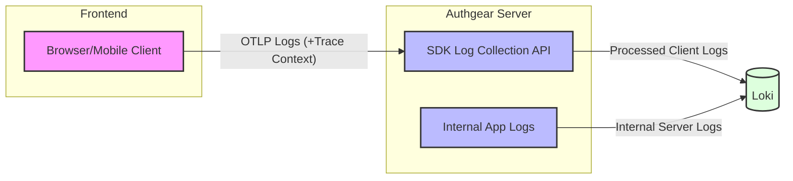

# Log Tracing & SDK Log Collection

## Table Of Contents

- [Overview](#overview)
- [Trace ID](#trace-id)
  - [Authgear SDK](#authgear-sdk)
  - [Trace Context over HTTP Headers](#trace-context-over-http-headers)
  - [API Errors](#api-errors)
  - [Exceptions](#exceptions)
- [SDK Log Collection API](#sdk-log-collection-api)
  - [Path](#path)
  - [Protocol](#protocol)
  - [Validations](#validations)
  - [Transformations](#transformations)
  - [Rate Limits](#rate-limits)
- [Configuration](#configuration)
  - [Enabling & Rate Limits](#enabling--rate-limits)
  - [Environment variables](#environment-variables)
- [AuthUI](#authui)
- [Audit Logs](#audit-logs)
- [SDK](#sdk)
  - [Configuring](#configuring)
  - [Attributes](#attributes)
- [Deployment](#deployment)
- [Future Works](#future-works)
  - [Authentication of SDK log collection API with Client Key](#authentication-of-sdk-log-collection-api-with-client-key)
  - [Query Logs & Export as files in Portal](#query-logs--export-as-files-in-portal)

## Overview



## Trace ID

We implement [OTel Context Propagation](https://opentelemetry.io/docs/concepts/context-propagation/) to propagate trace ID from client to server.

### Authgear SDK

The Authgear SDK will be updated to generate Trace ID and Span ID on each action.

- Trace ID: Represents a invocation of a public method. For example, `authenticate()`.
- Span ID: Represents any sub actions the SDK have done under a public method call.

In addition, we attach the following information to the trace context:

- Device ID: Generate a unique ID on the first time `authgear.configure()` is called.
- User ID: The Authgear User ID, if available.

### Trace Context over HTTP Headers

The Trace Context will be propagated to the server by using HTTP headers specified in [this spec](https://www.w3.org/TR/trace-context/#abstract).

- traceparent: `00-{trace_id}-{parent_id}-00`
  - trace_id: The trace ID generated by the Authgear SDK.
  - parent_id: The parent span ID generated by Authgear SDK.
- tracestate: `user_id={user_id}, device_id={device_id}`
  - user_id: The Authgear User ID, if the user is authenticated.
  - device_id: A unique UUID identifying the device. It will be generated on the first time `authgear.configure()` is called.

### API Errors

Returns the trace ID in all API Errors.

```jsonc
{
  "name": "InternalError",
  "reason": "InternalError",
  "message": "internal server error",
  "trace_id": "4bf92f3577b34da6a3ce929d0e0e4736", // New Field
  "code": 500,
}
```

### Exceptions

Under the following cases, we have trace IDs managed in different ways:

1. If the request does not include a trace ID, maybe because logging is disabled or it is a old version. In this case, server generates a trace ID per request. With the exception in point 2.

2. If the request does not include a trace ID, and it is under a flow (e.g. oauth login flow, or settings action). They shares the same trace ID. The trace ID is stored in the related session cookie. However, if the traceparent HTTP Header exist, it always take precedence.

## SDK Log Collection API

A new API for SDKs to call, sending logs to server.

### Path

`/_api/otlp/logs`

### Protocol

[OTLP/HTTP](https://opentelemetry.io/docs/specs/otlp/#otlphttp) in JSON. Binary Protobuf not supported.

### Validations

Validation should be done using the otel SDK.

Some hard limits:

- Attribute Count Limit: 128
- Attribute Value Length Limit: 2048 characters
- Request body size: 1MB

### Transformations

The following attributes should be added to the logs by the server:

- project_id: The authgear project ID.

### Rate Limits

Rate limits configurable in `authgear.feature.yaml`:

- Log entries per project
- Log entries per project per IP
- Log entries per client
- Log entries per client per IP

See [Configuration](#configuration).

## Configuration

### Enabling & Rate Limits

The backend application logs cannot be disabled.

The SDK log collection endpoint can be configured in `authgear.feature.yaml`.

```yaml
sdk_log_collection:
  enabled: true
  rate_limits:
    per_client:
      burst: 10000
      period: 1h
    per_client_per_ip:
      burst: 1000
      period: 1h
    per_project:
      burst: 10000
      period: 1h
    per_project_per_ip:
      burst: 1000
      period: 1h
```

### Environment variables

`LOG_HANDLERS`: Comma separated values of log handlers to enable. Default `console`. Supported values:

- `console`: Write logs to standard output.
- `otlp`: Write logs to a otel log ingestion endpoint. `LOG_HANDLER_OTLP_ENDPOINT` must be set when enabling this handler.

`LOG_HANDLER_CONSOLE_LEVEL`: Log level of the console handler.

`LOG_HANDLER_OTLP_LEVEL`: Log level of the otlp handler.

`LOG_HANDLER_OTLP_ENDPOINT`: The endpoint to send logs to using OTLP.

## AuthUI

In the following pages, display a Trace ID:

- `/v2/errors/error`: The generic error page. Handles any unexpected errors.
- The CSRF error page.
- Direct Access Disabled Page.

## Audit Logs

Also include a trace_id in event context. See [event.md](./event.md)

## SDK

### Configuring

```typescript
authgear.configure({
    logLevel: "ERROR", // DEBUG, INFO, WARN, ERROR
    sdkLogCollectionEnabled: true,
});
```

- `logLevel`: Nullable. Default ERROR. If not null, produces logs according to the configured level. Set to null to turn off logging.
- `sdkLogCollectionEnabled`: If true, send logs to SDK log collection API of the configured authgear endpoint. If false, logs will be written using native logging tools. e.g. `console.info()` in javascript environments.

### Attributes

The SDK should include the following attributes in the logs if available:

- client_id
- user_id
- device_id

## Deployment

The following optional values will be added to the helm chart:

```yaml
logging:
  otlp:
    enabled: true
    otlpLogsEndpoint: http://<otel-collector-addr>
  console:
    enabled: true
```

- `logging.otlp`:
  - `enabled`: If `true`, enable `otlp` log handler, and `otlpLogsEndpoint` must be provided.
  - `otlpLogsEndpoint`: The otlp log ingestion endpoint to send logs to.

- `logging.console`:
  - `enabled`: If `true`, enable `console` log handler..

See [Environment Variables](#environemnt-variables) for details.

### Loki Instance

The deployment of the Loki instance is not included in this spec, because it is treated as an external component.

## Future Works

### Authentication of SDK log collection API with Client Key

Add basic auth using client key to the API.

Add in portal a section under application settings for Client Key Rotation. Max. 2 keys.

Stores Client Keys in `authgear.secrets.yaml`:

```yaml
- data:
    items:
      - client_id: example
        keys:
          - created_at: 1679563861
            k: c2VjcmV0
            kid: f0979da9-e916-4df2-9288-2eb3b4862b16
            kty: oct
  key: oauth.client.logging_api_keys
```

### Query Logs & Export as files in Portal

A page to query logs with a trace ID, user ID, device ID, project ID, and export as OTEL JSON.

Will not implement at the moment.

#### Environment Variable to add

`LOKI_ENDPOINT`: The endpoint to query logs from. If empty, Portal cannot query and export logs.
