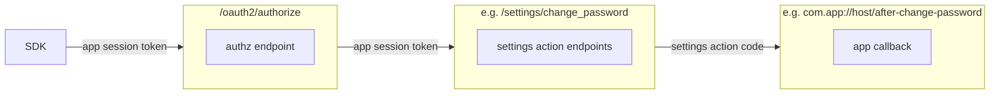
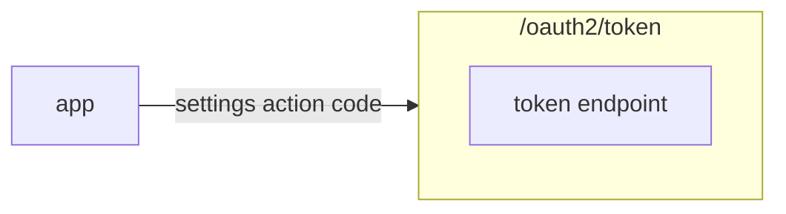

- [OIDC](#oidc)
  * [OAuth 2 and OIDC Conformance](#oauth-2-and-oidc-conformance)
  * [Client Metadata](#client-metadata)
    + [Standard Client Metadata](#standard-client-metadata)
    + [Custom Client Metadata](#custom-client-metadata)
      - [Generic RP Client Metadata example](#generic-rp-client-metadata-example)
      - [Native application Client Metadata example](#native-application-client-metadata-example)
      - [Web application sharing the same root domain Client Metadata example](#web-application-sharing-the-same-root-domain-client-metadata-example)
      - [Silent Authentication Client Metadata example](#silent-authentication-client-metadata-example)
  * [Authentication Request](#authentication-request)
    + [scope](#scope)
    + [response_type](#response_type)
    + [prompt](#prompt)
    + [max_age](#max_age)
    + [id_token_hint](#id_token_hint)
    + [login_hint](#login_hint)
    + [acr_values](#acr_values)
    + [code_challenge_method](#code_challenge_method)
    + [nonce](#nonce)
    + [x_page](#x_page)
    + [x_settings_action](#x_settings_action)
    + [x_authentication_flow_group](#x_authentication_flow_group)
  * [Token Request](#token-request)
    + [grant_type](#grant_type)
    + [id_token_hint](#id_token_hint-1)
    + [jwt](#jwt)
    + [`urn:authgear:params:oauth:grant-type:authorization_code`](#urnauthgearparamsoauthgrant-typeauthorization_code)
  * [Token Response](#token-response)
    + [token_type](#token_type)
    + [refresh_token](#refresh_token)
    + [scope](#scope-1)
  * [The metadata endpoint](#the-metadata-endpoint)
    + [authorization_endpoint](#authorization_endpoint)
    + [token_endpoint](#token_endpoint)
    + [userinfo_endpoint](#userinfo_endpoint)
    + [revocation_endpoint](#revocation_endpoint)
    + [jwks_uri](#jwks_uri)
    + [scopes_supported](#scopes_supported)
    + [response_types_supported](#response_types_supported)
    + [grant_types_supported](#grant_types_supported)
    + [subject_types_supported](#subject_types_supported)
    + [id_token_signing_alg_values_supported](#id_token_signing_alg_values_supported)
    + [claims_supported](#claims_supported)
    + [code_challenge_methods_supported](#code_challenge_methods_supported)
  * [ID Token](#id-token)
    + [`amr`](#amr)
    + [`auth_time`](#auth_time)
    + [`https://authgear.com/user/can_reauthenticate`](#httpsauthgearcomusercan_reauthenticate)
    + [`https://authgear.com/user/is_anonymous`](#httpsauthgearcomuseris_anonymous)
    + [`https://authgear.com/user/is_verified`](#httpsauthgearcomuseris_verified)
  * [External application acting as RP while Authgear acting as OP](#external-application-acting-as-rp-while-authgear-acting-as-op)
  * [Authgear acting as authentication server with native application](#authgear-acting-as-authentication-server-with-native-application)
  * [Authgear acting as authentication server with web application](#authgear-acting-as-authentication-server-with-web-application)
  * [Voluntary reauthentication](#voluntary-reauthentication)
  * [Silent Authentication](#silent-authentication)
    + [Comparison with cookie sharing approach](#comparison-with-cookie-sharing-approach)
    + [Details of Silent Authentication](#details-of-silent-authentication)
  * [Clients](#clients)
    + [Rationale of limitations](#rationale-of-limitations)
    + [First-party clients](#first-party-clients)
    + [First-party public clients](#first-party-public-clients)
    + [First-party confidential clients](#first-party-confidential-clients)
    + [Third-Party clients](#third-party-clients)
    + [Confidential clients](#confidential-clients)
    + [Consent Screen](#consent-screen)
    + [Authorized Apps page](#authorized-apps-page)
    + [App Session Token](#app-session-token)
    + [Settings Action](#settings-action)
  * [How to construct authentication request to achieve different scenarios](#how-to-construct-authentication-request-to-achieve-different-scenarios)
    + [The user has NOT signed in yet in my mobile app. I want to authenticate any user.](#the-user-has-not-signed-in-yet-in-my-mobile-app-i-want-to-authenticate-any-user)
    + [The user has NOT signed in yet in my mobile app. I want to authenticate any user. Possibly reuse any previous signed in sessions.](#the-user-has-not-signed-in-yet-in-my-mobile-app-i-want-to-authenticate-any-user-possibly-reuse-any-previous-signed-in-sessions)
    + [The user has signed in. I want to reauthenticate the user before they can perform sensitive operation.](#the-user-has-signed-in-i-want-to-reauthenticate-the-user-before-they-can-perform-sensitive-operation)

# OIDC

Authgear acts as OpenID Provider (OP).

## OAuth 2 and OIDC Conformance

Only [Authorization Code Flow](https://openid.net/specs/openid-connect-core-1_0.html#CodeFlowAuth) with [PKCE](https://tools.ietf.org/html/rfc7636) is implemented.

## Client Metadata

### Standard Client Metadata

Supported [standard client metadata](https://openid.net/specs/openid-connect-registration-1_0.html#ClientMetadata) are as follows:

- `client_name`
- `redirect_uris`
- `grant_types`
- `response_types`

### Custom Client Metadata

- `client_id`: OIDC client ID.
- `access_token_lifetime`: Access token lifetime in seconds, default to 1800.
- `refresh_token_lifetime`: Refresh token lifetime in seconds, default to max(access_token_lifetime, 86400). It must be greater than or equal to `access_token_lifetime`.
- `x_application_type`: Indicate the application type. See [Clients](#clients) for the meaning of the value. The application type is not changeable after creation on the portal. Supported values: `spa`, `traditional_webapp`, `native`, `confidential`, `third_party_app`.
- `x_max_concurrent_session`: Indicate whether the client restricts the number of concurrent sessions, `0` means no restriction, default is `0`. Currently, only `0` or `1` are supported. If `x_max_concurrent_session` is `1`, all refresh tokens of the client will be revoked when a new one is requested.
- `x_authentication_flow_allowlist`: Indicate the allowed authentication flows. See [Flow Allowlist](./authentication-flow-selection.md#flow-allowlist) for details.

#### Generic RP Client Metadata example

```yaml
redirect_uris:
- "https://appbackend.com"
grant_types:
- authorization_code
- refresh_token
response_types:
- code
```

Standard configuration for authorization code flow to work properly.

#### Native application Client Metadata example

```yaml
redirect_uris:
- "com.myapp://host/path"
grant_types:
- authorization_code
- refresh_token
response_types:
- code
```

Standard configuration for authorization code flow to work properly. Note that the redirect URI is of custom scheme.

#### Web application sharing the same root domain Client Metadata example

```yaml
redirect_uris:
- "https://www.myapp.com"
grant_types: []
response_types:
- "none"
```

The web application shares the cookies so authorization code is unnecessary.

#### Silent Authentication Client Metadata example

```yaml
redirect_uris:
- "https://client-app-endpoint.com"
grant_types:
- "authorization_code"
response_types:
- "code"
```

Refresh token is not used.

## Authentication Request

### scope

- `openid`: It is required by the OIDC spec
- `offline_access`: It is required to issue refresh token.
- `https://authgear.com/scopes/full-access`: Full access scope allows access to privileged user operations. Only [first-party public clients](#first-party-public-clients) can request this scope.
- `https://authgear.com/scopes/full-userinfo`: Returns the complete userinfo in the id_token or through the userinfo endpoint.

### response_type

- `none`: Nothing is included in the authentication response.
- `code`: `code` is included in the authentication response. This is the authorization code flow.

### prompt

- `none`: An error is returned if the authentication request cannot be processed without user interaction.
- `login`: Reauthenticate the end-user with any authenticator they have.

> In the future, we may support select_account and content.

### max_age

- `0`: It is equivalent to prompt=login.
- `n`, where n is Any positive integer: It is equivalent to prompt=login if the elapsed time in seconds of the last authentication is greater than `n`. Otherwise, it has no effect.

### id_token_hint

When `id_token_hint` is given, the end-user is guaranteed to be authenticated as the user indicated by this ID token. Otherwise it is an error.

If this is present and there is an valid session, the user is reauthenticated.

### login_hint

Developer can optionally pre-select the identity to use using `login_hint` parameter. `login_hint` should be a URL of form `https://authgear.com/login_hint?<query params>`.

The following are recognized query parameters:
- `type`: Identity type
- `user_id`: User ID
- `email`: Email claim of the user
- `oauth_provider`: OAuth provider ID
- `oauth_sub`: Subject ID of OAuth provider
- `jwt`: JWT object
- `promotion_code`: Anonymous user promotion code

For examples:
- To login with email `user@example.com`:
    `https://authgear.com/login_hint?type=login_id&email=user%40example.com`
- To login with Google OAuth provider:
    `https://authgear.com/login_hint?oauth_provider=google`
- To auth or promote an anonymous user with the jwt:
    `https://authgear.com/login_hint?type=anonymous&jwt=...`
- To promote an anonymous user with the promotion code:
    `https://authgear.com/login_hint?type=anonymous&promotion_code=...`


The UI tries to match an appropriate identity according to the provided parameters. If exactly one identity is matched, the identity is selected. Otherwise `login_hint` is ignored.

Unknown parameters are ignored, and invalid parameters are rejected. However, if user is already logged in, and the provided hint is not valid for the current user, it will be ignored instead.

### acr_values

Currently not supported.

### code_challenge_method

Only `S256` is supported. `plain` is not supported.

### nonce

To mitigate replay attacks, provide a `nonce` in the authentication request. Authgear will include the `nonce` Claim in the ID Token, and the client must verify that the `nonce` claim value is equal to the value of the `nonce` parameter sent in the authentication request. The `nonce` is recommended but it is optional. The `nonce` value is a case sensitive string. Reference: [Authentication Request](https://openid.net/specs/openid-connect-core-1_0.html#rfc.section.3.1.2.1).

### x_page

It specifies either the login or signup page to be shown to the user.

It can be used in conjunction with `x_authentication_flow_group` to override authentication flow in Auth UI. For details, see [Authentication Flow Selection in Auth UI](./authentication-flow-selection.md#auth-ui).

Supported values: `login`, `signup`

### x_settings_action

When it is specified, the user will be redirected to the corresponding auth ui pages of the settings action. After completing the action, the user will be redirected back to the app through redirect URI.

Supported values: `change_password`, `delete_account`.

### x_authentication_flow_group

Overrides the authentication flow group in Auth UI. details, see [Authentication Flow Selection in Auth UI](./authentication-flow-selection.md#auth-ui).

It can be used in conjunction with `x_page` to decide whether to execute login or signup flow.

If the specified group is not found or not included in the [client's allow list](/docs/specs/authentication-flow-selection.md#configuration), the request will be rejected.

## Token Request

### grant_type

- `authorization_code`
- `refresh_token`
- `urn:authgear:params:oauth:grant-type:anonymous-request`
- `urn:authgear:params:oauth:grant-type:biometric-request`
- `urn:authgear:params:oauth:grant-type:id-token`
- `urn:authgear:params:oauth:grant-type:authorization_code`
- `urn:authgear:params:oauth:grant-type:settings-action`

`urn:authgear:params:oauth:grant-type:anonymous-request` is for authenticating and issuing tokens directly for anonymous user.

`urn:authgear:params:oauth:grant-type:biometric-request` is for authenticating and issuing tokens directly for users with Biometric identity.

`urn:authgear:params:oauth:grant-type:settings-action` is issued upon completion of a settings action, such as change password.

### id_token_hint

When the grant type is `urn:authgear:params:oauth:grant-type:id-token`, the request must include `id_token_hint`.
The response will include an ID token with the following claims updated:

- `https://authgear.com/user/can_reauthenticate`
- `https://authgear.com/user/is_anonymous`
- `https://authgear.com/user/is_verified`

### jwt

When the grant type is `urn:authgear:params:oauth:grant-type:anonymous-request`, the value is specified [here](./user-model.md#anonymous-identity-jwt).

When the grant type is `urn:authgear:params:oauth:grant-type:biometric-request`, the value is specified [here](./user-model.md#biometric-identity-jwt).

### `urn:authgear:params:oauth:grant-type:authorization_code`

This grant type is similar to `authorization_code`, except that it **DOES NOT** support the use of PKCE.
`authorization_code` by definition is delivered by redirect, thus is subject to interception attack, as described in [RFC 7636](https://datatracker.ietf.org/doc/html/rfc7636).
`urn:authgear:params:oauth:grant-type:authorization_code`, in contrast, is delivered in traditional HTTP request-response, thus the use of PKCE is redundant, and would add unnecessary friction.

## Token Response

### token_type

It is always the value `bearer`.

### refresh_token

Present only if authorized scopes contain `offline_access`.

### scope

It is always absent.

## The metadata endpoint

[OpenID Connect Discovery](https://openid.net/specs/openid-connect-discovery-1_0.html#ProviderMetadata)

```
<endpoint>/.well-known/openid-configuration
```

[Authorization Server Metadata](https://tools.ietf.org/html/rfc8414#section-2)

```
<endpoint>/.well-known/oauth-authorization-server
```

The following sections list out the supported metadata fields.

### authorization_endpoint

The value is `<endpoint>/oauth2/authorize`.

### token_endpoint

The value is `<endpoint>/oauth2/token`.

### userinfo_endpoint

The value is `<endpoint>/oauth2/userinfo`.

### revocation_endpoint

The value is `<endpoint>/oauth2/revoke`.

### jwks_uri

The value is `<endpoint>/oauth2/jwks`.

### scopes_supported

See [scope](#scope)

### response_types_supported

See [response_type](#response_type)

### grant_types_supported

See [grant_type](#grant_type)

### subject_types_supported

The value is `["public"]`.

### id_token_signing_alg_values_supported

The value is `["RS256"]`.

### claims_supported

The value is `["sub", "iss", "aud", "exp", "iat"]`.

### code_challenge_methods_supported

The value is `["S256"]`

## ID Token

ID tokens contains following claims:

### `amr`

To indicate the authenticator used in authentication, `amr` claim is used in OIDC ID token.

`amr` claim is an array of string. It includes authentication method used:
- If secondary authentication is performed: `mfa` is included.
- If password authenticator is used: `pwd` is included.
- If any OTP (TOTP/OOB-OTP) is used: `otp` is included.
- If WebAuthn is used: `hwk` is included.
- If Biometric is used: `x_biometric` is included.

If no authentication method is included in `amr` claim, `amr` claim would be omitted from the ID token.

### `auth_time`

The time in Unix epoch when the authentication was performed.
This claim is only present if the ID token is obtained via the authorization code flow or the implicit flow.

This is the authenticated at of the IdP session.

### `https://authgear.com/user/can_reauthenticate`

The value `true` means the user can be [reauthenticated](voluntary-reauthentication).

### `https://authgear.com/user/is_anonymous`

The value `true` means the user is anonymous. Otherwise, it is a normal user.

### `https://authgear.com/user/is_verified`

The value `true` means the user is verified.

## External application acting as RP while Authgear acting as OP

[![](https://mermaid.ink/img/eyJjb2RlIjoic2VxdWVuY2VEaWFncmFtXG4gIHBhcnRpY2lwYW50IENsaWVudEFwcFxuICBwYXJ0aWNpcGFudCBBcHBCYWNrZW5kXG4gIHBhcnRpY2lwYW50IEF1dGhnZWFyXG4gIENsaWVudEFwcC0-PkFwcEJhY2tlbmQ6IFVzZXIgY2xpY2sgbG9naW5cbiAgQXBwQmFja2VuZC0-PkF1dGhnZWFyOiBBdXRob3JpemF0aW9uIGNvZGUgcmVxdWVzdFxuICBBdXRoZ2Vhci0-PkNsaWVudEFwcDogUmVkaXJlY3QgdG8gYXV0aG9yaXphdGlvbiBlbmRwb2ludFxuICBDbGllbnRBcHAtPj5BdXRoZ2VhcjogQXV0aG9yaXphdGlvbiBhbmQgY29uc2VudFxuICBBdXRoZ2Vhci0-PkFwcEJhY2tlbmQ6IEF1dGhvcml6YXRpb24gY29kZVxuICBBcHBCYWNrZW5kLT4-QXV0aGdlYXI6IEF1dGhvcml6YXRpb24gY29kZSArIGNsaWVudCBpZCArIGNsaWVudCBzZWNyZXRcbiAgQXV0aGdlYXItPj5BdXRoZ2VhcjogVmFsaWRhdGUgYXV0aG9yaXphdGlvbiBjb2RlICsgY2xpZW50IGlkICsgY2xpZW50IHNlY3JldFxuICBBdXRoZ2Vhci0-PkFwcEJhY2tlbmQ6IFRva2VuIHJlc3BvbnNlIChJRCB0b2tlbiArIGFjY2VzcyB0b2tlbiArIHJlZnJlc2ggdG9rZW4pXG4gIEFwcEJhY2tlbmQtPj5BdXRoZ2VhcjogUmVxdWVzdCB1c2VyIGRhdGEgd2l0aCBhY2Nlc3MgdG9rZW5cbiAgQXV0aGdlYXItPj5BcHBCYWNrZW5kOiBSZXNwb25zZSB1c2VyIGRhdGFcbiAgQXBwQmFja2VuZC0-PkFwcEJhY2tlbmQ6IENyZWF0ZSBBcHBCYWNrZW5kIG1hbmFnZWQgc2Vzc2lvblxuICBBcHBCYWNrZW5kLT4-Q2xpZW50QXBwOiBSZXR1cm4gQXBwQmFja2VuZCBtYW5hZ2VkIHNlc3Npb25cbiIsIm1lcm1haWQiOnsidGhlbWUiOiJkZWZhdWx0Iiwic2VxdWVuY2UiOnsic2hvd1NlcXVlbmNlTnVtYmVycyI6dHJ1ZX19fQ)](https://mermaid-js.github.io/mermaid-live-editor/#/edit/eyJjb2RlIjoic2VxdWVuY2VEaWFncmFtXG4gIHBhcnRpY2lwYW50IENsaWVudEFwcFxuICBwYXJ0aWNpcGFudCBBcHBCYWNrZW5kXG4gIHBhcnRpY2lwYW50IEF1dGhnZWFyXG4gIENsaWVudEFwcC0-PkFwcEJhY2tlbmQ6IFVzZXIgY2xpY2sgbG9naW5cbiAgQXBwQmFja2VuZC0-PkF1dGhnZWFyOiBBdXRob3JpemF0aW9uIGNvZGUgcmVxdWVzdFxuICBBdXRoZ2Vhci0-PkNsaWVudEFwcDogUmVkaXJlY3QgdG8gYXV0aG9yaXphdGlvbiBlbmRwb2ludFxuICBDbGllbnRBcHAtPj5BdXRoZ2VhcjogQXV0aG9yaXphdGlvbiBhbmQgY29uc2VudFxuICBBdXRoZ2Vhci0-PkFwcEJhY2tlbmQ6IEF1dGhvcml6YXRpb24gY29kZVxuICBBcHBCYWNrZW5kLT4-QXV0aGdlYXI6IEF1dGhvcml6YXRpb24gY29kZSArIGNsaWVudCBpZCArIGNsaWVudCBzZWNyZXRcbiAgQXV0aGdlYXItPj5BdXRoZ2VhcjogVmFsaWRhdGUgYXV0aG9yaXphdGlvbiBjb2RlICsgY2xpZW50IGlkICsgY2xpZW50IHNlY3JldFxuICBBdXRoZ2Vhci0-PkFwcEJhY2tlbmQ6IFRva2VuIHJlc3BvbnNlIChJRCB0b2tlbiArIGFjY2VzcyB0b2tlbiArIHJlZnJlc2ggdG9rZW4pXG4gIEFwcEJhY2tlbmQtPj5BdXRoZ2VhcjogUmVxdWVzdCB1c2VyIGRhdGEgd2l0aCBhY2Nlc3MgdG9rZW5cbiAgQXV0aGdlYXItPj5BcHBCYWNrZW5kOiBSZXNwb25zZSB1c2VyIGRhdGFcbiAgQXBwQmFja2VuZC0-PkFwcEJhY2tlbmQ6IENyZWF0ZSBBcHBCYWNrZW5kIG1hbmFnZWQgc2Vzc2lvblxuICBBcHBCYWNrZW5kLT4-Q2xpZW50QXBwOiBSZXR1cm4gQXBwQmFja2VuZCBtYW5hZ2VkIHNlc3Npb25cbiIsIm1lcm1haWQiOnsidGhlbWUiOiJkZWZhdWx0Iiwic2VxdWVuY2UiOnsic2hvd1NlcXVlbmNlTnVtYmVycyI6dHJ1ZX19fQ)

1. User clicks login and call App Backend
1. App Backend generates authorization code request to Authgear
1. Authgear redirects user to authorization page
1. User authorizes and consents
1. Authgear creates IdP session and redirects authorization code result back to App Backend
1. App Backend sends the token request to Authgear with authorization code + client id + client secret
1. Authgear validates authorization code + client id + client secret
1. Authgear returns token response to App Backend
1. App Backend requests user data by using the access token
1. Authgear returns the user data
1. App Backend creates self managed session based on user data
1. App Backend returns self managed session to Client App

## Authgear acting as authentication server with native application

[![](https://mermaid.ink/img/eyJjb2RlIjoic2VxdWVuY2VEaWFncmFtXG4gIHBhcnRpY2lwYW50IENsaWVudEFwcFxuICBwYXJ0aWNpcGFudCBBdXRoZ2VhciBhcyBBdXRoZ2VhciAoaHR0cHM6Ly9hY2NvdW50cy5teWFwcC5jb20pXG4gIHBhcnRpY2lwYW50IEFwcEJhY2tlbmQgYXMgQXBwQmFja2VuZCAoaHR0cHM6Ly9hcGkubXlhcHAuY29tKVxuICBDbGllbnRBcHAtPj5DbGllbnRBcHA6IEdlbmVyYXRlIGNvZGUgdmVyaWZpZXIgKyBjb2RlIGNoYWxsZW5nZVxuICBDbGllbnRBcHAtPj5BdXRoZ2VhcjogQXV0aG9yaXphdGlvbiBjb2RlIHJlcXVlc3QgKyBjb2RlIGNoYWxsZW5nZVxuICBBdXRoZ2Vhci0-PkNsaWVudEFwcDogUmVkaXJlY3QgdG8gYXV0aG9yaXphdGlvbiBlbmRwb2ludFxuICBDbGllbnRBcHAtPj5BdXRoZ2VhcjogQXV0aG9yaXphdGlvbiBhbmQgY29uc2VudFxuICBBdXRoZ2Vhci0-PkNsaWVudEFwcDogQXV0aG9yaXphdGlvbiBjb2RlXG4gIENsaWVudEFwcC0-PkF1dGhnZWFyOiBBdXRob3JpemF0aW9uIGNvZGUgKyBjb2RlIHZlcmlmaWVyXG4gIEF1dGhnZWFyLT4-QXV0aGdlYXI6IFZhbGlkYXRlIGF1dGhvcml6YXRpb24gY29kZSArIGNvZGUgdmVyaWZpZXJcbiAgQXV0aGdlYXItPj5DbGllbnRBcHA6IFRva2VuIHJlc3BvbnNlIChpZCB0b2tlbiArIGFjY2VzcyB0b2tlbiArIHJlZnJlc2ggdG9rZW4pXG4gIENsaWVudEFwcC0-PkFwcEJhY2tlbmQ6IFNlbmQgYXBpIHJlcXVlc3Qgd2l0aCBhY2Nlc3MgdG9rZW4sIHJldmVyc2UgcHJveHkgZGVsZWdhdGUgdG8gQXV0aGdlYXIgdG8gcmVzb2x2ZSBzZXNzaW9uXG4gIGxvb3AgV2hlbiBhcHAgbGF1bmNoIG9yIGNsb3NlIHRvIGV4cGlyZWRfaW5cbiAgICBOb3RlIG92ZXIgQ2xpZW50QXBwLEFwcEJhY2tlbmQ6IFJlbmV3IGFjY2VzcyB0b2tlblxuICAgIENsaWVudEFwcC0tPj5BdXRoZ2VhcjogVG9rZW4gcmVxdWVzdCB3aXRoIHJlZnJlc2ggdG9rZW5cbiAgICBBdXRoZ2Vhci0tPj5DbGllbnRBcHA6IFRva2VuIHJlc3BvbnNlIHdpdGggbmV3IGFjY2VzcyB0b2tlblxuICBlbmRcbiIsIm1lcm1haWQiOnsidGhlbWUiOiJkZWZhdWx0Iiwic2VxdWVuY2UiOnsic2hvd1NlcXVlbmNlTnVtYmVycyI6dHJ1ZX19LCJ1cGRhdGVFZGl0b3IiOmZhbHNlfQ)](https://mermaid-js.github.io/mermaid-live-editor/#/edit/eyJjb2RlIjoic2VxdWVuY2VEaWFncmFtXG4gIHBhcnRpY2lwYW50IENsaWVudEFwcFxuICBwYXJ0aWNpcGFudCBBdXRoZ2VhciBhcyBBdXRoZ2VhciAoaHR0cHM6Ly9hY2NvdW50cy5teWFwcC5jb20pXG4gIHBhcnRpY2lwYW50IEFwcEJhY2tlbmQgYXMgQXBwQmFja2VuZCAoaHR0cHM6Ly9hcGkubXlhcHAuY29tKVxuICBDbGllbnRBcHAtPj5DbGllbnRBcHA6IEdlbmVyYXRlIGNvZGUgdmVyaWZpZXIgKyBjb2RlIGNoYWxsZW5nZVxuICBDbGllbnRBcHAtPj5BdXRoZ2VhcjogQXV0aG9yaXphdGlvbiBjb2RlIHJlcXVlc3QgKyBjb2RlIGNoYWxsZW5nZVxuICBBdXRoZ2Vhci0-PkNsaWVudEFwcDogUmVkaXJlY3QgdG8gYXV0aG9yaXphdGlvbiBlbmRwb2ludFxuICBDbGllbnRBcHAtPj5BdXRoZ2VhcjogQXV0aG9yaXphdGlvbiBhbmQgY29uc2VudFxuICBBdXRoZ2Vhci0-PkNsaWVudEFwcDogQXV0aG9yaXphdGlvbiBjb2RlXG4gIENsaWVudEFwcC0-PkF1dGhnZWFyOiBBdXRob3JpemF0aW9uIGNvZGUgKyBjb2RlIHZlcmlmaWVyXG4gIEF1dGhnZWFyLT4-QXV0aGdlYXI6IFZhbGlkYXRlIGF1dGhvcml6YXRpb24gY29kZSArIGNvZGUgdmVyaWZpZXJcbiAgQXV0aGdlYXItPj5DbGllbnRBcHA6IFRva2VuIHJlc3BvbnNlIChpZCB0b2tlbiArIGFjY2VzcyB0b2tlbiArIHJlZnJlc2ggdG9rZW4pXG4gIENsaWVudEFwcC0-PkFwcEJhY2tlbmQ6IFNlbmQgYXBpIHJlcXVlc3Qgd2l0aCBhY2Nlc3MgdG9rZW4sIHJldmVyc2UgcHJveHkgZGVsZWdhdGUgdG8gQXV0aGdlYXIgdG8gcmVzb2x2ZSBzZXNzaW9uXG4gIGxvb3AgV2hlbiBhcHAgbGF1bmNoIG9yIGNsb3NlIHRvIGV4cGlyZWRfaW5cbiAgICBOb3RlIG92ZXIgQ2xpZW50QXBwLEFwcEJhY2tlbmQ6IFJlbmV3IGFjY2VzcyB0b2tlblxuICAgIENsaWVudEFwcC0tPj5BdXRoZ2VhcjogVG9rZW4gcmVxdWVzdCB3aXRoIHJlZnJlc2ggdG9rZW5cbiAgICBBdXRoZ2Vhci0tPj5DbGllbnRBcHA6IFRva2VuIHJlc3BvbnNlIHdpdGggbmV3IGFjY2VzcyB0b2tlblxuICBlbmRcbiIsIm1lcm1haWQiOnsidGhlbWUiOiJkZWZhdWx0Iiwic2VxdWVuY2UiOnsic2hvd1NlcXVlbmNlTnVtYmVycyI6dHJ1ZX19LCJ1cGRhdGVFZGl0b3IiOmZhbHNlfQ)

1. SDK generates code verifier + code challenge
1. SDK sends authorization code request with code challenge
1. Authgear directs user to authorization page
1. User authorizes and consents in authorization page
1. Authgear creates IdP session and redirects the authorization code back to SDK
1. SDK sends token request with authorization code + code verifier
1. Authgear validates authorization code + code verifier
1. Authgear returns token response to SDK with id token + access token + refresh token
1. SDK injects authorization header for subsequent requests, the reverse proxy delegate to Authgear to resolve the session.
1. When app launches or access token expires, SDK sends token request with refresh token
1. Authgear returns token response with new access token

## Authgear acting as authentication server with web application

**Authgear and the web application must under the same root domain**

[](https://mermaid-js.github.io/mermaid-live-editor/#/edit/eyJjb2RlIjoic2VxdWVuY2VEaWFncmFtXG4gIHBhcnRpY2lwYW50IEJyb3dzZXJcbiAgcGFydGljaXBhbnQgQXV0aGdlYXIgYXMgQXV0aGdlYXI8YnIvPihhY2NvdW50cy5leGFtcGxlLmNvbSlcbiAgcGFydGljaXBhbnQgQXBwQmFja2VuZCBhcyBBcHBCYWNrZW5kPGJyLz4od3d3LmV4YW1wbGUuY29tKVxuICBCcm93c2VyLT4-QXV0aGdlYXI6IEF1dGhvcml6YXRpb24gcmVxdWVzdCB3aXRoIHJlc3BvbnNlX3R5cGU9bm9uZSArIGNsaWVudF9pZFxuICBBdXRoZ2Vhci0-PkJyb3dzZXI6IFJlZGlyZWN0IHRvIGF1dGhvcml6YXRpb24gZW5kcG9pbnRcbiAgQnJvd3Nlci0-PkF1dGhnZWFyOiBBdXRob3JpemF0aW9uIGFuZCBjb25zZW50XG4gIEF1dGhnZWFyLT4-QnJvd3NlcjogU2V0IElkcCBzZXNzaW9uIGluIGVUTEQrMSBhbmQgcmVkaXJlY3QgYmFjayB0byBBcHBCYWNrZW5kXG4gIEJyb3dzZXItPj5BcHBCYWNrZW5kOiBTZW5kIGFwaSByZXF1ZXN0IHdpdGggSWRwIHNlc3Npb24sIHJldmVyc2UgcHJveHkgZGVsZWdhdGVzIHRvIEF1dGhnZWFyIHRvIHJlc29sdmUgc2Vzc2lvblxuIiwibWVybWFpZCI6eyJ0aGVtZSI6ImRlZmF1bHQiLCJzZXF1ZW5jZSI6eyJzaG93U2VxdWVuY2VOdW1iZXJzIjp0cnVlfX0sInVwZGF0ZUVkaXRvciI6ZmFsc2V9)

1. SDK sends authorization request with response_type=none + client id
1. Authgear redirects user to authorization page
1. User authorizes and consents
1. Authgear creates IdP session in eTLD+1, redirect empty result back to client SDK
1. Since IdP session is set in eTLD+1, cookies header will be included when user send request to AppBackend too. The reverse proxy delegates to Authgear to resolve the session.

## Voluntary reauthentication

By verifying the signature of the ID token and validating the claims in the ID token,
the developer can assure the user has authenticated themselves.

The flow is illustrated by the following chart.

[](https://mermaid-js.github.io/mermaid-live-editor/edit##eyJjb2RlIjoiZ3JhcGggXG4gICAgYShCZWZvcmUgcGVyZm9ybWluZyBzZW5zaXRpdmUgb3BlcmF0aW9uKSAtLT58Q0FOTk9UIHJlYXV0aGVudGljYXRlfCBiKFNlbmQgc2Vuc2l0aXZlIHJlcXVlc3QgYWxvbmcgd2l0aCBJRCB0b2tlbilcbiAgICBhIC0tPnxDQU4gcmVhdXRoZW50aWNhdGV8IGMoVHJpZ2dlciByZWF1dGhlbnRpY2F0aW9uIHdpdGggU0RLKVxuICAgIGMgLS0-fFJlYXV0aGVudGljYXRpb24gc3VjY2VlZGVkfCBiXG4gICAgYyAtLT58UmVhdXRoZW50aWNhdGlvbiBmYWlsZWR8IGMiLCJtZXJtYWlkIjoie1xuICBcInRoZW1lXCI6IFwiZGVmYXVsdFwiXG59IiwidXBkYXRlRWRpdG9yIjpmYWxzZSwiYXV0b1N5bmMiOnRydWUsInVwZGF0ZURpYWdyYW0iOmZhbHNlfQ)

Details:

1. Before performing sensitive operation, check if reauthentication is possible. You can either check the claim `https://authgear.com/user/can_reauthenticate` or call the SDK method `authgear.canReauthenticate`.
1. If reauthentication is impossible, you should send your request along with the ID token.
1. If reauthentication is possible, trigger reauthentication with the SDK.
1. Send your request along with the updated ID token.
1. Your server verifies the signature of the ID token.
1. Check whether `amr` includes `x_biometric` and `auth_time` is recent enough.
1. Check whether `https://authgear.com/user/can_reauthenticate` is true and `auth_time` is recent enough.
1. Otherwise, the user cannot be reauthenticated.

## Silent Authentication

Silent authentication is an alternative way to refresh access token without a refresh token. It is achieved with `prompt=none&id_token_hint=...`. In web environment, local storage is not a secure place to store refresh token.

Since [Cookie sharing approach](#authgear-acting-as-authentication-server-with-web-application) covers all basic use cases, this is not yet implemented.

### Comparison with cookie sharing approach

[Cookie sharing approach](#authgear-acting-as-authentication-server-with-web-application)

- Pros:
  - Cookie is used so Server Side Rendering (SSR) app and Single Page App (SPA) are both supported.
- Cons:
  - Not fully OIDC compliant. The IdP session is used directly.
  - App must be first party app. That is, they are sharing the eTLD+1 domain.

Silent Authentication

- Pros:
  - OIDC compliant
  - App does not need to be first party app.
- Cons:
  - Only SPA is supported.

### Details of Silent Authentication

[![](https://mermaid.ink/img/eyJjb2RlIjoic2VxdWVuY2VEaWFncmFtXG4gIHBhcnRpY2lwYW50IEJyb3dzZXJcbiAgcGFydGljaXBhbnQgQXV0aGdlYXJcbiAgcGFydGljaXBhbnQgQXBwQmFja2VuZFxuICBCcm93c2VyLT4-QnJvd3NlcjogR2VuZXJhdGUgY29kZSB2ZXJpZmllciArIGNvZGUgY2hhbGxlbmdlXG4gIEJyb3dzZXItPj5BdXRoZ2VhcjogQXV0aG9yaXphdGlvbiBjb2RlIHJlcXVlc3QgKyBjb2RlIGNoYWxsZW5nZVxuICBBdXRoZ2Vhci0-PkJyb3dzZXI6IFJlZGlyZWN0IHRvIGF1dGhvcml6YXRpb24gZW5kcG9pbnRcbiAgQnJvd3Nlci0-PkF1dGhnZWFyOiBBdXRob3JpemF0aW9uIGFuZCBjb25zZW50XG4gIEF1dGhnZWFyLT4-QnJvd3NlcjogQXV0aG9yaXphdGlvbiBjb2RlXG4gIEJyb3dzZXItPj5BdXRoZ2VhcjogQXV0aG9yaXphdGlvbiBjb2RlICsgY29kZSB2ZXJpZmllclxuICBBdXRoZ2Vhci0-PkF1dGhnZWFyOiBWYWxpZGF0ZSBhdXRob3JpemF0aW9uIGNvZGUgKyBjb2RlIHZlcmlmaWVyXG4gIEF1dGhnZWFyLT4-QnJvd3NlcjogVG9rZW4gcmVzcG9uc2UgKElEIHRva2VuICsgYWNjZXNzIHRva2VuKVxuICBCcm93c2VyLT4-QXBwQmFja2VuZDogUmVxdWVzdCBBcHBCYWNrZW5kIHdpdGggYWNjZXNzIHRva2VuXG4gIGxvb3AgV2hlbiBhcHAgbGF1bmNoIG9yIGNsb3NlIHRvIGV4cGlyZWRfaW5cbiAgICBOb3RlIG92ZXIgQnJvd3NlcixBcHBCYWNrZW5kOiBSZW5ldyBhY2Nlc3MgdG9rZW5cbiAgICBCcm93c2VyLT4-QnJvd3NlcjogR2VuZXJhdGUgY29kZSB2ZXJpZmllciArIGNvZGUgY2hhbGxlbmdlXG4gICAgQnJvd3Nlci0-PkF1dGhnZWFyOiBJbmplY3QgaWZyYW1lIHRvIHNlbmQgYXV0aG9yaXphdGlvbiByZXF1ZXN0XG4gICAgQXV0aGdlYXItPj5BdXRoZ2VhcjogUmVkaXJlY3QgYXV0aG9yaXphdGlvbiBjb2RlIHJlc3VsdCB0byBBdXRoZ2VhciBlbmRwb2ludFxuICAgIEF1dGhnZWFyLT4-QnJvd3NlcjogUG9zdCBtZXNzYWdlIHdpdGggYXV0aG9yaXphdGlvbiBjb2RlIHJlc3VsdFxuICAgIEJyb3dzZXItLT4-QnJvd3NlcjogSWYgSWRwIFNlc3Npb24gaXMgaW52YWxpZCwgbG9nb3V0XG4gICAgQnJvd3Nlci0-PkF1dGhnZWFyOiBTZW5kIHRva2VuIHJlcXVlc3Qgd2l0aCBjb2RlICsgY29kZSB2ZXJpZmllclxuICAgIEF1dGhnZWFyLT4-QnJvd3NlcjogVG9rZW4gcmVzcG9uc2UgKGlkIHRva2VuICsgYWNjZXNzIHRva2VuKVxuICBlbmRcbiIsIm1lcm1haWQiOnsidGhlbWUiOiJkZWZhdWx0Iiwic2VxdWVuY2UiOnsic2hvd1NlcXVlbmNlTnVtYmVycyI6dHJ1ZX19LCJ1cGRhdGVFZGl0b3IiOmZhbHNlfQ)](https://mermaid-js.github.io/mermaid-live-editor/#/edit/eyJjb2RlIjoic2VxdWVuY2VEaWFncmFtXG4gIHBhcnRpY2lwYW50IEJyb3dzZXJcbiAgcGFydGljaXBhbnQgQXV0aGdlYXJcbiAgcGFydGljaXBhbnQgQXBwQmFja2VuZFxuICBCcm93c2VyLT4-QnJvd3NlcjogR2VuZXJhdGUgY29kZSB2ZXJpZmllciArIGNvZGUgY2hhbGxlbmdlXG4gIEJyb3dzZXItPj5BdXRoZ2VhcjogQXV0aG9yaXphdGlvbiBjb2RlIHJlcXVlc3QgKyBjb2RlIGNoYWxsZW5nZVxuICBBdXRoZ2Vhci0-PkJyb3dzZXI6IFJlZGlyZWN0IHRvIGF1dGhvcml6YXRpb24gZW5kcG9pbnRcbiAgQnJvd3Nlci0-PkF1dGhnZWFyOiBBdXRob3JpemF0aW9uIGFuZCBjb25zZW50XG4gIEF1dGhnZWFyLT4-QnJvd3NlcjogQXV0aG9yaXphdGlvbiBjb2RlXG4gIEJyb3dzZXItPj5BdXRoZ2VhcjogQXV0aG9yaXphdGlvbiBjb2RlICsgY29kZSB2ZXJpZmllclxuICBBdXRoZ2Vhci0-PkF1dGhnZWFyOiBWYWxpZGF0ZSBhdXRob3JpemF0aW9uIGNvZGUgKyBjb2RlIHZlcmlmaWVyXG4gIEF1dGhnZWFyLT4-QnJvd3NlcjogVG9rZW4gcmVzcG9uc2UgKElEIHRva2VuICsgYWNjZXNzIHRva2VuKVxuICBCcm93c2VyLT4-QXBwQmFja2VuZDogUmVxdWVzdCBBcHBCYWNrZW5kIHdpdGggYWNjZXNzIHRva2VuXG4gIGxvb3AgV2hlbiBhcHAgbGF1bmNoIG9yIGNsb3NlIHRvIGV4cGlyZWRfaW5cbiAgICBOb3RlIG92ZXIgQnJvd3NlcixBcHBCYWNrZW5kOiBSZW5ldyBhY2Nlc3MgdG9rZW5cbiAgICBCcm93c2VyLT4-QnJvd3NlcjogR2VuZXJhdGUgY29kZSB2ZXJpZmllciArIGNvZGUgY2hhbGxlbmdlXG4gICAgQnJvd3Nlci0-PkF1dGhnZWFyOiBJbmplY3QgaWZyYW1lIHRvIHNlbmQgYXV0aG9yaXphdGlvbiByZXF1ZXN0XG4gICAgQXV0aGdlYXItPj5BdXRoZ2VhcjogUmVkaXJlY3QgYXV0aG9yaXphdGlvbiBjb2RlIHJlc3VsdCB0byBBdXRoZ2VhciBlbmRwb2ludFxuICAgIEF1dGhnZWFyLT4-QnJvd3NlcjogUG9zdCBtZXNzYWdlIHdpdGggYXV0aG9yaXphdGlvbiBjb2RlIHJlc3VsdFxuICAgIEJyb3dzZXItLT4-QnJvd3NlcjogSWYgSWRwIFNlc3Npb24gaXMgaW52YWxpZCwgbG9nb3V0XG4gICAgQnJvd3Nlci0-PkF1dGhnZWFyOiBTZW5kIHRva2VuIHJlcXVlc3Qgd2l0aCBjb2RlICsgY29kZSB2ZXJpZmllclxuICAgIEF1dGhnZWFyLT4-QnJvd3NlcjogVG9rZW4gcmVzcG9uc2UgKGlkIHRva2VuICsgYWNjZXNzIHRva2VuKVxuICBlbmRcbiIsIm1lcm1haWQiOnsidGhlbWUiOiJkZWZhdWx0Iiwic2VxdWVuY2UiOnsic2hvd1NlcXVlbmNlTnVtYmVycyI6dHJ1ZX19LCJ1cGRhdGVFZGl0b3IiOmZhbHNlfQ)

1. SDK generates code verifier + code challenge
1. SDK sends authorization code request with code challenge
1. Authgear directs user to authorization page
1. User authorizes and consents in authorization page
1. Authgear creates Idp session and redirects the result (authorization code) back to client SDK
1. SDK send token request with authorization code + code verifier
1. Authgear validates authorization code + code verifier
1. Authgear returns token response to SDK with id token + access token
1. SDK inject authorization header for subsequent requests to AppBackend, the reverse proxy delegate to Authgear to resolve the session.
1. Trigger silent authentication to obtain new access token when app launches or access token expiry, generate code verifier + code challenge for new authorization flow
1. Inject iframe with Authgear authorization endpoint, the authorization request includes code request + code challenge + id_token_hint + prompt=none
1. Authgear redirects the result (authorization code) back to an Authgear specific endpoint
1. Authgear specific endpoint posts the result back to parent window (SDK)
1. SDK reads the result message, logout if the result indicates IdP Session is invalid
1. If authorization code request result is successful, send the token request to Authgear with code + code verifier
1. Authgear returns token response to SDK with id token + new access token

## Clients

The value of `x_application_type` determines the type of the client.

The tables summarizes client Party, confidentiality, PII in ID token, and access to privileged user operations of different `x_application_type`.
The content of this table is explained in [Rationale of limitations](#rationale-of-limitations).

|`x_application_type`|Client Party|Confidentiality|PII in ID token|Access to privileged user operations|
|---|---|---|---|---|
|`spa`|First-party|public|No|Yes|
|`traditional_webapp`|First-party|public|No|Yes|
|`native`|First-party|public|No|Yes|
|`confidential`|First-party|confidential|Yes|No|
|`third_party_app`|Third-party|confidential|Yes|No|

### Rationale of limitations

1. By definition, first-party clients should have access to privileged user operations.
2. Access to privileged user operations include reauthentication.
3. Reauthentication requires `id_token_hint`. Thus ID token would appear in the query of the URL.
4. Thus, first-party clients should have no PII in ID tokens.
5. However, the use-case of first-party confidential client should be similar to third-party client. That means ID token should include PII. The difference between first-party confidential client between third-party client is trust. Since first-party confidential client is trusted, the consent screen can be skipped.
6. Therefore, first-party confidential client should have PII in ID tokens. This implies first-party confidential client has no access to privileged user operations.

### First-party clients

First-party clients can only be created by the project collaborators thus are trusted.

First-party clients are further divided into first-party public clients and first-party confidential clients.

Developers should note the security implications for first-party clients:
- Access tokens for first-party clients should not be passed to any third party with limited trust.
  (TODO: on-behalf-of flow https://tools.ietf.org/html/rfc7523)

### First-party public clients

First-party public clients have access to privileged user operations through the special scope value `https://authgear.com/scopes/full-access`

The ID tokens issued to first-party public clients have no personal identifiable information (PII).
This is because first-party public clients have access to [voluntary reauthentication](#voluntary-reauthentication).
The ID token will appear in the query of the URL in reauthentication.

### First-party confidential clients

First-party confidential clients have `client_secret`. During code exchange, `client_secret` must be present.

First-party confidential clients have NO access to privileged user operations, and CANNOT request the special scope value `https://authgear.com/scopes/full-access`.

### Third-Party clients

Third-party clients are always confidential, thus they have `client_secret`. During code exchange, `client_secret` must be present.

Third-party clients have NO access to privileged user operations, and CANNOT request the special scope value `https://authgear.com/scopes/full-access`.

Third-party clients can use the scope value `https://authgear.com/scopes/full-userinfo` to request complete user info.

### Confidential clients

Confidential clients can opt-out PKCE, but `client_secret` must be present during code exchange.

The client secrets of confidential clients are stored in `authgear.secrets.yaml`.

```yaml
- data:
    items:
      - client_id: CLIENT_ID
        keys:
        - created_at: 1136171045
          k: CLIENT_SECRET
          kid: 06e1a1ed-3cec-4931-9179-d84e7dcaa558
          kty: oct
  key: oauth.client_secrets
```

### Consent Screen

First-party clients are trusted so consent screen is skipped.

Third-party clients are NOT trusted so the end-user must give explicit consent in the consent screen.

The consent screen will be shown only if there is no authorization record (first-time login / the user revokes it). The consent screen will show the client name and the requested permissions.

The concent screen example:

```
<!-- App Login -->

# Authorize <CLIENT_NAME>

<CLIENT_NAME> wants to access your account.

- Allows <CLIENT_NAME> to access your email, phone number or username if available.
- Allows <CLIENT_NAME> to access other information of your profile.
- Allows <CLIENT_NAME> to access your information after login.

[Cancel] [Authorize]

```

The list will be changed based on the requested scopes. The copywriting are listed as follows:

- `https://authgear.com/scopes/full-userinfo`:
  - Allows <CLIENT_NAME> to access your email, phone number or username if available.
  - Allows <CLIENT_NAME> to access other information of your profile.
- `offline_access`:
  - Allows <CLIENT_NAME> to access your information after login.

### Authorized Apps page

In the **Signed in Sessions** page, only IdP sessions and sessions of first-party clients are listed. The refresh token of third-party clients are NOT listed in this page because revoking a refresh token of third-party clients DOES NOT affect the login in the third-party app.

The **Authorized Apps** page lists authorizations of third-party client only. Revoking an authorization revokes all the refresh tokens of the third-party client.

### App Session Token

Clients granted the scope `https://authgear.com/scopes/full-access` can use refresh token to exchange for a one-time-use app session token.

Pass the refresh token to `/oauth2/app-session-token` to exchange for a app session token:
```
POST /oauth2/app-session-token HTTP/1.1
Host: accounts.example.com
Content-Type: application/json

{"refresh_token":"<refresh token>"}

---
HTTP/1.1 200 OK
Content-Type: application/json

{"result":{"app_session_token":"<app session token>"}}
```

Use the app session token as login hint in the authorization endpoint to open authenticated pages:
```
GET /oauth2/authorize?client_id=client_id&prompt=none&response_type=none
    &login_hint=https%3A%2F%2Fauthgear.com%2Flogin_hint%3Ftype%3Dapp_session_token%26app_session_token%3D<app session token>
    &redirect_uri=<redirect URI> HTTP/1.1
Host: accounts.example.com

---
HTTP/1.1 302 Found
Set-Cookie: <session cookie>
Location: <redirect URI>
```

When the app session token is consumed:
- If the app session token is invalid, normal OAuth authorization flow would be
  performed instead.
- The session cookie would contain a token referencing the refresh token,
  instead of IdP sessions. Therefore, the lifetime of session cookie is bound
  to refresh token instead of IdP session.

### Settings Action

For first-party clients, user may want to perform specific account settings action (e.g. verify email) in the app.

Settings action will be started via authorization endpoint. Authentication is needed for performing settings action. Both IdP session or App session are accepted. If the login hint (app session token) is provided in the authorization endpoint, the app session cookie will be set when redirecting to the settings action ui. If the login hint is not provided, user will be redirected to the settings action ui directly and the IdP session will be used.

The redirect URI of the settings action should be registered in client settings `redirect_uris`.

After redirecting back to the app, An code of grant type `urn:ietf:params:oauth:grant-type:settings-action` will be returned to the app. The app can exchange the code to prove the completion of the settings action.

The following flow charts show how the settings actions work.





#### Authentication request of settings actions

```
GET /oauth2/authorize?client_id=<Client ID>&prompt=none&response_type=settings_action
    &login_hint=https%3A%2F%2Fauthgear.com%2Flogin_hint%3Ftype%3Dapp_session_token%26app_session_token%3D<app session token>
    &id_token_hint=<ID token>
    &code_challenge=<code challenge>
    &code_challenge_method=S256
    &x_settings_action=<change_password>
    &redirect_uri=<redirect URI of the client app> HTTP/1.1
Host: accounts.example.com

---
HTTP/1.1 302 Found
Set-Cookie: <session cookie>
Location: <auth ui of specific settings action>
```

Remarks:
- `response_type=settings_action` is required to issue a code of grant type `urn:ietf:params:oauth:grant-type:settings-action`.
- `x_settings_action` is a custom parameter to indicate the settings action.
- `login_hint` is required to set the app session cookie.
-  `prompt` query parameter is ignored. The user will be redirected to the settings action ui directly.

## How to construct authentication request to achieve different scenarios

### The user has NOT signed in yet in my mobile app. I want to authenticate any user.

The authentication request is `response_type=code&prompt=login&scope=openid+offline_access`.

The user will NOT see select account screen even if they have previously signed in.

The user is authenticated fully.

### The user has NOT signed in yet in my mobile app. I want to authenticate any user. Possibly reuse any previous signed in sessions.

The authentication request is `response_type=code&scope=openid+offline_access`.

The user will see select account screen if they have valid sessions.
If the user continues with an existing valid session, the user is NOT reauthenticated.
If the user continues with another account, the user is authenticated fully.

### The user has signed in. I want to reauthenticate the user before they can perform sensitive operation.

The authentication request is `response_type=code&prompt=login&max_age=0&scope=openid&id_token_hint=ID_TOKEN`.

The user will NOT see select account screen because `id_token_hint` is given.

If the user has valid session, the user is reauthenticated with any of their primary authenticator, or secondary authenticator.

It is an error if the user does not have any authenticator.
For example, the user just signed up with Google so they do not have any primary authenticator.

If the user does not have valid session, a normal authentication screen is shown.
It is an error if the user signs in as a different user.

The user is authenticated fully.

It is possible that we show a tailor made screen that let the user to choose which login method to use,
but this requires much effort to implement and may leak available login methods.
