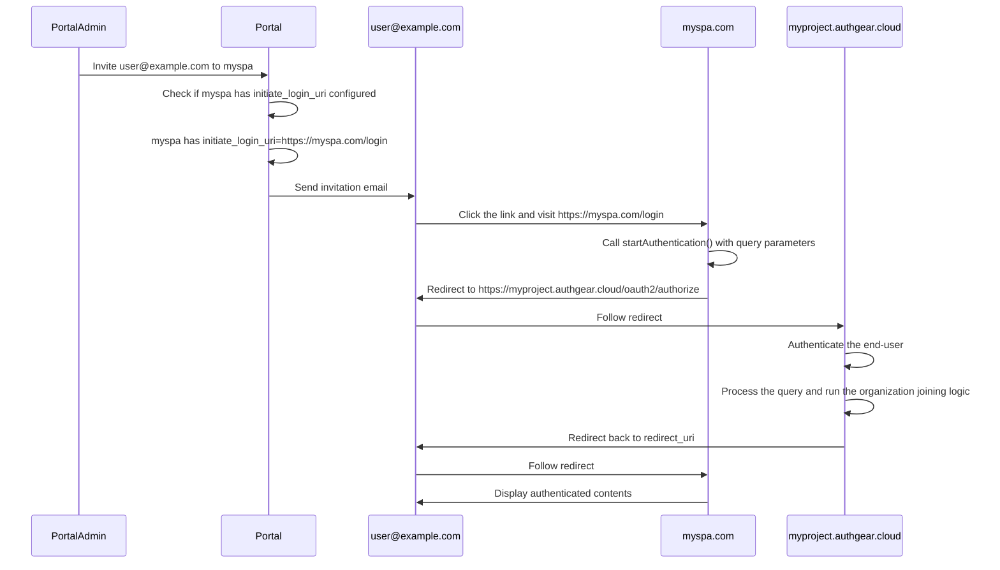

# Design

This document specifies the design of organization in Authgear.

## Data model

A new table `_auth_organization` is introduced to represent organization.

```sql
CREATE TABLE _auth_organization (
  id text PRIMARY KEY,
  app_id text NOT NULL,
  created_at timestamp without time zone NOT NULL,
  updated_at timestamp without time zone NOT NULL,
  slug text NOT NULL,
  name text NOT NULL,
)

-- Each slug is unique within the project.
CREATE UNIQUE INDEX _auth_organization_slug_unique ON _auth_organization USING btree (app_id, slug);
-- For typeahead search for slug.
CREATE INDEX _auth_organization_slug_typeahead ON _auth_organization USING btree (app_id, slug text_pattern_ops);
```

A new table `_auth_user_organization` is introduced to represent user membership in organization.

```sql
CREATE TABLE _auth_user_organization (
  id text PRIMARY KEY,
  app_id text NOT NULL,
  created_at timestamp without time zone NOT NULL,
  updated_at timestamp without time zone NOT NULL,
  user_id text NOT NULL REFERENCES _auth_user(id),
  organization_id text NOT NULL REFERENCES _auth_organization(id)
);
-- A user and an organization can only be associated at most once.
CREATE UNIQUE INDEX _auth_user_organization_unique ON _auth_user_organization USING btree (app_id, user_id, organization_id);
-- This index supports joining from _auth_user.
CREATE INDEX _auth_user_organization_user ON _auth_user_organization USING btree (app_id, user_id);
-- This index supports joining from _auth_organization.
CREATE INDEX _auth_user_organization_organization ON _auth_user_organization USING btree (app_id, organization_id);
```

## Organization-specific configuration

Organization-specific configuration **IS NOT** stored in `_auth_organization`.
They are stored in `authgear.yaml` in the parent project.

An example looks like

```
authentication:
  identities:
  - login_id
  - oauth
  primary_authenticators:
  - password
  - passkey
  secondary_authenticators:
  - totp
  secondary_authentication_mode: if_exists
identity:
  oauth:
    providers:
    - type: azureadv2
      alias: org1_federated_login
      # NOTE: This field does not exist yet.
      # This provider is disabled in the project.
      disabled: true
authenticator:
  password:
    policy:
      min_length: 8
      uppercase_required: false
      lowercase_required: false
    expiry:
      force_change:
        enabled: false
  sms:
    phone_otp_mode: whatsapp_sms
account_deletion:
  scheduled_by_end_user_enabled: true
forgot_password:
  enabled: true
verification:
  claims:
    email:
      enabled: true
      required: true
    phone_number:
      enabled: true
      required: true

organizations:
- organization_id: xxx
  organization_specific:
    authentication:
      identities:
      # Allow Federated login only
      - oauth
      # Change MFA to required.
      secondary_authentication_mode: required
    identity:
      oauth:
        providers:
        # Enable the Federated Login OAuth provider.
        - alias: azureadv2
          disabled: false
    authenticator:
      password:
        policy:
          min_length: 12
          uppercase_required: true
          lowercase_required: true
          digit_required: true
          symbol_required: true
        expiry:
          force_change:
            enabled: true
            # Force change password every 30 days.
            duration_since_last_update: 720h
      sms:
        # Allow SMS OTP only. No Whatsapp.
        phone_otp_mode: sms
      account_deletion:
        # Disallow self-serve account deletion.
        scheduled_by_end_user_enabled: false
      forgot_password:
        # Disallow forgot password.
        # Must contact admin.
        enabled: false
      verification:
        claims:
          # The email may be fake. So verification is meaningless.
          email:
            enabled: false
            required: false
```

> [!WARNING]
> Only the above listed configuration are organization-specific.
> Other configuration are inherited to the organization.

---

# Brainstorming on the technical design of supporting organization in Authgear

Usecase-driven design begins here.

## Usecase 1: Different password policies and Usecase 3: Enable MFA for some organization

This usecase can be generalized to Organization-specific settings.
Specifically, organization-specific settings **override** the project settings.

For organization-specific settings, we can store them in a new directory in the project FS, like `/orgs/{org-id}/templates`.

For organization-specific login settings, this is more complicated. We want to

- Allow the developer to add a organization-specific OAuth provider.
  - Does this really have to be organization-specific? That is, can we also list it in the original OAuth provider list?
  - Maybe we can just add a new field `orgs` to OAuth provider config, which is a list of org-id.
  - When `orgs` is abent, the behavior is backwards compatible, the OAuth provider can be used project-wise.
  - When `orgs` is specified, the OAuth provider can only be used in the specific organizations.
  - This design allows organization to share common OAuth provider config. (Question: is this common?)
- Federated Login.
  This means the project simply delegates to another IdP to do the login.
  The key point is, the end-user NEVER see the UI of Authgear.
  - We have a ad-hoc support for a Federated Login experience via the poorly authentication parameter `x_oauth_provider_alias`.
  - TODO: Formally document `x_oauth_provider_alias`.
  - Add something this to support Federated Login natively.
    ```yaml
    authentication:
      federated_login:
        # When this is enabled, authentication.identities are ignored.
        enabled: true
        # Use the configured OAuth provider `adfs` to do Federated Login.
        oauth:
          alias: adfs
    ```
  - When `x_oauth_provider_alias` agrees with `authentication.federated_login`, the behavior is unchanged, otherwise, the authentication is rejected with a OAuth error.
- Allow organization-specific MFA settings.
  - This implies we need to introduce a new section in `authgear.yaml` to contain organization-specific settings.
  - But this DOES NOT mean duplicate the whole `authgear.yaml` under organization-specific settings.
  - We need to think carefully and decide how the config should look like.
  - For settings that can be organization-specific, do we make it look like its project-specific counterpart?
    ```yaml
    authentication:
      secondary_authentication_mode: if_exists
      secondary_authentication_grace_period:
        enabled: true
        end_at: "2025-06-30T00:00:00Z"
      secondary_authenticators:
      - totp

    organizations:
    - organization_id: org_123
      organization_specific:
        # This "authentication" is different from the project "authentication"
        # In particular, it only supports these 3 fields.
        # Specifying other fields IS AN ERROR.
        authentication:
          secondary_authentication_mode: required
          secondary_authentication_grace_period:
            enabled: false
          secondary_authenticators:
          - oob_otp_sms
    ```

## Usecase 5: Email discovery

This usecase requires detailed email domain related settings. See below.

```yaml
organizations:
- organization_id: org_123
  email_domains:
  # When allowed_domains is defined, then its member must have at least one identity with identity attributes `email` matching one of the listed domain.
  - allowed_domains:
    - oursky.com
    - skymakers.co.uk
    - anothercompany.com
  # This list MUST be a subset of allowed_domains. This is enforced by config validation.
  # A newly signed up user whose identity with identity attributes `email` matching one of the listed domain becomes a member of the organization.
  - auto_membership_domains:
    - oursky.com
    - skymakers.co.uk
```

## Usecase 4: Invitation

https://openid.net/specs/openid-connect-core-1_0.html#ThirdPartyInitiatedLogin MUST BE implemented first.



The URL must be a HTTPS URL so most likely it is relevant to a web client application.

Suppose the project `myapp` has set up `auth.myapp.com` as the custom domain of Authgear.
Its website `www.myapp.com`, is using a web app client application to integrate with Authgear.
To enable invitation, the developer MUST configure `initiate_login_uri` in this web app client application.
An example value of `initiate_login_uri` would be `https://www.myapp.com/login`.
When the end-user lands on `https://www.myapp.com/login`, the web app should initiate the Authgear SDK for Web.
Invoke `startAuthentication()` if the end-user has not authenticated yet.

If `myapp` is sophisticated enough to have Universal Link setup, then the following is possible.

`myapp` also has a iOS app and Android app, with Universal Link setup to handle `https://www.myapp.com/login`.
When the end-user click the invitation link in the email, the corresponding app will be opened.
The app is responsible for handling the Universal link, and invoke a suitable SDK method to go through invitation-initiated login.

> [!NOTE]
> This implies supporting Universal link to invitation requires changes in the SDK!

## Usecase 2: IAM

Support for IAM is currently missing in Authgear.

Currently, we support the following types of identity:
- Login ID
  - Login ID is global to the project.
  - This means `johndoe@example.com` can only exist once in a project.
- OAuth
  - OAuth is much more complicated.
  - The uniqueness depends on the type of the OAuth provider.
  - For example, for Google Login, the Google user can only exist once in a project.
  - For example, for Sign in with Apple, the uniqueness depends on `team_id`.
    This means if the developer sets up two Sign in with Apple with different team ID,
    the same Apple ID `end-user@example.com` signs in through the 2 Sign in with Apple are considered as 2 different users.
- LDAP and passkeys are not discussed here.

To support IAM in a Authgear project, we need to be able to treat two previously identical identity (Login ID or OAuth) different.
This can be done by adding a new nullable column `org_id` to `_auth_identity`.

Existing identities with `org_id IS NULL` are unique within the project, they are not associated with any organization.

If an identity has `org_id IS NOT NULL`, then the uniqueness is within the organization.

Let's call identity that has `org_id IS NOT NULL` an organization-bound identity.

An organization-bound identity has the following implications:

1. In order for Authgear to only search organization-bound identities of an organization during a sign-in, the sign-in MUST specify the intended organization.
   This is similar to AWS login, you must specify the AWS Account ID you are signing in to.
2. When the intended organization is specified, the `organizations` claim in the ID token is always a singleton array containing only the intended organization.
   This implies IAM user and organization switcher **are mutually exclusive features**.
3. If a user has an organization-bound identity, then
  - It cannot have another organization-bound identity bound to another organization, or
  - It cannot have another identity not bound to any organization.
  - This implies a IAM user is always bound to one and only one organization.

> What about `_auth_authenticator`? Do we add `org_id` to it as well?

I think we need not. `_auth_identity` is the only table that needs to be organization-aware because it is used to search users.
Once the search is done, a IAM user in the organization `org1` having email `johndoe@example.com` will have a different user ID than the non-IAM user having the same email.
There is no need to make everything organization-aware.

## Usecase 6: Organization switcher

Auth0 does not support this natively, not sure if they have a reason.

If we wanted to support this, here are some potential problems we need to consider:

1. Do we report all or some of the organizations the user is member of?
   For example, if the user `johndoe@companya.com` is signing in,
   do we also report he is a member of another organization `companyb`?
   In what case, is the reporting undesirable?
   One of the case the reporting is undesirable is that the two organizations have different organization-specific settings on password policy and MFA.
   It seems that it is inappropriate to report information if the user only went through a less restrictive authentication process.

2. What are the alternatives if we do not support organization switcher natively?
   Once signed in, the developer gets the `sub`, they can then use the Admin API to query the membership of the user to build the switcher themselves.
   A counter-argument of this approach is that if organization switcher is something most developers want, it should be provided natively.

3. If we supported organization switcher, how do we represent it in the ID token?
   One way is the following.
   ```json5
   {
      // organization is the organization the user originally signed in to.
      // The application backend uses this field to determine what active organization is.
      "organization": {
        "id": "org_123",
        "slug": "org1",
        "name": "Org 1"
      },
      // All organizations the user is member of.
      "organizations": [
        {
          "id": "org_123",
          "slug": "org1",
          "name": "Org 1"
        },
        {
          "id": "org_456",
          "slug": "org2",
          "name": "Org 2"
        }
      ]
   }
   ```
   The application backend checks the `organization.slug` claim to do its own authorization logic.
   Since the ID token has the active organization stored, to switch organization, the user MUST sign in again.
   Require the user to sign in again eliminate a bunch of problems, like how to handle different password policies, different MFA requirements.

4. The idea of computing the most strict password policies / MFA requirements, and then determine which a sign-in is needed it also very to document.
   If it is hard to document, then it is probably that the developer will have a hard time using it.
