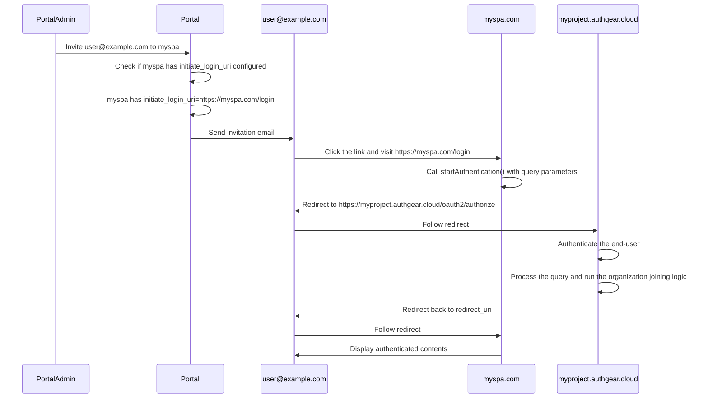

Legacy contents

## Use-case 1: Different password policies and Use-case 3: Enable MFA for some organization

This use-case can be generalized to **Organization-specific settings**.
Specifically, organization-specific settings **override** the project settings.

For organization-specific settings, we can store them in a new directory in the project filesystem, like `/orgs/{org-id}/templates`.

For organization-specific login settings, this is more complicated. We want to

- Allow the developer to add an organization-specific OAuth provider.
  - Does this really have to be organization-specific? That is, can we also list it in the original OAuth provider list?
  - Maybe we can just add a new field `orgs` to OAuth provider config, which is a list of org-id.
  - When `orgs` is absent, the behavior is backwards compatible, the OAuth provider can be used project-wise.
  - When `orgs` is specified, the OAuth provider can only be used in the specific organizations.
  - This design allows organization to share common OAuth provider config. (Question: is this common?)
- Federated Login.
  This means the project simply delegates to another Identity Provider to do the login.
  The key point is, the end-user NEVER see the UI of Authgear.
  - We have an ad-hoc support for a Federated Login experience via the poorly authentication parameter `x_oauth_provider_alias`.
  - TODO: Formally document `x_oauth_provider_alias`.
  - Add something this to support Federated Login natively.
    ```yaml
    authentication:
      federated_login:
        # When this is enabled, authentication.identities are ignored.
        enabled: true
        # Use the configured OAuth provider `adfs` to do Federated Login.
        oauth:
          alias: adfs
    ```
  - When `x_oauth_provider_alias` agrees with `authentication.federated_login`, the behavior is unchanged, otherwise, the authentication is rejected with an OAuth error.
- Allow organization-specific MFA settings.
  - This implies we need to introduce a new section in `authgear.yaml` to contain organization-specific settings.
  - But this DOES NOT mean duplicate the whole `authgear.yaml` under organization-specific settings.
  - We need to think carefully and decide how the config should look like.
  - For settings that can be organization-specific, do we make it look like its project-specific counterpart?
    ```yaml
    authentication:
      secondary_authentication_mode: if_exists
      secondary_authentication_grace_period:
        enabled: true
        end_at: "2025-06-30T00:00:00Z"
      secondary_authenticators:
      - totp

    organizations:
    - organization_id: org_123
      organization_specific:
        # This "authentication" is different from the project "authentication"
        # In particular, it only supports these 3 fields.
        # Specifying other fields IS AN ERROR.
        authentication:
          secondary_authentication_mode: required
          secondary_authentication_grace_period:
            enabled: false
          secondary_authenticators:
          - oob_otp_sms
    ```

## Use-case 5: Email discovery

This use-case requires the introduction of email domain settings. See below.

```yaml
organizations:
- organization_id: org_123
  email_domains:
  # When allowed_domains is defined, then its member must have at least one identity with identity attributes `email` matching one of the listed domain.
    allowed_domains:
    - oursky.com
    - skymakers.co.uk
    - anothercompany.com
  # This list MUST be a subset of allowed_domains. This is enforced by config validation.
  # A newly signed up user whose identity with identity attributes `email` matching one of the listed domain becomes a member of the organization.
    auto_membership_domains:
    - oursky.com
    - skymakers.co.uk
```

When the sign in is

- Email First
- The email address identifies a User who is member of more than 1 Organizations.
- The Organizations have different password policies / different MFA policies.

In competitors like Auth0, they ask at the end of the sign in on which Organization to sign in to.
Depending on the chosen Organization, the sign in flow may have extra steps to run.

For example, if password was used, and the password does not fulfill the requirements of Organization `a`,
then Authgear should force the end-user to update the password.

Since we do not store password, we need to store the facts about the password instead.
For example, does the password has lowercase character? Does the password match N recent history entries?
After the Organization is chosen, the final password policies / MFA policies are now known.

In Auth0, they do not suffer this problem because they validate the password during sign-in.
The requirement enforcement is done in sign up and password change only.
See https://auth0.com/docs/authenticate/database-connections/password-strength#change-your-policy

It may be tempting to move the select-organization step right after the User is identified.
But doing that before the User is authenticated may leak information.
So it should not be done.

## Use-case 4: Invitation

https://openid.net/specs/openid-connect-core-1_0.html#ThirdPartyInitiatedLogin MUST BE implemented first.



The URL must be an HTTPS URL so most likely it is relevant to a web client application.

Suppose the project `myapp` has set up `auth.myapp.com` as the custom domain of Authgear.
Its website `www.myapp.com`, is using a web app client application to integrate with Authgear.
To enable invitation, the developer MUST configure `initiate_login_uri` in this web app client application.
An example value of `initiate_login_uri` would be `https://www.myapp.com/login`.
When the end-user lands on `https://www.myapp.com/login`, the web app should initiate the Authgear SDK for Web.
Invoke `startAuthentication()` if the end-user has not authenticated yet.

If `myapp` is sophisticated enough to have Universal Link setup, then the following is possible.

`myapp` also has an iOS app and Android app, with Universal Link setup to handle `https://www.myapp.com/login`.
When the end-user click the invitation link in the email, the corresponding app will be opened.
The app is responsible for handling the Universal link, and invoke a suitable SDK method to go through invitation-initiated login.

> [!NOTE]
> This implies supporting Universal link to invitation requires changes in the SDK!

## Use-case 2: User Isolation by Organization

Support for User Isolation by Organization is currently missing in Authgear.

Let us first review what are the currently supported identities.

### Login ID

- Login ID is global to the project.
- This means `johndoe@gmail.com` can only exist once in a project.

### OAuth

- The uniqueness of an OAuth Identity depends on the type of the OAuth Provider.
- For example, in Google Login, the Google user (`@gmail.com`) can only exist once in a project because Google returns the same `sub` regardless of the value of the `client_id`.
- For example, in Sign in with Apple, the uniqueness depends on the value of `team_id`.
  This means if the developer sets up 2 Sign in with Apple with different team IDs,
  the same Apple ID `johndoe@gmail.com` signs in through the 2 Sign in with Apple are considered as 2 different identities.

---

The next question is, what changes must be made to the data model to support User Isolation by Organization.

To perform the analysis, we take the story from https://auth0.com/docs/get-started/architecture-scenarios/multiple-organization-architecture

### The case of Sally

MetaHexa is a bank having their own Identity Provider (say Microsoft Entra ID).
Sally, an employee of MetaHexa, signs in via Microsoft Entra ID.
The work email address of Sally is `sally@metahexa.com`.
`sally@metahexa.com` corresponds to a User with ID `sally-metahexa-com` who is a member of organization `metahexca`.

The personal email address of Sally is `sally@gmail.com`.
`sally@gmail.com` corresponds to a User with ID `sally-gmailcom`.
This User may or may not belong to any organization, it does not matter much.

When Sally does her work, she signs in `sally@metahexa.com` via Microsoft Entra ID.

When Sally manages her personal stuff, she signs in `sally@gmail.com`.

### The case of Pat

Pat works for Hoekstra and Gupta Smith as part-time.
Both Hoekstra and Gupta Smith does not own their Identity Provider.
But **we assume these 2 companies have their own email domains, and their employees have a email address with that email domain**.

Under this assumption, Pat has the following email addresses:

- `pat@hoekstra.com`, corresponds to User with ID `pat-hoekstra-com`, a member of organization `hoekstra`.
- `pat@guptasmith.com`, corresponds to User with ID `pat-gupta-smith-com`, a member of organization `guptasmith`.
- `pat@gmail.com`, corresponds to User with ID `pat-gmail-com`.

### The case of Sumana

Sumana is an employee of AdventureZ, and a freelancer for Rocky High.

Under the story's settings, she has the following email addresses:

- `sumana@adventurez.com`, corresponds to User with ID `sumana-adventurez-com`, a member of both organization `adventurez` and organization `rockyhigh`.

### Observation: Organization must own their email domain

As long as an organization owns their email domain,
our existing tables like `_auth_identity_login_id`, `_auth_identity_oauth`, and `_auth_user` **DO NOT** need to be organization-aware.

In practice, the organization should configure its email domain settings to control who can be a member of it.

In this story, the settings should look like

```yaml
organizations:

# MetaHexa is a bank.
# Therefore it requires all members to have email @metahexa.com
# Additionally, MetaHexa is configured to use Microsoft Entra ID as Federated Login,
# Thus effectively all members must sign in with Microsoft Entra ID.
- organization_id: metahexa
  email_domains:
    allowed_domains:
    - metahexa.com
    auto_membership_domains:
    - metahexa.com

# Hoekstra does not require all members to have email @hoekstra.com
# Though if a user with verified @hoekstra.com signs up, the user becomes member of it automatically.
# Hoekstra does not own its Identity Provider though.
# It allows Login ID Identity.
- organization_id: hoekstra
  email_domains:
    auto_membership_domains:
    - hoekstra.com

# Gupta Smith has a similar setup with Hoekstra.
- organization_id: guptasmith
  email_domains:
    auto_membership_domains:
    - guptasmith.com

# AdventureZ has a similar setup with Hoekstra.
- organization_id: adventurez
  email_domains:
    auto_membership_domains:
    - adventurez.com

# AdventureZ has a similar setup with Hoekstra.
- organization_id: rockyhigh
  email_domains:
    auto_membership_domains:
    - rockyhigh.com
```

What is impossible if we do not make any data model changes?

It is impossible to have `sally@gmail.com` to join organization `orga` and organization `orgb` simultaneously while requiring `sally@gmail.com` in `orga` has a **DIFFERENT** User ID than `sally@gmail.com` in `orgb`.

In my wild guess, this is not a problem in practice because

- The organizations most of the time have their own email domain.
- For organizations that allow any end-user to join, the end-user should be the same User. Think of GitHub.

### Observation: No need to introduce User Isolation by Organization at data model level

User and Organization forms N-to-M relationship.
There is no restriction to impose that a particular User must belong to one and only one Organization.

The membership is primarily controlled by setting a correct email domain settings on the Organization.

Since membership is controlled by email domain,
**it is very important to forbid the member to add / update / remove email**

> [!NOTE]
> If an Organization has email domain settings,
> does it make sense to forbid any identity creation / removal / update by end-user?

## Use-case 6: Organization switcher

Auth0 does not support this natively, not sure if they have a reason.

If we wanted to support this, here are some potential problems we need to consider:

1. Do we report all or some of the organizations the user is member of?
   For example, if the user `johndoe@companya.com` is signing in,
   do we also report he is a member of another organization `companyb`?
   In what case, is the reporting undesirable?
   One of the case the reporting is undesirable is that the two organizations have different organization-specific settings on password policy and MFA.
   It seems that it is inappropriate to report information if the user only went through a less restrictive authentication process.
   However, in Email First, the user is prompted to choose which Organization to sign in to, so the user is already told which organization he is a member of.

2. What are the alternatives if we do not support organization switcher natively?
   Once signed in, the developer gets the `sub`, they can then use the Admin API to query the membership of the user to build the switcher themselves.
   A counter-argument of this approach is that if organization switcher is something most developers want, it should be provided natively.

3. If we supported organization switcher, how do we represent it in the ID token?
   One way is the following.
   ```json5
   {
      // organization is the organization the user originally signed in to.
      // The application backend uses this field to determine what active organization is.
      "organization": {
        "slug": "org1",
        "name": "Org 1"
      },
      // All organizations the user is member of.
      "organizations": [
        {
          "slug": "org1",
          "name": "Org 1"
        },
        {
          "slug": "org2",
          "name": "Org 2"
        }
      ]
   }
   ```
   The application backend checks the `organization.slug` claim to do its own authorization logic.
   Since the ID token has the active organization stored, to switch organization, the user MUST sign in again.
   Require the user to sign in again eliminate a bunch of problems, like how to handle different password policies, different MFA requirements.

4. The idea of computing the most strict password policies / MFA requirements, and then determine which a sign-in is needed it also very hard to document.
   If it is hard to document, then it is probably that the developer will have a hard time using it.

5. GitHub allows the user to be member of multiple organizations. During sign-in, the user is not prompted to select an organization. If one of the organization the user belongs to require 2FA, then the user is required to have 2FA. Even Auth0 cannot model this use-case without resorting to Auth0 post-login actions.
