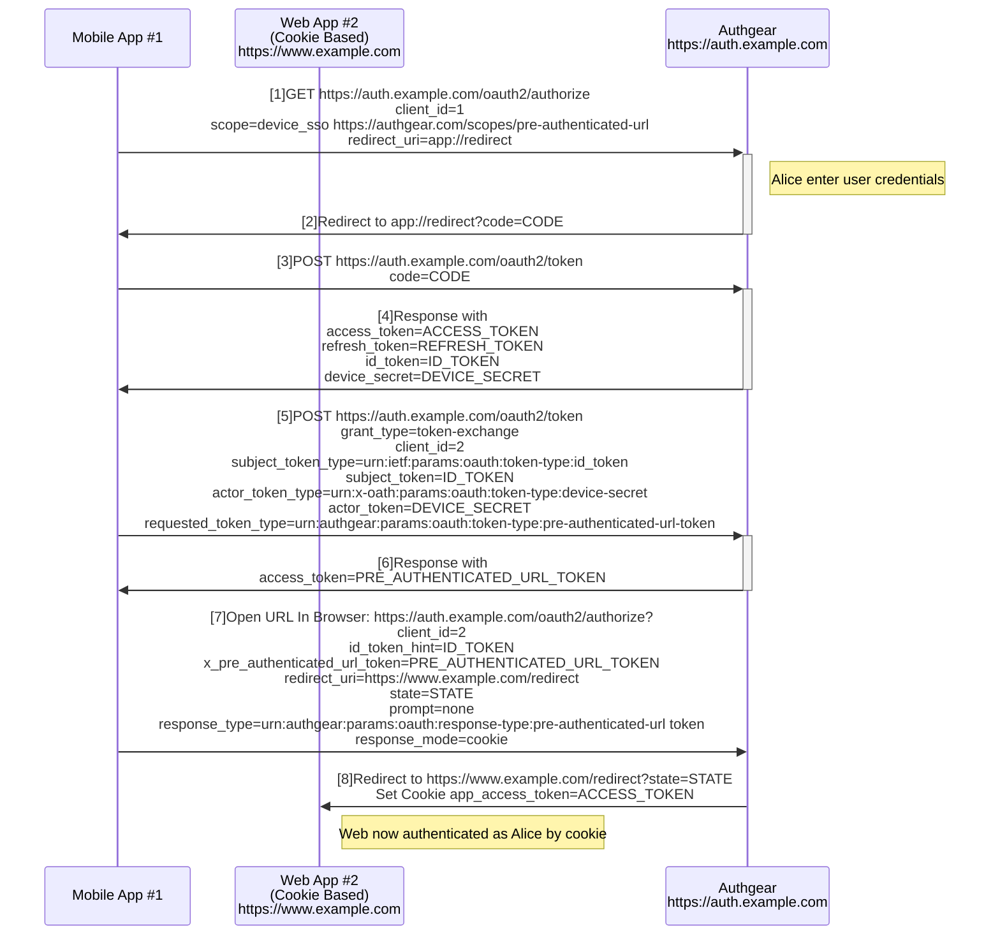

# Pre-Authenticated URL

- [Abstract](#abstract)
- [The Flow](#the-flow)
- [Native App Authorization Extensions](#native-app-authorization-extensions)
- [Token Exchange Profile for Pre-Authenticated URL](#token-exchange-profile-for-pre-authenticated-url)
  - [Defined token type identifiers](#defined-token-type-identifiers)
  - [Token Exchange Request](#token-exchange-request)
  - [Token Exchange Response](#token-exchange-response)
- [Exchanging for browser cookie of a session with the authorization endpoint](#exchanging-for-browser-cookie-of-a-session-with-the-authorization-endpoint)
- [Client Metadata](#client-metadata)
- [Security Considerations](#security-considerations)
  - [Binding Tokens To Device](#binding-tokens-to-device)
- [Changes In SDKs](#changes-in-sdks)
- [Usecases](#usecases)

## Abstract

This document describes a mechanism that allows a native mobile app to generate a cookie to be used by a web browser, so that the browser can obtain a valid session of the user logged in in the native mobile app without extra authentication steps.

This document is drafted based on [OpenID Connect Native SSO for Mobile Apps 1.0](https://openid.net/specs/openid-connect-native-sso-1_0.html).

## The Flow



Step [1] to [4] are the standard OpenID Connect authorization_code flow with the following extensions. In step [1], the scopes `device_sso https://authgear.com/scopes/pre-authenticated-url` is specified signifying that the client is requesting a `device_secret` to be returned when the code is exchanged for tokens.

After step [4], Mobile App #1 stores the device_secret and id_token in the protected device storage accessible only to Mobile App #1.

Step [5] invokes the /token endpoint with the token exchange profile passing the id_token obtained from the device storage, the client_id and the device secret. A Pre-Authenticated URL Token is then returned in step [6].

Step [7] uses the obtained Pre-Authenticated URL Token to open /authorize in a browser, with the id_token used in step [5], and a redirect_uri pointing to Web App #2.

Step [8] redirects the browser to Web App #2, with a with a cookie representing the user session set. The cookie can then be used for authorizing Web App #2 as it was logged in as the same user of Mobile App #1.

## Native App Authorization Extensions

Same as the [Native SSO](https://openid.net/specs/openid-connect-native-sso-1_0.html#name-native-app-authorization-ex). With a new supported scope `https://authgear.com/scopes/pre-authenticated-url`.

## Token Exchange Profile for Pre-Authenticated URL

This section profiles the OAuth2 Token Exchange [RFC8693](https://datatracker.ietf.org/doc/html/rfc8693) spec and describes the processing rules used to exchange a previous authentication for a Pre-Authenticated URL Token, which can then be used to exchange for an access token stored in a browser cookie for the use of another Web App.

### Defined token type identifiers

This profile also defines the following token type identifiers.

```
urn:x-oath:params:oauth:token-type:device-secret
```

Please refer to [OpenID Connect Native SSO for Mobile Apps 1.0](https://openid.net/specs/openid-connect-native-sso-1_0.html).

```
urn:authgear:params:oauth:token-type:pre-authenticated-url-token
```

This token type identifier refers to the Pre-Authenticated URL Token mentioned in this spec. It can be used as the `requested_token_type` parameter in token exchange request.

### Token Exchange Request

When a mobile app wants to create Pre-Authenticated URL, it makes a request to the token endpoint to obtain a Pre-Authenticated URL Token with the following parameters:

- `grant_type`: Must be `urn:ietf:params:oauth:grant-type:token-exchange`
- `subject_token`: The id_token obtained by the mobile app
- `subject_token_type`: Must be `urn:ietf:params:oauth:token-type:id_token`
- `actor_token`: The device_secret obtained by the mobile app
- `actor_token_type`: Must be `urn:x-oath:params:oauth:token-type:device-secret`
- `requested_token_type`: Required. The value must be `urn:authgear:params:oauth:token-type:pre-authenticated-url-token`.
- `scope`: Optional. Requested scopes of the new session. Only scopes exist in the current offline grant is allowed.

Here is an example:

```
POST /token HTTP/1.1
Host: auth.example.com
...
grant_type=urn%3Aietf%3Aparams%3Aoauth%3Agrant-type%3Atoken-exchange
&subject_token=<id_token>
&subject_token_type=urn%3Aietf%3Aparams%3Aoauth%3Atoken-type%3Aid-token
&actor_token=95twdf3w4y6wvftw35634t
&actor_token_type=urn%3Ax-oath%3Aparams%3Aoauth%3Atoken-type%3Adevice-secret
&requested_token_type=urn%3Aauthgear%3Aparams%3Aoauth%3Atoken-type%3Apre-authenticated-url-token
```

### Token Exchange Response

The Token Exchange response for this profile has the following characteristics:

- `access_token`: Required. The Pre-Authenticated URL Token which can then be used to exchange for a browser cookie. It is named as `access_token` for historical reasons as mentioned in [RFC8963](https://datatracker.ietf.org/doc/html/rfc8693#section-2.2.1).
- `issued_token_type`: Required. The value must be `urn:authgear:params:oauth:token-type:pre-authenticated-url-token`.
- `token_type`: Required. The value is always `Bearer`.
- `device_secret`: Required. A new device secret must be returned. The mobile app should update its device secret with the new secret.
- `id_token`: Required. A new id_token which binds to the new issued device secret.
- `expires_in`: Required. When the device browser session token expires.

Here is an example:

```
HTTP/1.1 200 OK
Content-Type: application/json
Cache-Control: no-store

{
  "access_token": "9B0RFZUEGfOz3ag48MB2JQqP1phsTkXf",
  "device_secret": "pabH6DkgiKGhncszYgkA9jB3D7rt0f9h",
  "expires_in": 300,
  "id_token": "ID_TOKEN",
  "issued_token_type": "urn:authgear:params:oauth:token-type:pre-authenticated-url-token",
  "token_type": "Bearer"
}
```

## Exchanging for browser cookie with the authorization endpoint

A web browser can open the authorization endpoint endpoint to exchange for a valid browser session cookie with the following parameters:

- `client_id`: Required. The client_id of the obtained session.
- `id_token_hint`: Required. The id_token obtained by the mobile app.
- `x_pre_authenticated_url_token`: Required. The Pre-Authenticated URL Token obtained from token exchange response.
- `scope`: Optional. Scope of the session of the browser session cookie. If not provided, it will be same as the scope of the session which generates this browser session cookie (i.e. The offline grant of the mobile app).
- `prompt`: Required. The value must be `none`.
- `response_type`: Required. Must be one of the following values:
  - `urn:authgear:params:oauth:response-type:pre-authenticated-url token`: An access token will be set in the cookie, which shares the same session of the refresh_token of the native mobile app.
- `response_mode`: Required. Must be `cookie`.
- `redirect_uri`: Required. The uri to redirect to on the operation completed. It must be whitelisted by the client specified in `client_id`. See the below [Client Metadata](#client-metadata) section for details.
- `state`: Optional. If provided, will be provided to the redirect_uri as a `state` query parameter.

In the response, the authorize endpoint will redirect the user to `redirect_uri`, and set a browser cookie.

## Client Metadata

Two new configs are added to clients.

- `x_pre_authenticated_url_enabled`. Boolean. Default `false`. When `true`, the clients can participate in the Pre-Authenticated URL flow. Both native mobile app client and the web app client MUST set this flag to `true` to use Pre-Authenticated URL.

- `x_pre_authenticated_url_allowed_origins`. List of strings of URL origins. This is used to whitelist the `redirect_uri` provided to the authorization endpoint when using `x_pre_authenticated_url_token`. Only the origin of the `redirect_uri` will be compared with this list of origins, thus additional query and fragments are allowed in `redirect_uri`.

## Security Considerations

### Binding Tokens To Device

device_secret should always be bound to a device. See [OIDC Native SSO](./oidc-native-sso.md#security-considerations) for details.

## Changes In SDKs

- The container constructor will accept a new option `preAuthenticatedURLEnabled: boolean`. The flag MUST be set to `true` in the native mobile app SDK when using Pre-Authenticated URL.
- A new method `makePreAuthenticatedURL(): URL` will be added.
  - Parameters:
    - `webApplicationClientID: string`: The client ID of the web app.
    - `webApplicationURI: URI`: The uri you want to open in authenticated state.
    - `state: string`: Similar to oauth `state`. Will be passed to `webApplicationURI` as a query parameter on complete.
  - Return:
    - The url which can then be opened in a browser.
  - `PreAuthenticatedURLNotAllowedError` will be thrown if the current session does not support Pre-authenticated URL. i.e. `https://authgear.com/scopes/pre-authenticated-url` does not exist in scope.

## Usecases

1. We have a native mobile consumer app, and a cookie based web marketing site. We want the user to be authenticated when opening the marketing site from the mobile consumer app.

- Steps:

  1. In the mobile app, configure the SDK with `preAuthenticatedURLEnabled=true`.
  2. Call `authenticate()` to login.
  3. Call `makePreAuthenticatedURL()` with `webApplicationClientID=WEB_CLIENT_ID, webApplicationURI=https://marketing-site.example.com`. An URL is returned from the method.
  4. Open the system browser with the URL obtained in step 3. The user finally arrived `https://marketing-site.example.com` with authenticated state.

2. We have a native mobile app which is able to start web SPAs inside the mobile app. We want the user to be considered authenticated as the same user of the native mobile appin inside the web SPAs. The web SPAs are refresh token based.

- Steps:

  1. In the mobile app, configure the SDK with `preAuthenticatedURLEnabled=true`.
  2. Call `authenticate()` to login.
  3. Call `makePreAuthenticatedURL()` with `webApplicationClientID=WEB_SPA_CLIENT_ID, webApplicationURI=https://spa.example.com`. An URL is returned from the method.
  4. Open the system browser with the URL obtained in step 3. The user finally arrived `https://spa.example.com`.
  5. The SPA hosted in `https://spa.example.com` should call the `authenticate()` method of the SDK with `isSSOEnabled=true`.
  6. The user will see the continue screen of the auth ui. Press continue result in authenticated as the same user of the mobile app session.
