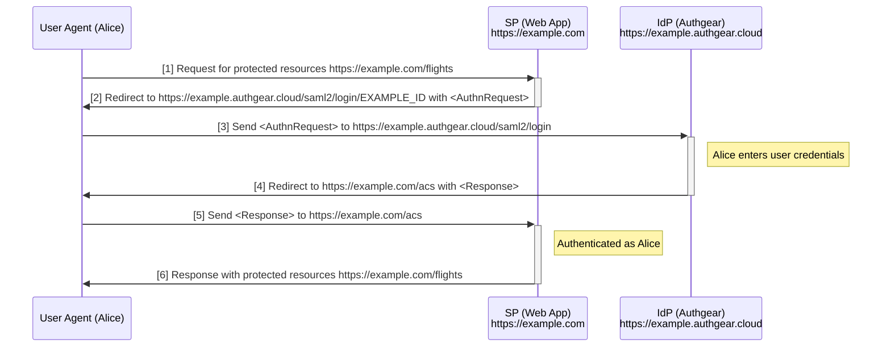
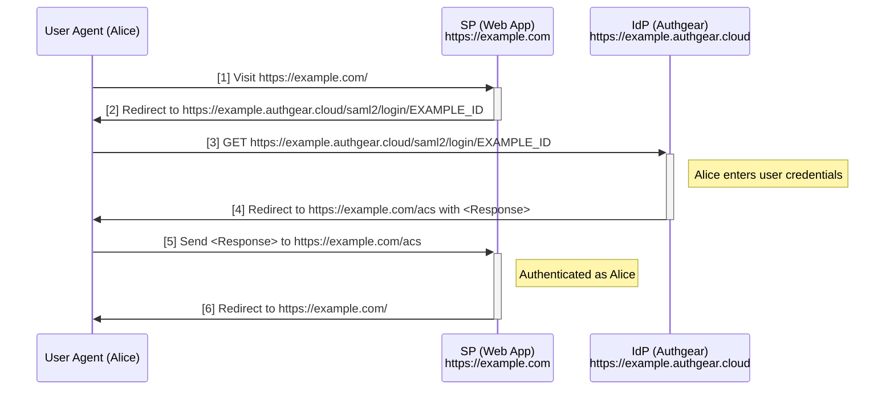
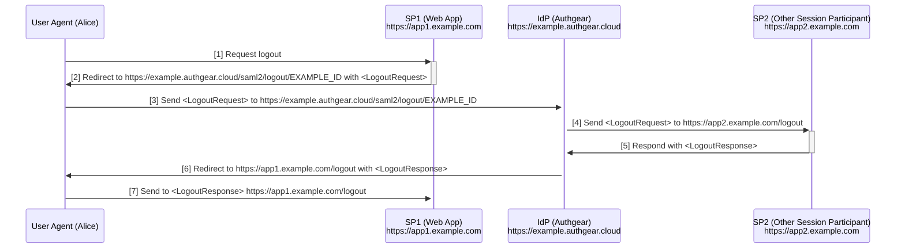

# SAML

- [Web Browser SSO](#1)
  - [SP Initiated](#1_1)
  - [IdP Initiated](#1_2)
  - [Configs](#1_3)
  - [Supported Parameters in `<AuthnRequest>`](#1_4)
  - [Support Pre-Selecting User by SAML Subject in Authentication Flow](#1_5)
  - [The Login Endpoint](#1_6)
- [Single Logout](#2)
  - [Configs](#2_1)
  - [Supported Parameters in `<LogoutRequest>`](#2_2)
  - [The Logout Endpoint](#2_3)
- [NameID](#3)
  - [Supported NameIDFormat](#3_1)
    - [Configure NameID when using urn:oasis:names:tc:SAML:1.1:nameid-format:unspecified](#3_1_1)
  - [Configs](#3_2)
  - [Unsupported `NameIDFormat`](#3_3)
- [Attributes](#4)
  - [Customizing the attributes](#4_1)
  - [Use a hook to compute SAML attributes](#4_2)
    - [Payload](#4_2_1)
    - [Response](#4_2_2)
- [Bindings](#5)
  - [Supported Bindings](#5_1)
  - [Unsupported Bindings](#5_2)
- [Signing](#6)
  - [Configs](#6_1)
  - [Secrets](#6_2)
- [Metadata](#7)
- [Debug Logging](#8)
  - [Configs](#8_1)
- [Profiles not supported at the moment](#9)
- [An example with all configurable options](#10)
- [Service Provider Support](#11)

## <a id="1"></a> Web Browser SSO

### <a id="1_1"></a> SP Initiated

Ref: [SAMLProfile](https://groups.oasis-open.org/higherlogic/ws/public/download/35389/sstc-saml-profiles-errata-2.0-wd-06-diff.pdf) Section 4.1



- The login endpoint `https://example.authgear.cloud/saml2/login/EXAMPLE_ID` is from the metadata.
- The Assertion Consumer Service (ACS) URL `https://example.com/acs` is from `<AuthnRequest>` if provided, else it is the first item in `acs_urls` of the SP's configuration.
- `Destination`, `Audience` and `Recipient` of the `<Response>` and SAML assertions will be set to the  Assertion Consumer Service URL by default, but these fields can be customized in the configuration of each SP.
- In step [4], Authgear creates an IdP Session with the User Agent using cookies. `SessionIndex` in the `<Response>` of step [5] is composed by the ID of the IdP Session.
- In step [5], the SP should memorize the authentication state. For example, by creating a session using cookies.

### <a id="1_2"></a> IdP Initiated

Ref: [SAMLProfile](https://groups.oasis-open.org/higherlogic/ws/public/download/35389/sstc-saml-profiles-errata-2.0-wd-06-diff.pdf) Section 4.1



- The login endpoint `https://example.authgear.cloud/saml2/login/EXAMPLE_ID` is from the metadata. Different applications will use a different endpoint.
- Same as SP Initiated Web Browser SSO, Idp Session is created in step [4]. `SessionIndex` in the `<Response>` of step [5] is the ID of the IdP Session.
- Same as SP Initiated Web Browser SSO, SP should memorize the authentication state in step [5] .
- The Assertion Consumer Service (ACS) URL `https://example.com/acs` MUST be configured in the application config. Config name `acs_urls`.
- `Audience` of the MUST be configured in the application config. Config name `audience`.
- The URL the user finally reached in step [6] is up to the implementaion of the SP. In the above example, it backs to the home page `https://example.com/`.

### <a id="1_3"></a> Configs

Here is an example of configurations about Web Browser SSO:

```yaml
saml:
  service_providers:
    - id: EXAMPLE_ID
      audience: https://example.com
      destination: https://example.com/acs
      recipient: https://example.com/acs
      acs_urls:
        - https://example.com/acs
```

- `saml.service_providers`: Required. A list of objects containing the configurations of a Service Provider. The objects in the list contains the following fields:
  - `id`: Required. ID of the service provider. Authgear uses this ID to reference the service provider. Note that this is not the entity ID of the service provider.
  - `audience`: Optional. `Audience` condition of the `<Assertion>` generated at the end of Browser SSO flow. If not set, the `Audience` will be the Assertion Consumer Service URL.
  - `destination`: Optional. `Destination` of the `<Response>` generated at the end of Browser SSO flow. If not set, the `Destination` will be the Assertion Consumer Service URL.
  - `recipient`: Optional. `Recipient` of the `<Subject>` generated at the end of Browser SSO flow. If not set, the `Recipient` will be the Assertion Consumer Service URL.
  - `acs_urls`: Required. A list of strings. The minimum number of items is 1. The list of allowed `AssertionConsumerServiceURL`s to be used in an `<AuthnRequest>` issued by a SP. If `AssertionConsumerServiceURL` is not set in `<AuthnRequest>`, or it is an IdP-initiated flow, the first item in the list will be picked as the `AssertionConsumerServiceURL`.

### <a id="1_4"></a> Supported Parameters in `<AuthnRequest>`

- `<saml:Subject>`

  - If provided, the subject will be passed to Authentication Flow for pre-selecting a user. See [Support Pre-Selecting User by SAML Subject in Authentication Flow](#1_5) for details.
  - Ref: [SAMLCore](https://docs.oasis-open.org/security/saml/v2.0/saml-core-2.0-os.pdf) Section 3.3.4.

- `<NameIDPolicy>`

  - `<Format>`: If provided, `NameID` will be returned in the specified format. See [NameID](#3) section for supported formats.
  - `<AllowCreate>`: If `true`, user can signup a new user during the SSO flow. Else, only login to an existing user is allowed. The default is `true`. Note that according to the SAML specification, the default value should be `false`, but we decided to change the default to `true` to match the behavior of the OIDC flow.
  - `SPNameQualifier`: Not supported. If provided, it MUST be the entity ID of the service provider, or it will be an error.

- `<saml:Conditions>`

  - If provided, same conditions will be applied to the returned SAML assertions.

- `<RequestedAuthnContext>`

  - Not supported. If provided, only `<AuthnContextClassRef>` with value `urn:oasis:names:tc:SAML:2.0:ac:classes:unspecified` is accepted. Others will be an error.

- `<Scoping>`

  - Not supported. Will be ignored if provided.

- `<ForceAuthn>`

  - If `true`, any IdP Session will be ignored during the authentication process. i.e. The user must authenticate again by the Auth UI. If `<IsPassive>` is true, it is always an error.
  - If `false`, and if an IdP Session already exist. Combining with `<IsPassive>`, there will be different behaviors:
    - If `<IsPassive>` is `true`, the user will be authenticated directly without seeing any interactable UI.
    - If `<IsPassive>` is `false`, the user will see the Select Account Screen. If `<saml:Subject>` was provided, the user will not be allowed to login with another account.
  - Here are the equivalents of the `prompt` parameter in oidc:
    - `prompt=login`: `ForceAuthn=true` and `IsPassive=false`.
    - `prompt=select_account login`: `ForceAuthn=false` and `IsPassive=false`.
    - `prompt=none`: `ForceAuthn=false` and `IsPassive=true`.

- `<IsPassive>`

  - See the above `<ForceAuthn>` section.

- `<AssertionConsumerServiceIndex>`

  - Not supported. Use `<AssertionConsumerServiceURL>` to specify the Assertion Consumer Service URL. Will be an error if provided.

- `<AssertionConsumerServiceURL>`

  - Optional. If not provided, the first item in the `acs_urls` config in items of `saml.service_providers` will be used.

- `<ProtocolBinding>`

  - Optional. If not provided, default to `urn:oasis:names:tc:SAML:2.0:bindings:HTTP-Post`. See [Bindings](#5) section for supported bindings.

- `<AttributeConsumingServiceIndex>`

  - Not supported. Will be ignored if provided.

- `<ProviderName>`
  - Not supported. Will be ignored if provided.

### <a id="1_5"></a> Support Pre-Selecting User by SAML Subject in Authentication Flow

A new identification method `saml_authn_request` will be added. It accepts the base64url encoded SAML request as the input.

```json
{
  "identification": "saml_authn_request",
  "authn_request": "PHNhbWxwOkF1dGhuUmVxdWVzdA..."
}
```

- The request MUST includes a valid Subject, with a valid NameID.
- The NameID will be mapped to an existing user. See [NameID](#3) section for related configs.

### <a id="1_6"></a> The Login Endpoint

- The URL is https://example.authgear.cloud/saml2/login/EXAMPLE_ID. Where `EXAMPLE_ID` is the `id` of the service provider as specified in the config `saml.service_providers[index].id`. As a result, each service provider will have a independent login endpoint.
- The metadata for each service provider will includes the above login endpoint.
- When the endpoint receives a GET or POST request with a `<AuthnRequest>` provided, the [SP Initiated SSO flow](#1_1) will be triggered.
- When the endpoint receives a GET request without a `<AuthnRequest>` provided, the [IdP Initiated SSO flow](#1_2) will be triggered.
- When the endpoint receives a POST request without a `<AuthnRequest>` provided, it is an error.

#### Selecting Service Provider

- This is not supported at the moment.
- When entering the URL `https://example.authgear.cloud/saml2/login` with a GET request, user should be allowed to select a service provider to log into.

## <a id="2"></a> Single Logout

Ref: [SAMLProfile](https://groups.oasis-open.org/higherlogic/ws/public/download/35389/sstc-saml-profiles-errata-2.0-wd-06-diff.pdf) Section 4.4



- The logout endpoint `https://example.authgear.cloud/saml2/logout/EXAMPLE_ID` is from the metadata.
- The logout callback URL `https://app1.example.com/logout` MUST be configured in the application config. Config name `logout_callback_url`.
- Step [4] and [5] will be repeated for all other `service_providers` configured with `slo_enabled: true`, if the current logging out application has `slo_enabled: true` configured.
- If any errors occurs during step [4] and [5], the errors will be ignored. The loop will continue until logout callback URLs of all SPs who participated in the session is called.
- The binding used in step [4] is configurable with the config name `logout_binding`.
- After step [7], the SP can redirect the user to a fixed url. This is up to the SP implementation.

### <a id="2_1"></a> Configs

```yaml
saml:
  service_providers:
    - id: EXAMPLE_ID
      logout_callback_url: https://app1.example.com/logout
      slo_enabled: true
      logout_binding: urn:oasis:names:tc:SAML:2.0:bindings:HTTP-Redirect
```

- `logout_callback_url`: Required if `slo_enabled` is `true`. The URL where the `<LogoutRequest>` should be sent to.
- `slo_enabled`: Optional. Whether the application participate in Single Logout. Default `false`.
- `logout_binding`: The binding used to send a `<LogoutRequest>` to the `logout_callback_url`. See the below Bindings section for supported bindings. Default `urn:oasis:names:tc:SAML:2.0:bindings:HTTP-Redirect`.

### <a id="2_2"></a> Supported Parameters in `<LogoutRequest>`

- `<saml:NameID>`

  - Requried. Must be the NameID of the current logging out user which obtained from a `<Response>`.

- `<NotOnOrAfter>`

  - Optional. If provided, the request will be ignored if the current time is after this value.

- `<Reason>`

  - Not supported. Will be ignored if provided.

- `<SessionIndex>`
  - Optional. If provided, must be a valid IdP Session ID which obtained from `<SessionIndex>` of a `<Response>`.

### <a id="2_3"></a> The Logout Endpoint

- The URL is https://example.authgear.cloud/saml2/logout/EXAMPLE_ID. Where `EXAMPLE_ID` is the `id` of the service provider as specified in the config `saml.service_providers[index].id`. As a result, each service provider will have a independent logout endpoint.
- The metadata for each service provider will includes the above login endpoint.
- When the endpoint receives a GET or POST request with a `<LogoutRequest>` provided, the [Single Logout flow](#2) will be triggered. A `<LogoutResponse>` will be returned. The binding used to return the response will be same as the binding used to receive the `<LogoutRequest>`.
- When the endpoint receives a GET request without a `<LogoutRequest>` provided, and if a valid IdPSession exist, redirect the user to the `/logout` endpoint.
- When the endpoint receives a GET request without a `<LogoutRequest>` provided, and if a valid IdPSession does not exist, redirect the user to the login endpoint as defined in [The Login Endpoint](#1_6).

## <a id="3"></a> NameID

### <a id="3_1"></a> Supported NameIDFormat

- urn:oasis:names:tc:SAML:1.1:nameid-format:unspecified
  - See the below [Configure NameID when using urn:oasis:names:tc:SAML:1.1:nameid-format:unspecified](#3_1_1) section.
- urn:oasis:names:tc:SAML:1.1:nameid-format:emailAddress
  - Use the `email` attribute of the user as the NameID. If the user does not have an `email` attribute, the login will fail.

#### <a id="3_1_1"></a> Configure NameID when using urn:oasis:names:tc:SAML:1.1:nameid-format:unspecified

```yaml
saml:
  service_providers:
    - id: EXAMPLE_ID
      nameid_format: urn:oasis:names:tc:SAML:1.1:nameid-format:unspecified
      nameid_attribute_pointer: /username
```

- `nameid_attribute_pointer`: The JSON pointer pointing to a user's standard attribute or custom attribute which will be used as the NameID. The login will fail if the attribute does not exist or it is empty. The default is `/sub`. Only the following values are accepted:
  - `/sub`: The user id. This is the default.
  - `/username`: The username.
  - `/email`: The email.
  - `/phone_number`: The phone number.

### <a id="3_2"> Configs

```yaml
saml:
  service_providers:
    - id: EXAMPLE_ID
      nameid_format: urn:oasis:names:tc:SAML:1.1:nameid-format:unspecified
      nameid_attribute_pointer: /username
```

- `nameid_format`: Optional. The `NameIDFormat` used in SAML assertions. Default `urn:oasis:names:tc:SAML:1.1:nameid-format:unspecified`.
- `nameid_attribute_pointer`: Optional. See the above [Configure NameID when using urn:oasis:names:tc:SAML:1.1:nameid-format:unspecified](#3_1_1) section for details. Default `/sub`. Only effective if `nameid_format` is `urn:oasis:names:tc:SAML:1.1:nameid-format:unspecified`.

### <a id="3_3"></a> Unsupported `NameIDFormat`

The following `NameIDFormat`s are not supported at the moment, but they are commonly supported by different SAML IdPs so we would like to support it in the future:

- urn:oasis:names:tc:SAML:2.0:nameid-format:persistent
- urn:oasis:names:tc:SAML:2.0:nameid-format:transient

## <a id="4"></a> Attributes

By default, all attributes of the user, including standard attributes and custom attributes, will be included in the SAML assertion `<AttributeStatement>` element. The `Name` of the `<Attribute>` will be same as the name of the attribute. The user id will also be included as an `<Attribute>` with `Name="sub"`.

For example, if the response of the `/oauth2/userinfo` endpoint of a user is:

```json
{
  "sub": "f9639c43-1529-4f7d-9468-451e91228010",
  "email": "test@example.com",
  "email_verified": true,
  "phone_number": "+85200000001",
  "phone_number_verified": true,
  "preferred_username": "employee00001",
  "custom_attributes": {
    "employee_id": "00001"
  }
}
```

Then the SAML attributes of the user will be:

```xml
<saml:AttributeStatement>
  <saml:Attribute
    NameFormat="urn:oasis:names:tc:SAML:2.0:attrname-format:basic"
    Name="sub">
    <saml:AttributeValue
      xsi:type="xs:string">f9639c43-1529-4f7d-9468-451e91228010</saml:AttributeValue>
  </saml:Attribute>
  <saml:Attribute
    NameFormat="urn:oasis:names:tc:SAML:2.0:attrname-format:basic"
    Name="email">
    <saml:AttributeValue
      xsi:type="xs:string">test@example.com</saml:AttributeValue>
  </saml:Attribute>
  <saml:Attribute
    NameFormat="urn:oasis:names:tc:SAML:2.0:attrname-format:basic"
    Name="email_verified">
    <saml:AttributeValue
      xsi:type="xs:boolean">true</saml:AttributeValue>
  </saml:Attribute>
  <saml:Attribute
    NameFormat="urn:oasis:names:tc:SAML:2.0:attrname-format:basic"
    Name="phone_number">
    <saml:AttributeValue
      xsi:type="xs:string">+85200000001</saml:AttributeValue>
  </saml:Attribute>
  <saml:Attribute
    NameFormat="urn:oasis:names:tc:SAML:2.0:attrname-format:basic"
    Name="phone_number_verified">
    <saml:AttributeValue
      xsi:type="xs:boolean">true</saml:AttributeValue>
  </saml:Attribute>
  <saml:Attribute
    NameFormat="urn:oasis:names:tc:SAML:2.0:attrname-format:basic"
    Name="preferred_username">
    <saml:AttributeValue
      xsi:type="xs:string">employee00001</saml:AttributeValue>
  </saml:Attribute>
  <saml:Attribute
    NameFormat="urn:oasis:names:tc:SAML:2.0:attrname-format:basic"
    Name="employee_id">
    <saml:AttributeValue
      xsi:type="xs:string">00001</saml:AttributeValue>
  </saml:Attribute>
</saml:AttributeStatement>
```

For all supported attributes, please read [User profile](user-profile/design.md)

### <a id="4_1"></a> Customizing the attributes

The SAML attributes can be customized in the config. Here is an example:

```yaml
saml:
  service_providers:
    - id: EXAMPLE_ID
      attributes:
        definitions:
          - name: https://schemas.xmlsoap.org/ws/2005/05/identity/claims/email
            name_format: urn:oasis:names:tc:SAML:2.0:attrname-format:uri
            friendly_name: Email
          - name: https://schemas.xmlsoap.org/ws/2005/05/identity/claims/upn
            name_format: urn:oasis:names:tc:SAML:2.0:attrname-format:uri
            friendly_name: Username
        mappings:
          - from_user_profile_attribute: /email
            to_saml_attribute: https://schemas.xmlsoap.org/ws/2005/05/identity/claims/email
          - from_user_profile_attribute: /username
            to_saml_attribute: https://schemas.xmlsoap.org/ws/2005/05/identity/claims/upn
          - hook: authgeardeno:///deno/saml_mapping.ts
```

The `attributes` object under items of `service_providers` is used to customize the SAML attributes. It contains two objects.

- `definitions`: Optional. This object defines all SAML attributes that can be included in the `<AttributeStatement>`. When `null` or not provided, the default attributes mentioned above is used. When provided, it MUST be a list of objects containing the following fields:

  - `name`: Required. MUST be a string. The name of the attribute. It will be used as the `Name` of the `<Attribute>` element.
  - `name_format`: Optional. Used as the `NameFormat` of the `<Attribute>` element. See [SAMLCore](https://docs.oasis-open.org/security/saml/v2.0/saml-core-2.0-os.pdf) Section 2.7.3.1 for details.
  - `friendly_name`: Optional. Used as the `FriendlyName` of the `<Attribute>` element. See [SAMLCore](https://docs.oasis-open.org/security/saml/v2.0/saml-core-2.0-os.pdf) Section 2.7.3.1 for details.

- `mappings`: Required if `definitions` is not empty, else optional. When provided, it MUST be a list of objects, in one of the following types:

  1. A simple mapping object. It maps a value from a user profile attribute to a SAML attribute. The object contains the following fields:

  - `from_user_profile_attribute`: Required. A JSON pointer to a field of the user profile. A value will be read using the JSON pointer from the user profile. And write to the SAML attribute with `Name` specified by `to_saml_attribute`.
  - `to_saml_attribute`: Required. The `Name` of the SAML attribute to write the value.

  2. A hook. It runs a hook to computes the resulting SAML attributes. See the below section [Use a hook to compute SAML attributes](#use-a-hook-to-compute-saml-attributes) for more details about the hook. The object contains the following fields:

  - `hook`: Required. The url of the hook to execute. It could be either a webhook url, or a deno hook. See [hook](./hook.md) for details.

  - Note that the ordering of items inside `mappings` is important. The items are run one by one, from top to bottom. Mappings item run later will override the result of the previous steps if there is a conflict, for example, written to a same attribute `Name`. So for the following example:

  ```yaml
  mappings:
    - from_user_profile_attribute: /email
      to_saml_attribute: username
    - from_user_profile_attribute: /phone_number
      to_saml_attribute: username
  ```

  The value in the SAML attribute with `Name` equal to `username` will be the phone number of the user.

### <a id="4_2"></a> Use a hook to compute SAML attributes

You can either use a typescript deno hook, or a webhook to compute the SAML attributes.

See the below sections for the payload the hook receives, and the expected response.

#### <a id="4_2_1"></a> Payload

The hook will receive an object, containing the following fields:

- `user`: The user profile object. It will be same as the JSON object you got when calling the `oauth2/userinfo` endpoint.
- `saml_attributes`: The resulting SAML attributes from the previous mappings step. If the hook is the first step, it will be an empty object `{}`.

Here is an example of the payload:

```jsonc
{
  "user": {
    "sub": "f9639c43-1529-4f7d-9468-451e91228010",
    "email": "test@example.com",
    "email_verified": true,
    "phone_number": "+85200000001",
    "phone_number_verified": true,
    "preferred_username": "employee00001",
    "custom_attributes": {
      "employee_id": "00001"
    }
  },
  "saml_attributes": {
    "https://schemas.xmlsoap.org/ws/2005/05/identity/claims/email": "test@example.com"
  }
}
```

#### <a id="4_2_2"></a> Response

The hook is expected to return a object, which the key is the `Name` of the SAML attribute, and the value is the value of the SAML attribute.

Here is an typescript hook example:

```typescript
import {
  SAMLAttributesMappingsPayload,
  SAMLAttributesMappingsResponse,
} from "https://deno.land/x/authgear-deno-hook@0.1.0/mod.ts";

export default async function (
  e: SAMLAttributesMappingsPayload
): Promise<SAMLAttributesMappingsResponse> {
  return {
    "https://schemas.xmlsoap.org/ws/2005/05/identity/claims/email":
      e.user.email,
    "https://schemas.xmlsoap.org/ws/2005/05/identity/claims/upn":
      e.user.preferred_username,
  };
}
```

## <a id="5"></a> Bindings

### <a id="5_1"></a> Supported Bindings

The following bindings are supported:

- urn:oasis:names:tc:SAML:2.0:bindings:HTTP-Redirect
- urn:oasis:names:tc:SAML:2.0:bindings:HTTP-Post

### <a id="5_2"></a> Unsupported Bindings

The following bindings are not supported at the moment, but we would like to support it in the future:

- urn:oasis:names:tc:SAML:2.0:bindings:SOAP

  - SAML SOAP Binding is a synchronous binding which can be used in the single logout profile to send `<LogoutRequest>` to other session participants.
  - Many other profiles can be supported if we support SOAP binding. See [SAMLConformance](https://groups.oasis-open.org/higherlogic/ws/public/download/35393/sstc-saml-conformance-errata-2.0-wd-04-diff.pdf) Section 2.

We have no plan to support other bindings not mentioned at the moment.

## <a id="6"></a> Signing

- Authgear as an IdP always sign all issued requests, responses and assertions.
  - The signatures are created according to [SAMLCore](https://docs.oasis-open.org/security/saml/v2.0/saml-core-2.0-os.pdf) Section 5.
  - Each project will have independent signing certs. New certs can be generated by the portal. To facilitate cert rotations, a maximum of two certs is allowed. However, only one single cert can be used in signing. The active signing cert is controlled by the config `saml.signing.key_id`.
  - Signing Algorithm ([SignatureMethod](https://www.w3.org/TR/xmldsig-core1/#sec-SignatureMethod)) is configurable with config `saml.signing.signature_method`. Please see below for supported values.
  - Digest Method ([DigestMethod](https://www.w3.org/TR/xmldsig-core1/#sec-DigestMethod)) is configurable with config `saml.signing.digest_method`. Please see below for supported values.
- If Service Providers has signing certs uploaded, all requests and responses from the Service Provider will be validated against the provided certs.
  - To facilitate cert rotations, two certs are allowed to be uploaded. When there are two certs, the requests and responses will be considered valid if its signature can be validated by any one of the uploaded certs.

### <a id="6_1"></a> Configs

```yaml
saml:
  signing:
    key_id: key01
    signature_method: RSAwithSHA256
    digest_method: SHA256
```

- `saml.signing`: Required. Configurations of signing behvaiors. MUST be an object with the following fields:
  - `key_id`: Required. A string which points to a signing key secret inside the `saml.idp.signing` secret. See the below [Secrets] section for details.
  - `signature_method`: Optional. An enum which specifies the signing algorithm used to generate the signature. The only supported value is `RSAwithSHA256`. If not provided, it defaults to `RSAwithSHA256`. For details, see [xmldsig](https://www.w3.org/TR/xmldsig-core1/#sec-SignatureAlg).
  - `digest_method`: Optional. An enum which specifies the digest method used. The supported values are `SHA1` and `SHA256`. If not provided, it defaults to `SHA256`. For details, see [xmldsig](https://www.w3.org/TR/xmldsig-core1/#sec-MessageDigests).

### <a id="6_2"></a> Secrets

Two secrets are defined for SAML signing:

```yaml
- data:
    certs:
      - cert:
          pem: "-----BEGIN CERTIFICATE-----\nMIIH/TCCBeWgAwIBAgIQaBYE3/..."
        key:
          alg: RS256
          created_at: 1671439710
          kid: key01
          d: xxxxxx
          use: sig
      - cert:
          pem: "-----BEGIN CERTIFICATE-----\nMIIH/TCCBeWgAwIBAgIQaBYE3/..."
        key:
          alg: RS256
          created_at: 1671439710
          kid: key02
          d: xxxxxx
          use: sig
  key: saml.idp.signing
```

- The above secret is for storing the signing key pairs used by Authgear to sign the SAML requests, responses and assertions. The keys are stored in jwk format.
  - `key`: Must be `saml.idp.signing`.
  - `data`: Required. An object containing the following fields:
    - `certs`: Required. A list of objects which represents the signing keypairs and the X.509 certs used to sign the IdP requests, responses and assertions. The minimum number of items in the list is 1. The maximum number of items in the list is 0. The item inside the list MUST contains the following fields:
      - `cert`: Requried. An object represents a X.509 cert. It MUST contains the following fields:
        - `pem`: Required. The X.509 cert in pem format. See [Metadata](#7) for details.
      - `key`: Required. The private key used to sign, in jwk format.

```yaml
- data:
    - service_provider_id: EXAMPLE_ID
      certs:
        - pem: "-----BEGIN CERTIFICATE-----\nMIIH/TCCBeWgAwIBAgIQaBYE3/..."
        - pem: "-----BEGIN CERTIFICATE-----\nMIIH/TCCBeWgAwIBAgIQaBYE3/..."
  key: saml.service_providers.signing
```

- The above secret is for storing the certificates for validating requests, responses generated by service providers.
  - `key`: Must be `saml.service_providers.signing`.
  - `data`: Required. A list of objects which represents the certs of one service provider. The object inside the list MUST contains the following fields:
    - `service_provider_id`: Required. The ID of the service provider which owns the certs in `certs` below.
    - `certs`: Requried. A list of objects representing X.509 certs. The minimum number of items in the list is 0. The maximum number of items in the list is 2. When there is at least one item in the list, all requests or responses from the service provider which specified by the above `service_provider_id` will be rejected if it is not signed with one of the cert in the list. The objects inside the list MUST contains the following fields:
        - `pem`: Required. The X.509 cert in pem format.

## <a id="7"></a> Metadata

Metadata about the IdP will be provided through a metadata endpoint.

The content of the metadata will be as mentioned in [SAMLMetadata](https://docs.oasis-open.org/security/saml/v2.0/saml-metadata-2.0-os.pdf). Including the following:

- Supported bindings
- Web Browser SSO endpoint
- Single Logout endpoint
- Signing algorithms and certs

## <a id="8"></a> Debug Logging

When `debug_mode_enabled` is `true`. Addtional non-blocking events will be created:

- `saml.debug.sso.authn_reqeust_received`
  - Triggered whenever a `<AuthnRequest>` received.
- `saml.debug.sso.response_issued`
  - Triggered whenever a `<Response>` issued.
- `saml.debug.slo.logout_request_received`
  - Triggered whenever a `<LogoutRequest>` received.
- `saml.debug.slo.logout_request_issued`
  - Triggered whenever a `<LogoutRequest>` issued.
- `saml.debug.slo.logout_response_received`
  - Triggered whenever a `<LogoutResponse>` received.
- `saml.debug.slo.logout_response_issued`
  - Triggered whenever a `<LogoutResponse>` issued.

All of them will be saved as audit logs.

The payload of the above events includes:

- The request body.
- The response body and the redirect URI if applicable.
- The error on handling the request, if any.

### <a id="8_1"></a> Configs

```yaml
saml:
  debug_mode_enabled: true
```

## <a id="9"></a> Profiles not supported at the moment

- Enhanced Client or Proxy (ECP) Profile
  - No plan to support ECP clients.
- Identity Provider Discovery Profile.
  - No plan to support multiple IdP.
- Name Identifier Management Profile
  - This profile could be useful in the following case: Assume the `NameIDFormat` is set to `urn:oasis:names:tc:SAML:1.1:nameid-format:emailAddress`. And an admin changed the email address of the alice using admin API. In such case, Authgear as an IdP should notify SPs which holds an Name Ideentifier of alice using this profile.
- Name Identifier Mapping Profile
  - Not useful until we implemented the `urn:oasis:names:tc:SAML:2.0:nameid-format:persistent` NameIDFormat.
  - Currently, the Name Identifiers issued by Authgear is always consistent accross different service providers.
- Assertion query/request profile
  - For querying existing assertions. Not implemented because all assertions will be provided in the authentication response.

## <a id="10"></a> An example with all configurable options

```yaml
saml:
  debug_mode_enabled: true
  signing:
    key_id: key01
    signature_method: RSAwithSHA256
    digest_method: SHA256
  service_providers:
    - id: EXAMPLE_ID
      audience: https://example.com
      destination: https://example.com/acs
      recipient: https://example.com/acs
      acs_urls: 
        - https://example.com/acs
      logout_callback_url: https://app1.example.com/logout
      slo_enabled: true
      logout_binding: urn:oasis:names:tc:SAML:2.0:bindings:HTTP-Redirect
      nameid_format: urn:oasis:names:tc:SAML:1.1:nameid-format:unspecified
      nameid_attribute_pointer: /username
      attributes:
        definitions:
          - name: https://schemas.xmlsoap.org/ws/2005/05/identity/claims/email
            name_format: urn:oasis:names:tc:SAML:2.0:attrname-format:uri
            friendly_name: Email
          - name: https://schemas.xmlsoap.org/ws/2005/05/identity/claims/upn
            name_format: urn:oasis:names:tc:SAML:2.0:attrname-format:uri
            friendly_name: Username
        mappings:
          - from_user_profile_attribute: /email
            to_saml_attribute: https://schemas.xmlsoap.org/ws/2005/05/identity/claims/email
          - from_user_profile_attribute: /username
            to_saml_attribute: https://schemas.xmlsoap.org/ws/2005/05/identity/claims/upn
          - hook: authgeardeno:///deno/saml_mapping.ts
```

## <a id="11"></a> Service Provider Support

- Google Workspace
  - To support Web Browser SSO, we need to meet the SAML requirement here: https://support.google.com/a/answer/6330801?hl=en
    - Example config:
      ```yaml
      saml:
        service_providers:
          - id: EXAMPLE_ID
            audience: https://www.google.com/a/example.com/acs
            destination: https://www.google.com/a/example.com/acs
            acs_urls:
              - https://www.google.com/a/example.com/acs
            nameid_format: urn:oasis:names:tc:SAML:1.1:nameid-format:emailAddress
      ```
    - Setup SSO profile by filling in the following information: [(Reference)](https://support.google.com/a/answer/12032922?hl=en&ref_topic=7579248&sjid=6814148323019762018-AP#org_profile)
      - Sign-in page URL: https://example.authgear.cloud/saml2/login/EXAMPLE_ID
      - Sign-out page URL: https://example.authgear.cloud/saml2/logout/EXAMPLE_ID
      - X.509 Certificate: Obtain the IdP signing cert from the secret `saml.idp.signing`.
      - Change password URL: The settings page. https://example.authgear.cloud/settings

  - Single Logout is not supported by Google Workspace
