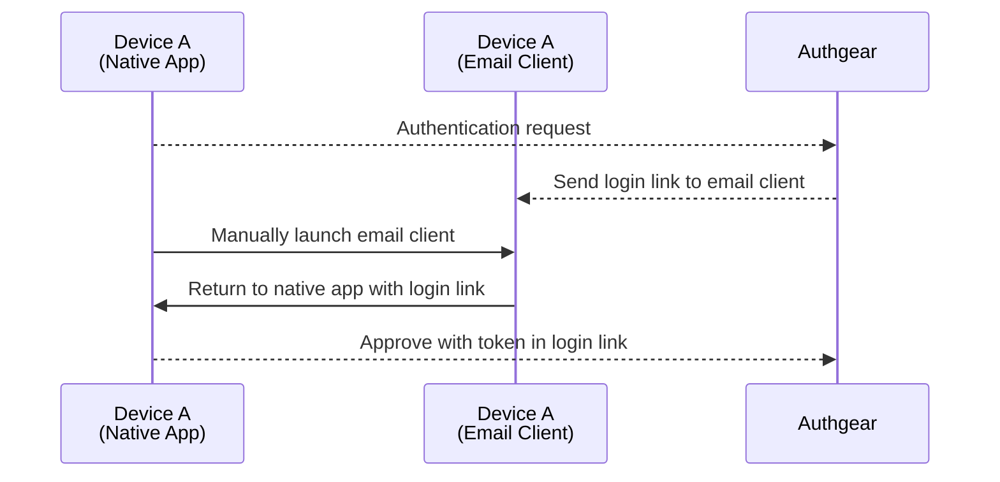
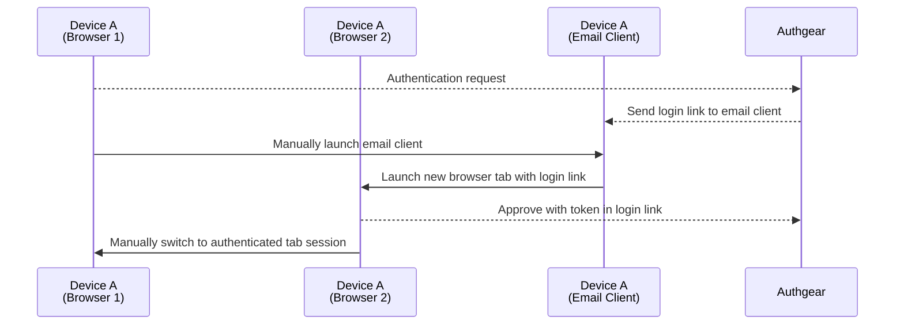
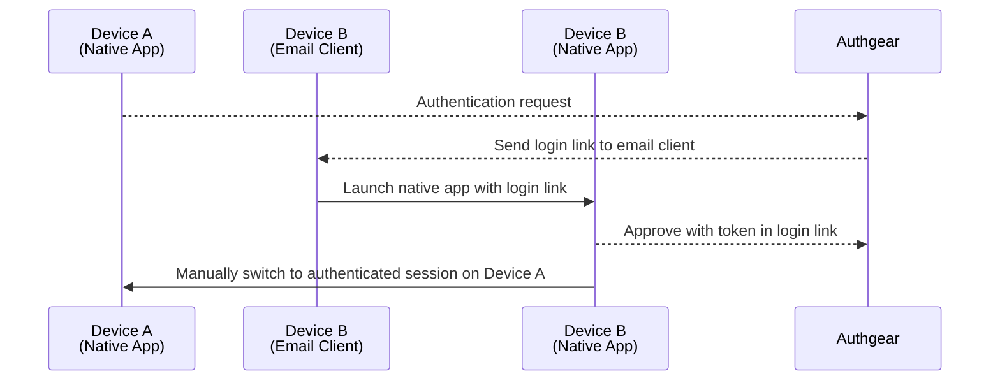
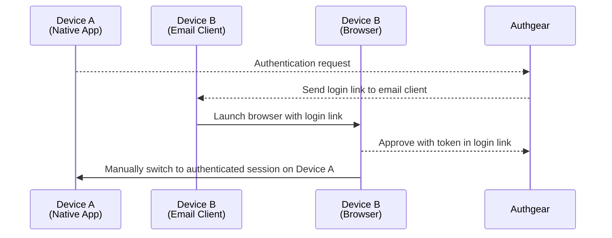
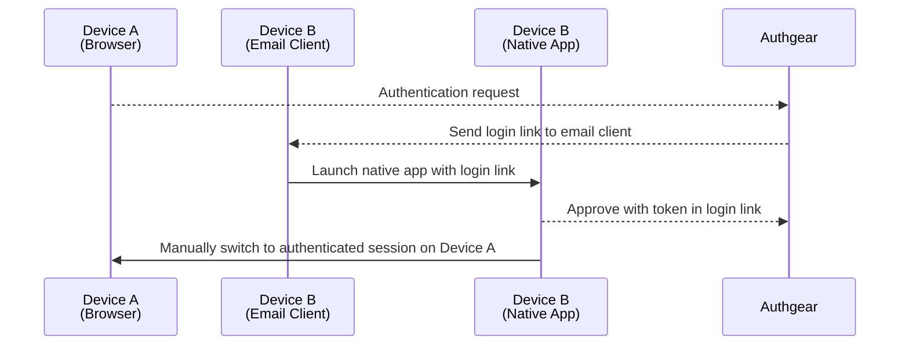
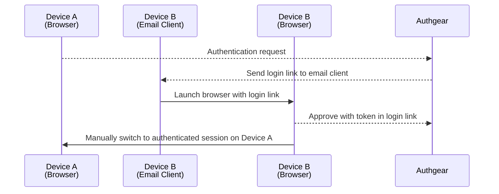

- [Universal Link](#universal-link)
  - [Universal Link / AssetLink hosting](#universal-link--assetlink-hosting)
    - [Configuration](#configuration)
    - [iOS](#ios)
    - [Android](#android)
    - [Associating with multiple apps](#associating-with-multiple-apps)
  - [Cases](#cases)
    - [Authenticate with Login Link](#authenticate-with-login-link)
      - [1. Same device (with native app)](#1-same-device-with-native-app)
      - [2. Same device (without native app)](#2-same-device-without-native-app)
      - [3. Different device (both with native app)](#3-different-device-both-with-native-app)
      - [4. Different device (only A with native app)](#4-different-device-only-a-with-native-app)
      - [5. Different device (only B with native app)](#5-different-device-only-b-with-native-app)
      - [6. Different device (without native app)](#6-different-device-without-native-app)

# Universal Link

This document specifies how universal link is configured and handled for different user flows

## Universal Link / AssetLink hosting

For Android / iOS to recognize which domains **can** open the app, Authgear hosts following files

- [iOS](https://developer.apple.com/documentation/xcode/supporting-associated-domains): `https://{project}.authgear.com/.well-known/apple-app-site-association`
- [Android](https://developer.android.com/training/app-links/verify-android-applinks#web-assoc): `https://{project}.authgear.com/.well-known/assetlinks.json`

Developer needs to configure native app's manifest and lifecycle methods to allow Authgear handling deep links.

For Android, the [SHA256 fingerprint of app's signing certificate](https://developer.android.com/training/app-links/verify-android-applinks#web-assoc) is also needed on admin portal

### Configuration

```yaml
oauth:
  clients:
  - client_id: portal
    name: Portal
    universal_link:
      ios:
        enabled: true
        bundle_id: com.example.normal
      android:
        enabled: true
        bundle_id: com.example.normal
        sha_signature: 14:6D:E9:83:C5:73:06:50:D8:EE:B9:95:2F:34:FC:64:16:A0:83:42:E6:1D:BE:A8:8A:04:96:B2:3F:CF:44:E5
```

**iOS**
- `universal_link.ios.enabled`: Enable universal link for iOS App (defaults `false`)
- `universal_link.ios.bundle_id`: Bundle ID of iOS App (required)

**Android**
- `universal_link.android.enabled`: Enable app link for Android App (defaults `false`)
- `universal_link.android.bundle_id`: Bundle ID of Android App (required)
- `universal_link.android.sha_signature`: [SHA256 fingerprint of app's signing certificate](https://developer.android.com/training/app-links/verify-android-applinks#web-assoc) (required)

### iOS

***.Entitlement**

```xml
<?xml version="1.0" encoding="UTF-8"?>
<!DOCTYPE plist PUBLIC "-//Apple//DTD PLIST 1.0//EN" "http://www.apple.com/DTDs/PropertyList-1.0.dtd">
<plist version="1.0">
<dict>
	<key>com.apple.developer.associated-domains</key>
	<array>
		<string>applinks:{project}.authgear.com</string>
	</array>
</dict>
</plist>
```

**AppDelegate**

```swift
func application(_ application: NSApplication,
                continue userActivity: NSUserActivity,
                restorationHandler: @escaping ([NSUserActivityRestoring]) -> Void) -> Bool {
    return authgear.application(application, continue: userActivity, restorationHandler: restorationHandler)
}
```

**SceneDelegate**

> Only needed if opted-in to Scenes

```swift
func scene(_ scene: UIScene, continue userActivity: NSUserActivity) {
    authgear.scene(scene, continue: userActivity)
}
```

### Android

> Developer also needs to provide SHA256 fingerprint of app's signing certificate at admin portal.

**AndroidManifest**

```xml
<intent-filter android:autoVerify="true">
  <action android:name="android.intent.action.VIEW" />

  <category android:name="android.intent.category.DEFAULT" />
  <category android:name="android.intent.category.BROWSABLE" />

  <data
      android:scheme="https"
      android:host="{project}.authgear.com"
      android:path="/clients/{client_id}/flows/verify_login_link" />
</intent-filter>
```

**MainActivity**

```java
@Override
protected void onCreate(Bundle savedInstanceState) {
  authgear.verifyLoginLink(getIntent());
}

@Override
protected void onNewIntent(Intent intent) {
  authgear.verifyLoginLink(getIntent());
}
```

### Associating with multiple apps

Different clients under same project are treated as different apps and separated with `/clients/{client_id}` path.

For example, if user has following clients:

-  "Admin App" (`com.example.admin`)
-  "Normal App" (`com.example.normal`)

Then the served `/.well-known` files will list each client separately:

**`/.well-known/apple-app-site-association`**

```json
{
  "applinks": {
      "details": [
      {
        "appID": "com.example.admin",
        "paths": ["/clients/{client_id}/flows/verify_login_link"]
      },
      {
        "appID": "com.example.normal",
        "paths": ["/clients/{client_id}/flows/verify_login_link"]
      }
    ]
  }
}
```

**`/.well-known/assetlinks.json`**

```json
[
  {
    "relation": ["delegate_permission/common.handle_all_urls"],
    "target": {
      "namespace": "android_app",
      "package_name": "com.example.admin",
      "sha256_cert_fingerprints": ["14:6D:E9:83:C5:73:06:50:D8:EE:B9:95:2F:34:FC:64:16:A0:83:42:E6:1D:BE:A8:8A:04:96:B2:3F:CF:44:E5"]
    }
  },
  {
    "relation": ["delegate_permission/common.handle_all_urls"],
    "target": {
      "namespace": "android_app",
      "package_name": "com.example.normal",
      "sha256_cert_fingerprints": ["14:6D:E9:83:C5:73:06:50:D8:EE:B9:95:2F:34:FC:64:16:A0:83:42:E6:1D:BE:A8:8A:04:96:B2:3F:CF:44:E5"]
    }
  }
]

```

#### Fallback

When `https://{project}.authgear.com/clients/{client_id}/flows/[...]` is opened in browser, user will be redirected to `https://{project}.authgear.com/flows/[...]?client={client_id}` and handled same as web flow.

## Cases

### Authenticate with Login Link

Login Link involves navigating user back to native app using universal link to approve authentication.

The approval action is automatic for native app but requires manual interaction for browser.
This avoids login link being consumed by link scanning (e.g. [Outlook](https://learn.microsoft.com/en-us/microsoft-365/security/office-365-security/safe-links-about?view=o365-worldwide)).

Following are possible flows when user initiate and visit generated link on same / different device:

#### 1. Same device (with native app)



#### 2. Same device (without native app)



#### 3. Different device (both with native app)



#### 4. Different device (only A with native app)



#### 5. Different device (only B with native app)



#### 6. Different device (without native app)

